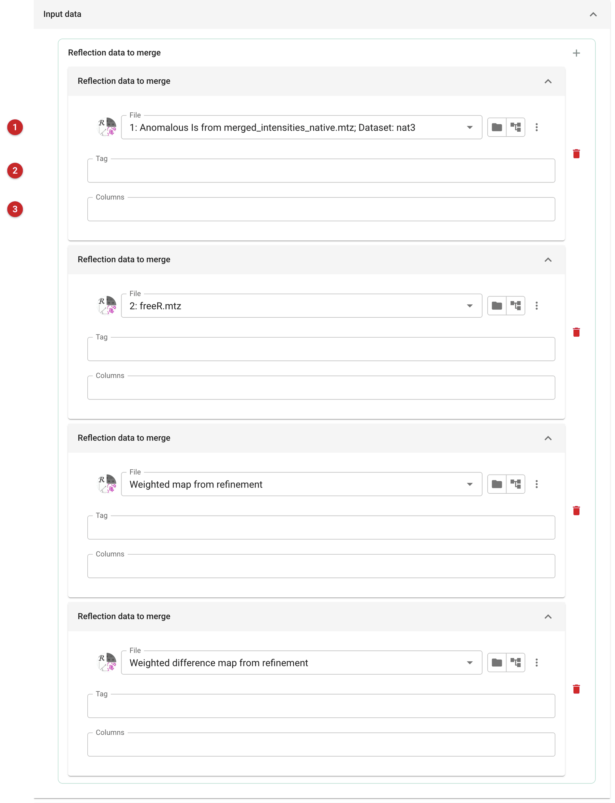
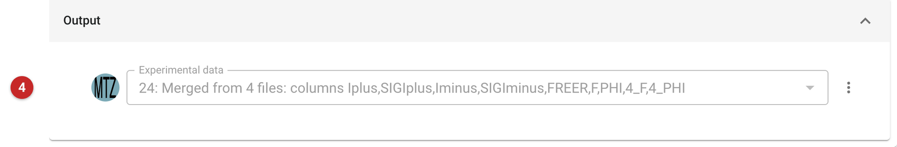

######################################
Merge experimental data objects to MTZ
######################################

CCP4i2 keeps each kind of experimental data in its own small ('mini') MTZ
file: observations, phases, map coefficients and free R sets are separate
*experimental data objects*, each one file. This task recreates an old-style
'monster' MTZ from a list of them.

When to use it
==============

Use it to hand data to a program **outside CCP4i2** that wants everything in
one MTZ file. CCP4i2's own tasks take the typed files directly and choose
the columns they need, so do not merge data for them.

If you want the data of one job, there is a quicker route: the job panel's
**Export MTZ** button offers an MTZ of the data associated with that job.
Use this task when you need to choose the files yourself, for example the
observations from one job, the free R set the model was refined against and
the map coefficients from the refinement.

Input
=====

|image1|

The input is a list of experimental data objects. For each one, choose the
file **(1)**. Its columns are given the standard names of its kind of data
(for example Iplus, SIGIplus, Iminus, SIGIminus for anomalous intensities;
FREER for a free R set; F and PHI for map coefficients).

The optional **Tag** **(2)** is a prefix for that file's column names: a tag
of ``REF`` turns ``F`` into ``REF_F``. With no tag, a column name that an
earlier file in the list has already used is prefixed with the file's
position in the list instead, so a second F,PHI pair becomes ``4_F,4_PHI``
when it is the fourth file. Give a tag when you want names you can
recognise in the other program.

The **Columns** field **(3)** can hold a comma-separated list of names to
use in place of the standard ones. It is only used if it has as many names
as the file has columns.

The list is extended with the **+** button at the top of the list; the
red bin beside a file removes it.

Results
=======

|image2|

The output is one MTZ file, ``HKLOUT.mtz`` **(4)**. Its name in the job
lists the columns it holds after H, K and L, so you can check what was
written without opening the file.

For example, merging the native anomalous intensities, the free R set the
model was refined against and the refinement's two sets of map coefficients
gave a file of 12485 reflections with the columns H, K, L, Iplus, SIGIplus,
Iminus, SIGIminus, FREER, F, PHI, 4_F, 4_PHI. The second pair of map
coefficients, the difference map, took the prefix ``4_`` because F and PHI
were already in use.

What to do next
===============

Use the file in the other program. When you do, check the column names it
asks for against the list in the output's name, and use a tag if they
differ. Merging reflections from different jobs is only meaningful if they
belong together: take the free R set the model was refined against, not a
new one.

