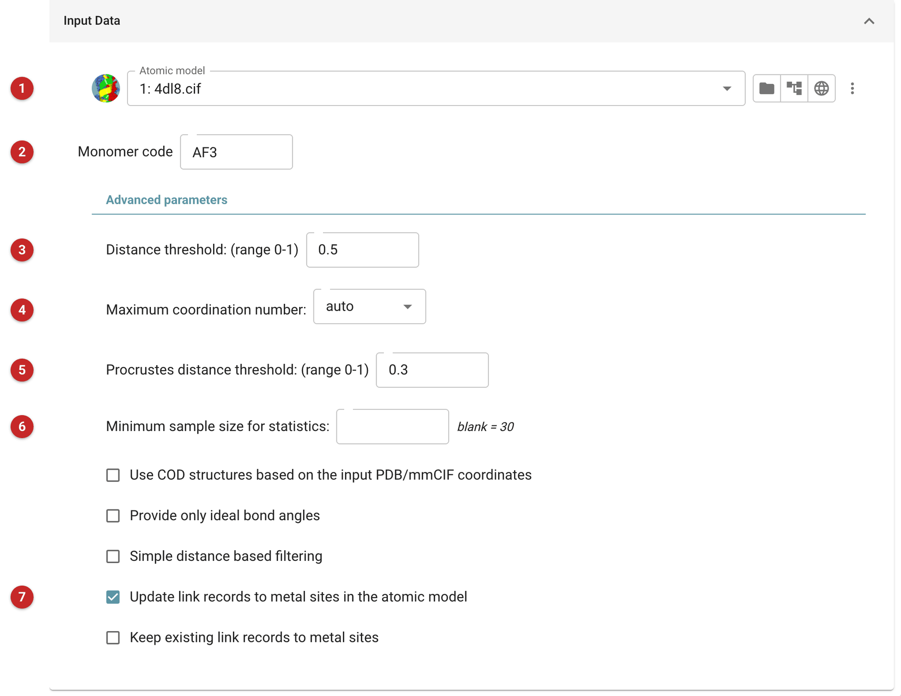
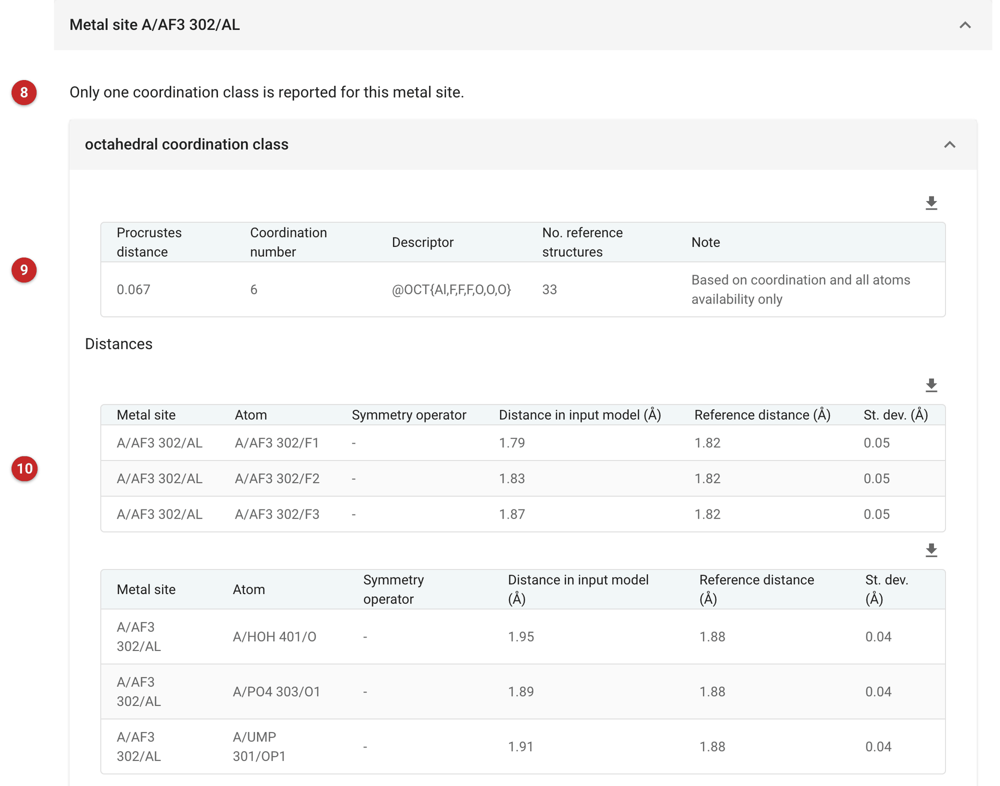

################################
MetalCoord
################################

MetalCoord writes restraints for a metal site, taken from how that kind of
metal is coordinated in structures already solved. It looks at the atoms
around the metal in your model, works out which coordination geometry they
form (octahedral, tetrahedral, square-planar and so on), and looks up the
bond lengths and angles that geometry has in the coordination statistics of
the PDB and COD. The result is a set of external restraints, with a mean and
a standard deviation for each distance and angle, that hold the site to
what is usual for it.

Use it when a model has a metal, or a metal-containing ligand, that the
monomer library describes badly or not at all, and refinement is pulling
the site out of shape or leaving it loose. It is not a way to make a
ligand's own dictionary (that is :doc:`../LidiaAcedrgNew/index`), and it
does not refine anything: the restraints are passed to a refinement
(:doc:`../servalcat_pipe/index`, which can also run MetalCoord itself). Judge
the statistics before using them: a site with few reference examples, or
one whose geometry is unusual for a real reason, should not be forced to
the average.

The pictures on this page come from the MetalSite project of the
refinement route: PDB entry 4dl8, whose ligand AF3 (aluminium fluoride)
holds an aluminium that is bound to three fluorines and three oxygens. The
task was run at its defaults.

Input
=====

   Figure 1: MetalCoord input

The atomic model **(1)**, and the monomer code **(2)** of the residue that
contains the metal (here AF3, the aluminium fluoride itself). The metal's
neighbours may belong to other residues: here two of the six oxygens come
from a phosphate and a nucleotide, and one is a water.

The advanced parameters have workable defaults:

* **Distance threshold (3)**, 0 to 1, default 0.5. Atoms count as
  neighbours of the metal when they lie within (r1 + r2) (1 + d) of it,
  where r1 and r2 are the covalent radii and d is this threshold.
* **Maximum coordination number (4)**: *auto* decides from the model. A
  number can be given, and then a menu of the geometries known for that
  coordination number appears (with the share of reference structures that
  have each); choosing one overrides the program's own pick.
* **Procrustes distance threshold (5)**, 0 to 1, default 0.3. The
  Procrustes distance measures how far the observed arrangement of
  neighbours is from an ideal geometry.
* **Minimum sample size for statistics (6)**: left empty, the program's own
  default, 30, applies.
* **Use COD structures based on the input PDB/mmCIF coordinates**,
  **Provide only ideal bond angles** and **Simple distance based
  filtering** change how the reference statistics are chosen. They are off by
  default, and are worth trying only when the default answer is wrong.
* **Update link records (7)**, on by default, also writes the model back
  with metal link records added. **Keep existing link records** (shown
  when that is on) keeps the links the model already had to metals; by
  default the model's metal links are deleted first and written again from
  the analysis, so check them if you keep the old ones.

Results
=======

   Figure 2: MetalCoord report

The report has a section for each metal site found, named by chain,
residue, number and atom (A/AF3 302/AL). Within it, one fold for each
possible coordination class. When several are reported, the one with the
lowest Procrustes distance comes first and is the one used for the
restraints **(8)**. Here there is only one: octahedral.

Its table **(9)** gives the Procrustes distance (0.067 here: a close
match to the ideal octahedron), the coordination number (6), the descriptor
(@OCT{Al,F,F,F,O,O,O}: the geometry and the elements around the metal),
the number of reference structures the statistics rest on (33) and a note
saying how the class was chosen (here, by coordination and the
availability of all the atoms only). A small count of reference structures
means a weak basis for the restraints.

The tables below **(10)** compare, for each bond and angle, the value in
your model with the reference value and its standard deviation. The Al-F
reference is 1.82 Å (standard deviation 0.05); the model has 1.79, 1.83
and 1.87 Å, all within about one standard deviation. The three Al-O bonds
(water, phosphate, nucleotide phosphate) have a reference of 1.88 Å (0.04)
and the model 1.95, 1.89 and 1.91 Å; the water is the furthest out. The
angles are 90 or 180 degrees with a deviation of 5; in the model the
180-degree angles are 175.4, 175.0 and 171.3 degrees.

The coordination statistics do not tell you whether the model is right, only
what is usual. A bond far outside the reference range is a reason to look
at the density before restraining it.

Files, and what to do next
==========================

Everything is written to the job's directory; the first, second and last
below are also listed in the job's output.

* ``AF3.json``: the full analysis (here with the model's own distances and
  angles added), named after the monomer code.
* ``AF3_restraints.txt``: the external restraints as keywords for Servalcat
  and Refmac (the wrapper's own documentation calls them "Servalcat or
  Refmacat"): 6 distances and 15 angles here. In
  :doc:`../servalcat_pipe/index`, the metal-site section can run MetalCoord
  itself, or *use a keyword file with restraints generated previously*:
  this file.
* ``AF3_restraints_coot.txt``: the same restraints in a simplified form
  Coot can read (Calculate, Modules, Restraints, then Read Refmac Extra
  Restraints). It leaves out atoms in alternative conformations and
  symmetry-related atoms.
* ``AF3_restraints.params``: the restraints as a Phenix.refine parameter
  file (without symmetry-related atoms).
* ``AF3_restraints.mmcif`` (listed as the structure model with links) and
  ``AF3_restraints.pdb``: your model with the metal link records rewritten
  from the analysis. Here three links were written, to the water, the
  phosphate and the nucleotide oxygens (the Al-F bonds are inside the
  ligand and need none). The mmCIF is the file to refine from if you want
  the links.

Restraints alone only help if the refinement uses them, and the atom names
must match the model: rerun the refinement with them and compare the site
before and after.
