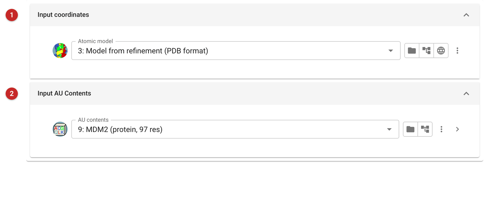
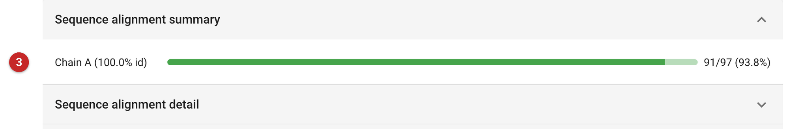

#########################################
Check a model against the AU contents
#########################################

This task aligns each chain of a model with the sequences in the
project's AU contents (see :doc:`../ProvideAsuContents/index`) and reports
how much of each sequence the model covers and how well it matches. Use it
before deposition, or after model building, to catch a chain built with
the wrong sequence, a register shift that turned into mutations, a chain
the AU contents do not account for, or a stretch left unbuilt.

The pictures on this page come from the MDM2 project of the refinement
route: the refined model against the AU contents defined for it.

Input
=====

   Figure 1: Model check input

The model **(1)** and the AU contents **(2)**.

Results
=======

   Figure 2: Model check report

One bar per chain **(3)**: the identity of the built residues to the
sequence they aligned with, and how much of that sequence is built. Here
chain A is 100% identical over 91 of the 97 residues. The detail fold
below shows the alignment itself: the six residues not built are the
N-terminal GPLGS left from the expression tag, and Ser17, the first MDM2
residue in the construct; the model starts at Gln18. Termini like this
are usually disordered, so leaving them unbuilt is expected.

What to look for: identity below 100% in a chain meant to be that
sequence (a mutation, or residues built out of register); a chain listed
as not aligned (the AU contents lack its sequence, or the chain is not
what it was meant to be); and coverage much lower than expected, which may
mean a domain or loop still to build.
