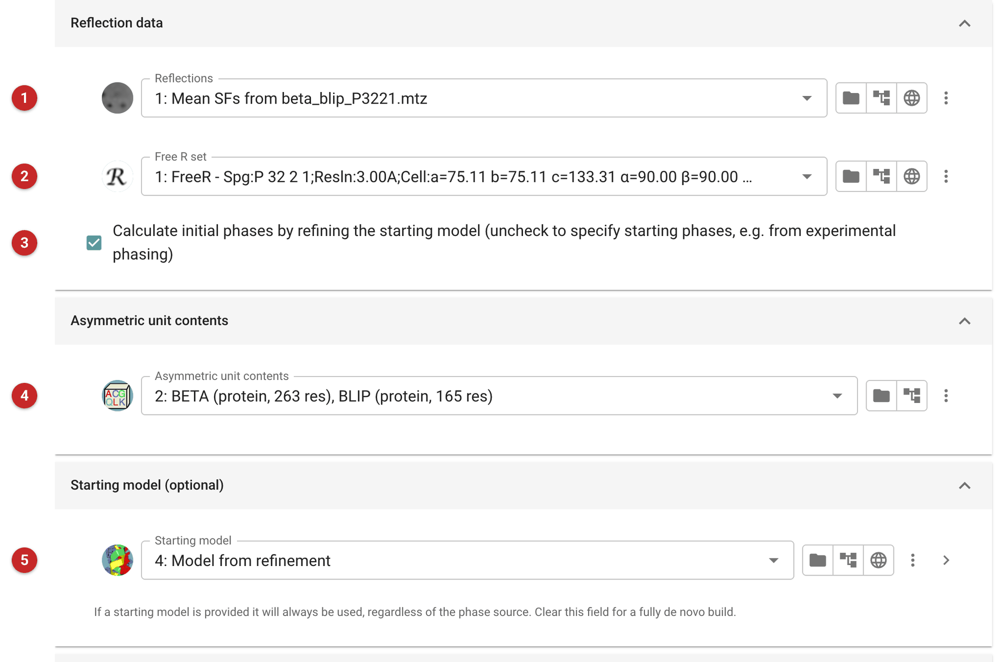
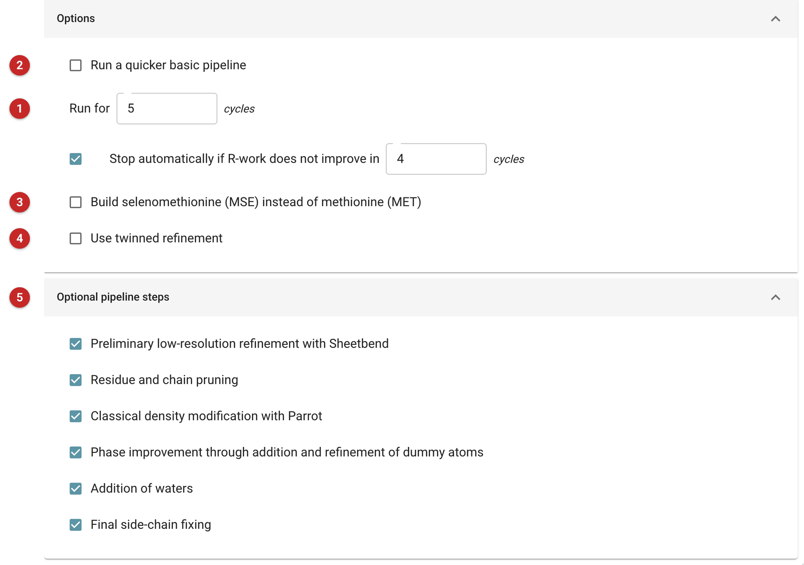
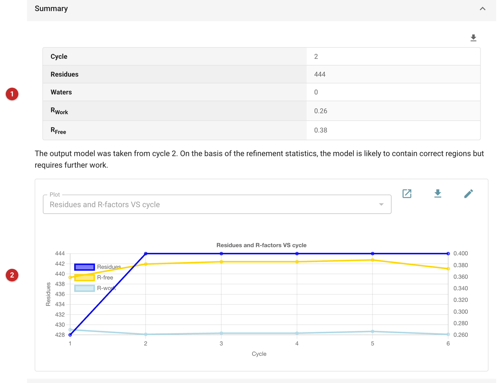

##########
ModelCraft
##########

.. note::

   The *Input* and *Results* sections of this page are a draft, written
   for the new interface from the task's code. The pipeline description is
   the original. Not yet reviewed by ModelCraft's developers.

The pictures on this page come from the demo data that ships with CCP4i2:
the beta-lactamase / BLIP complex, built from the expert Phaser solution.

ModelCraft is an automated model-building pipeline for X-ray crystallography.
It is based on the BUCCANEER and NAUTILUS model-building pipelines,
but with the following enhancements:

- Building of protein, RNA and DNA in a single pipeline.
- Prelimary refinement of the input model using SHEETBEND.
- Machine-learned pruning of protein residues and chains.
- Density modification using PARROT and dummy-atom addition.
- Addition of water molecules using COOT.
- Running for an increased number of cycles with automatic stopping criteria.
- Selecting the best output model from all cycles.
- Final rebuilding of side chains using COOT.

Pipeline
========

If a starting model was provided, ModelCraft refines it with 10 cycles of
REFMAC, both with and without shift-field refinement by SHEETBEND first,
and keeps whichever gives the lower R-free.
A single cycle of ModelCraft then consists of the following seven steps:

1. **Prune incorrect protein chains, residues and side chains**
   using COOT followed by 5 cycles of REFMAC.
   This step is not performed on the first cycle or if the resolution is 2.3 Å or worse.

2. **Density modification** using Parrot.

3. **Add dummy atoms** using COOT followed by 10 cycles of REFMAC.
   The dummy atoms are only used as a tool for phase improvement
   and are discarded after refinement.
   The dummy atom refinement is only accepted if it produces a lower free-R factor.
   Otherwise, the map from the previous step will be used.
4. **Build protein** using BUCCANEER followed by 10 cycles of REFMAC.

5. **Prune incorrect protein chains** using COOT followed by 5 cycles of REFMAC.

6. **Build RNA and DNA** using NAUTILUS followed by 10 cycles of REFMAC.

7. **Add waters** using COOT followed by 10 cycles of REFMAC.
   As in the third step, the model with waters is only accepted
   if it has a better R-free than the model without waters.

The best model from all cycles is chosen as the output: best by R-work,
not R-free (ModelCraft 6.1.1; its own help says R-free), so the output can
have a higher R-free than an earlier cycle. At the end of the pipeline
ModelCraft rebuilds side chains that are missing or predicted to be
incorrect, using COOT followed by 5 cycles of REFMAC, whatever the
resolution.

Input
=====

|input|

Give the reflections **(1)** and the Free R set **(2)** used for this
crystal. By default the phases come from refining the starting model
**(3)**, the usual case after molecular replacement. After experimental
phasing, untick this and give the phases instead; if they are unbiased
(experimental), say so, and they are used as restraints in refinement
until the model is good enough, R-work 35% or better, not to need them.
There is no need to run density modification first: ModelCraft runs
Parrot itself.

The AU contents **(4)** give the sequences to build and how many copies of
each, which also set the solvent content: get the copies right.

A starting model **(5)** is used whenever it is given, whatever the source
of the phases: after molecular replacement, the MR solution. Remove parts
you think wrong, with the atom selection or beforehand, and include heavy
atoms you are confident of. Clear it for a build from the phases alone.

|options|

ModelCraft runs for up to 25 cycles, stopping early when R-work (not
R-free) has not improved for 4 **(1)**; untick the stop to run them all.
The basic pipeline **(2)** is quicker: it builds with Buccaneer and
Nautilus and refines with REFMAC, running Parrot on the first cycle only;
choosing it here also sets the cycles to 5. Build selenomethionine instead of methionine for
SeMet protein **(3)**, and use twinned refinement only when you are sure
the crystal is twinned **(4)**. The optional steps of the pipeline
described above can each be turned off **(5)**.

Results
=======

|report|

The summary **(1)** gives the best cycle's residues built, waters, R-work
and R-free, and what R-free says about the model: above 0.50, very
incomplete or wrong; above 0.40, substantially incomplete; above 0.35,
correct in places but needing work; below, approaching completion. The
graph **(2)** follows the residues built and the R-factors cycle by cycle.
The model from the best cycle is the output, with its maps and phases.

Here ModelCraft, run for 5 cycles from the expert Phaser solution, kept
both chains whole (263 and 165 residues) and reached R-work 0.26 and
R-free 0.38 at 3.0 Å. It also built two short fragments, 8 residues each,
that the AU contents do not account for: pieces built into density that
belongs to something else, or to nothing. Look at anything the model holds
beyond its expected contents before refining further.

This is also a run that did not help. The model it was given was complete
and refined to R-free 0.343; ModelCraft's output is worse, 0.382 (its first
cycle reached 0.359, but the output is chosen by R-work). A model that
already accounts for the asymmetric unit needs refinement, not rebuilding:
compare the output's R-free with the input's before going on from it.

Reference
=========

| *ModelCraft*: an advanced automated model-building pipeline using *Buccaneer*  
| P. Bond, K. Cowtan *Acta Cryst. D* **78** (2022)
| `https://doi.org/10.1107/S2059798322007732 <https://doi.org/10.1107/S2059798322007732>`_

