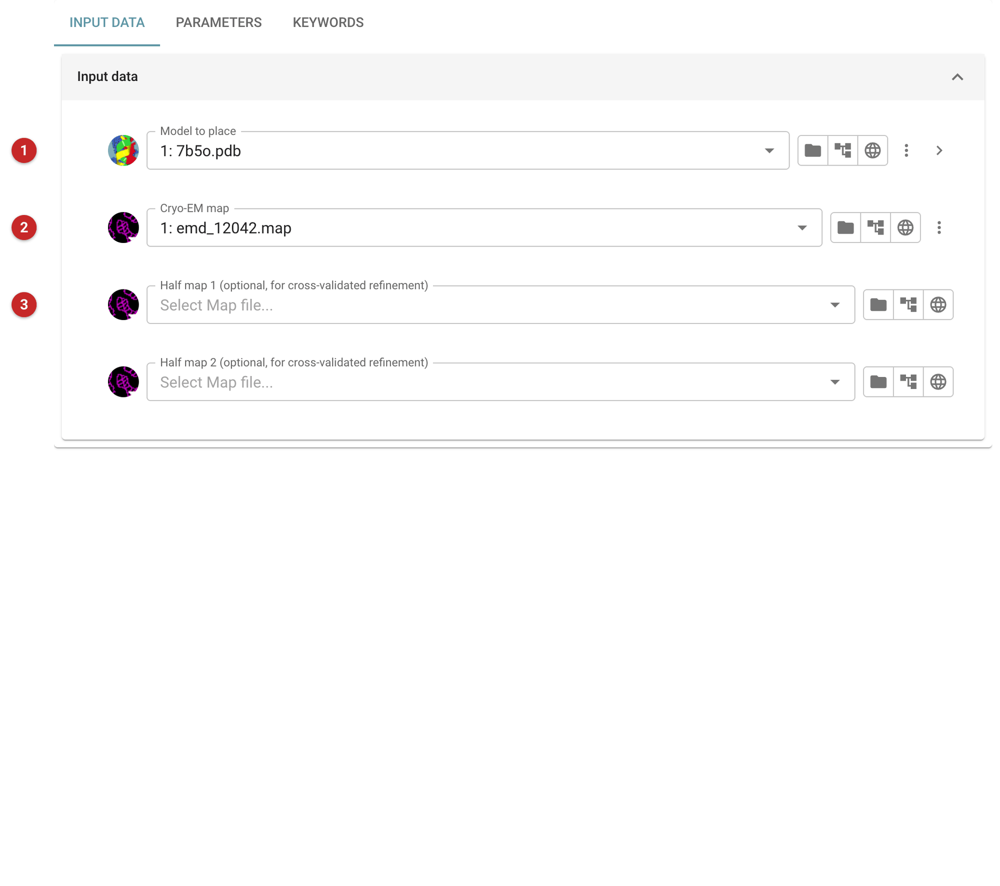
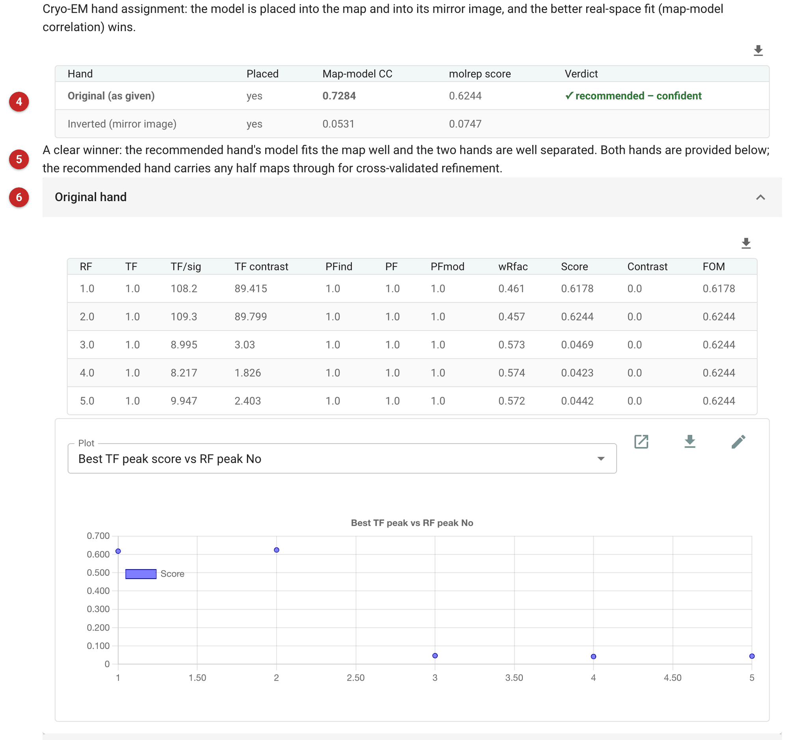

################################
Place a model in a cryo-EM map
################################

This task places an atomic model in a cryo-EM map and prepares the result
for refinement. It is the cryo-EM counterpart of molecular replacement: the
map plays the part of the data and the model is positioned and oriented to
fit it. Use it when you have a map and a model of what it contains (a
homologue, an AlphaFold model, an earlier structure of the same particle) and
need the model in the map's frame before refining it. For crystallographic
data use :doc:`../molrep_pipe/index` or one of the Phaser tasks instead.

Two things make it more than a placement.

* **It searches both hands.** A cryo-EM map can come out of the
  reconstruction as the mirror image of the true structure, and nothing in
  the map says which. The task places the model in the map as given and in
  its mirror image, then compares the two fits (by map-model correlation) and
  recommends the better hand. A model of the wrong hand will never fit, so
  this check settles a question that otherwise surfaces only as a refinement
  that will not converge.
* **It prepares the refinement.** For each hand the task writes the placed
  model, a map trimmed to the model plus a solvent border, and a mask around
  the model, all in one frame. These go straight into refinement.

The task prepares; it does not refine. The next step is
:doc:`../servalcat_pipe/index` (or a Coot or Moorhen session) on the files
of the recommended hand.

The pictures on this page come from a job in the CAK project: the
CDK-activating kinase model (PDB 7b5o) placed in its map (EMDB EMD-12042).
The map can be fetched from the EMDB when choosing the file (the globe
button beside the map field).

Input
=====

   Figure 1: Place in cryo-EM map, input

In Figure 1 the model to place **(1)**, which may be restricted to some chains
or residues with the atom selection under it (the arrow at the right of the
field), and the cryo-EM map **(2)**. If you have the two half maps from the
reconstruction, give them as well **(3)**: the placement itself always uses
the full map, but the half maps are cut to the same box as the full map and
written out for the recommended hand, which lets refinement validate against
them.

The **Parameters** tab holds the search controls. The ones to know:

* *Search resolution limit* and *Search-map down-sampling factor*: the
  search only needs the low-resolution shape of the map, so both are there to
  make it fast. The job shown used 4 Å and a factor of 2. The map you get
  back is never down-sampled.
* *Number of copies to position*: how many copies of the model to look for
  (default 1).
* *Number of rotation peaks to consider*: how many orientations are carried
  into the translation search (default 5).
* *B-factor to blur the search map* (default 50).
* *Time limit per placement*: blank means no limit.
* *Solvent border around the model for the trimmed map* (default 5 Å) and
  *Mask radius around atoms* (default 3 Å) set the extent of the trimmed map
  and the mask.

The engine menu offers molrep (the default) and phaser, but only molrep is
available yet: choosing phaser marks the field in red, saying so, and the job
cannot be run.

Results
=======

   Figure 2: Place in cryo-EM map, report

In Figure 2 the table **(4)** compares the hands: whether each was placed, the
map-model correlation (the headline number, in bold for the recommended
hand) and molrep's own score. The recommendation carries a confidence **(5)**:

* *confident*: a clear winner, with a well-fitting model and a clear margin
  between the hands;
* *ambiguous*: the hands are too close to separate, so the recommendation is
  a best guess;
* *weak*: both fit poorly, so the hand may not be determinable from this map
  (or the model does not belong in it);
* *single* or *none*: only one hand, or no hand, was placed.

Here the original hand fits with a correlation of 0.73 against 0.05 for the
inverted hand, and the task is confident. A correlation near zero for one
hand and well above zero for the other is what a hand determination should
look like; do not accept a recommendation when both are low.

Below, a fold per hand **(6)** lists molrep's rotation peaks, with the best
translation for each, and two plots. A real placement shows one or two peaks
standing far above the rest. Here the top two peaks of the original hand have
TF/sig about 108 and 109 and the next three about 8 to 10, while the
inverted hand has no peak above about 14. The best score, 0.6244, is the
one in the table.

The job's output files carry the hand in their names: for each hand a
placed model, a trimmed map and a mask, with the recommended hand marked
"(recommended)". Take all three of the recommended hand, together, to the next
step: they are in one frame, and mixing a map of one hand with a model of the
other will not work.

What next
=========

Refine the recommended model against the trimmed map with
:doc:`../servalcat_pipe/index`. Servalcat reads the map directly and needs
the resolution of the map (its *d_min*) to be set; the placement task does not
fill that in for you. If you supplied half maps, use the trimmed half maps of
the recommended hand so that refinement is cross-validated. To judge the
placement by eye, open the model and trimmed map together in Moorhen.
