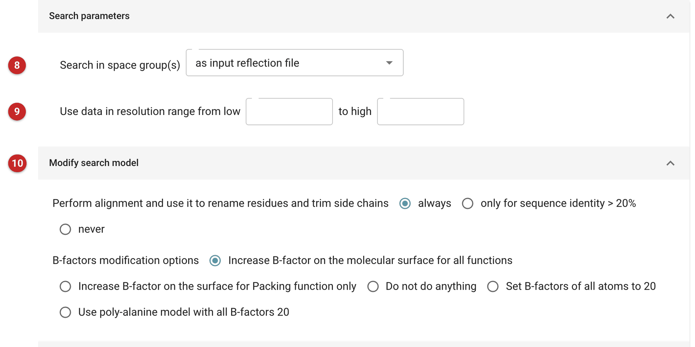
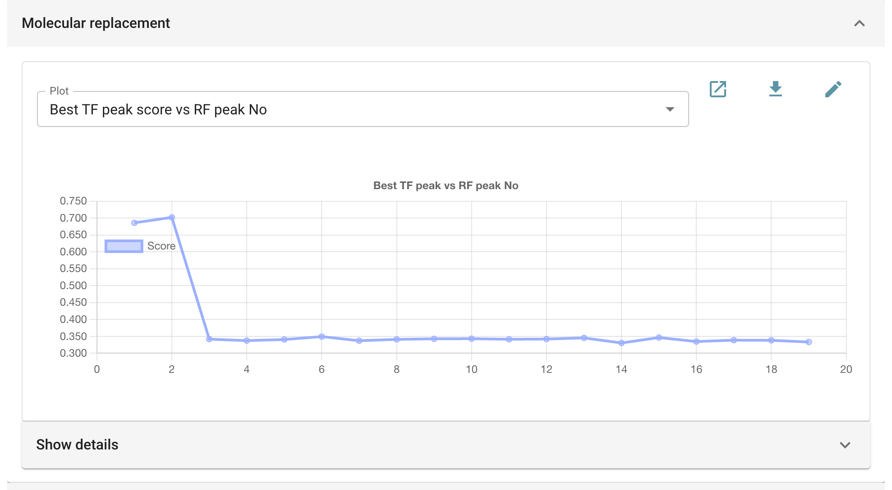
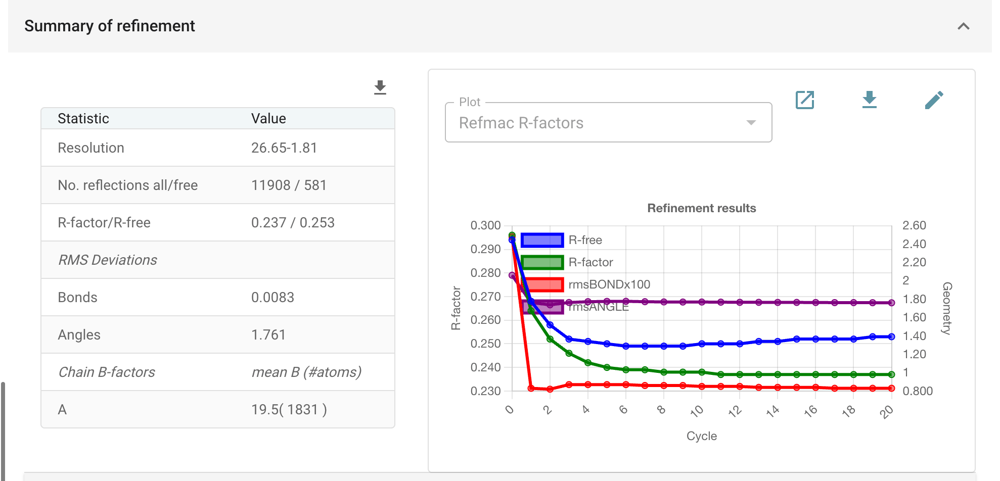

##############################
Molecular replacement - MOLREP
##############################

MOLREP is a quick and simple-to-use molecular replacement task using a
homologous search structure and, optionally, the sequence of the target.
The best solution can then be improved by shift-field refinement
(*Sheetbend*) and restrained refinement (*REFMAC5*).

Full documentation can be found at http://www.ccp4.ac.uk/html/molrep.html

The task searches for one or more copies of a single component in each
run. The expected number of copies can be given, or estimated by the
program assuming a solvent content of about 50%. For structures of
several components, place the full complement of the first component,
then run MOLREP again for the next with the first solution given as a
*fixed* model.

If a sequence is provided, MOLREP aligns the target sequence to that of a
single chain of the search model, and prunes and renames the model to
match. So if a search model is a multimer of several copies of one
sequence, edit all its chains with *Chainsaw* or *Sculptor* first.

The pictures on this page solve the native data of the *gamma* demo (the
data that come with CCP4i2) with the model supplied with them.

Input
=====

   Figure 1: Input data and protocol

The essential inputs are the reflection data **(1)**, the free R set
**(2)** and the search model **(3)**. The arrow at the end of the model's
row opens an atom selection, to use only part of it: only the protein, a
single chain, or a span of residues. Here the free set is the one the
model was refined against, not a new one: reflections the model has
already been fitted to are not free.

Optionally, the sequence of the target **(4)**: one sequence, from *Define
AU contents* or a sequence file. MOLREP then aligns it with the first
chain of the search model and modifies the model, renaming and pruning
non-conserved residues. Names of retained atoms are changed to match the
target, and residues are numbered consistently with the target sequence.
Without a sequence, the search model is used as it is.

The number of copies to search for **(5)** can be given, or left for
MOLREP to estimate. MOLREP takes the best result for the first copy, fixes
it, and searches for the second, third, and so on. A *fixed model*
**(6)** is the part of the structure already known, from an earlier run.

*Extra steps* **(7)**: shift-field refinement of the placed model with
Sheetbend, which corrects large-scale differences between model and
crystal cheaply, followed by restrained refinement (20 cycles by
default).

   Figure 2: Basic options

Space group **(8)**: where there is ambiguity (enantiomorphic pairs, or
screw axes not determined by the data), MOLREP can try the first search
in more than one space group, and uses the most likely for the rest.
Resolution range **(9)**: MOLREP uses data to the limit given; the
refinement that follows uses all the data. *Modify search model* **(10)**
controls whether the alignment with the target sequence renames residues
and trims side chains (always, only above 20% identity, or never), and
how B-factors are adjusted (by default increased on the surface of the
molecule).

Results
=======

   Figure 3: Rotation and translation function peaks

For each rotation function peak MOLREP tries, the report plots the score
of the best translation function peak it gave. A solution stands out: here
the first two rotation peaks give scores near 0.7 (TF/sigma 18-19), the
rest 0.34 (about 3), and MOLREP stops early because the contrast is
clear. *Show details* lists the scores for every peak.

   Figure 4: Refinement of the solution

The placed model is then refined, and the summary gives the result: here
R 0.237 and R-free 0.253 at 1.81 Å. The graphs of the cycles show R-free
rising slightly over the last ten while R still falls: fewer cycles would
have done as well. The output model is ready for rebuilding and further
refinement.
