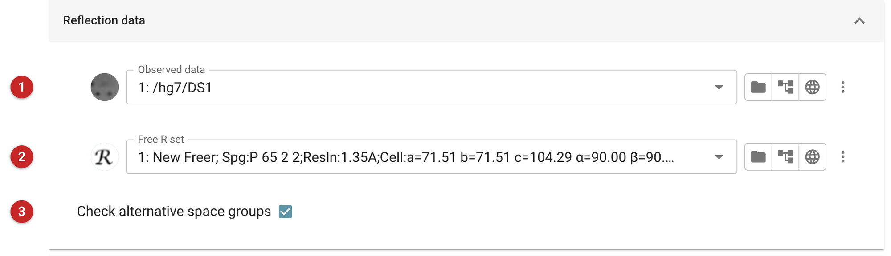
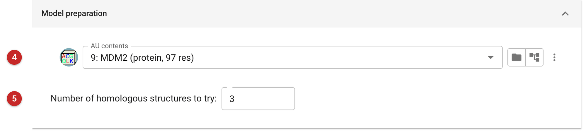

######################################
MoRDa: automated molecular replacement
######################################

MoRDa is an automated molecular replacement pipeline. Given the
reflections and the sequence of what is in the asymmetric unit, it picks
its own search models from its own library of domains and oligomers
derived from the PDB, prepares them, runs molecular replacement and
refines the best solution. You do not supply a model.

Use it when you have no model of your own and want an answer in one step.
If you already have a homologue or a predicted model, the Phaser steps
(:doc:`../phaser_simple_phil/index`) let you control the
search model; if you want to search the PDB for suitable models and try
several, see :doc:`../mrbump_basic/index`. SIMBAD
(:doc:`../SIMBAD/index`) is the choice when you do not even know the
protein.

.. note::

   MoRDa is distributed as an optional CCP4 package, because it includes
   a 3 GB library of domains, monomers and oligomers. In the CCP4 build
   these pages were made with, MoRDa was not installed, so this page is
   written from the task's interface and its wrapper, not from a run:
   no results are shown, and none are described as measured. The task
   starts MoRDa as the Python module ``morda`` of the Python that runs
   the task, so MoRDa has to be installed into that CCP4 first. The
   installation instructions are at
   http://www.ccp4.ac.uk/dist/html/morda_installation.html (and, in an
   older CCP4 installation, inside its ``html`` directory as
   ``morda_installation.html``).

Input
=====

The pictures come from an unrun MoRDa job in the MDM2 project.

   Figure 1: Reflection data

In Figure 1 the observed data **(1)** and the free R set **(2)**. The task
joins the two into one reflection file for MoRDa, using the mean structure
amplitudes, so give it data in that form (the same data you would give
Refmac). Reuse the free set the data already has rather than making a new
one. **(3)** Check alternative space groups, on by default, lets MoRDa
also try the other space groups that fit the same diffraction pattern
(such as P6\ :sub:`1`\ 22 and P6\ :sub:`5`\ 22); leave it on unless you are
sure of the space group.

   Figure 2: Model preparation

In Figure 2 the contents of the asymmetric unit **(4)** are required: their
sequences are what MoRDa uses to find homologous search models. Define them
first with the task for the asymmetric unit contents. **(5)** is the number of
homologous structures to try (3 by default). Below it, *Number of CPUs to
use* (1 by default) says how many processors MoRDa may use.

Results
=======

A successful run gives a refined model, with its map coefficients (the
usual and the difference map) and its R-factor and R-free, which MoRDa
itself reports. Judge the result as you would any molecular replacement:
by its R-free after refinement, against what a failure looks like on the
same data. The :doc:`../mrbump_basic/index` page shows both, for a
homologue placed in the MDM2 data and for the same homologue placed
wrongly.

If MoRDa finds no solution, the job ends as unsatisfactory rather than
failed. An interrupted job is reported as interrupted. In both cases try
a model-based route: MrBUMP, or Phaser with a model you prepare yourself.

After a solution, rebuild and refine as usual.

**Reference**

Vagin, A. & Lebedev, A. (2015). MoRDa, an automatic molecular
replacement pipeline. Acta Cryst. A71, s19.
