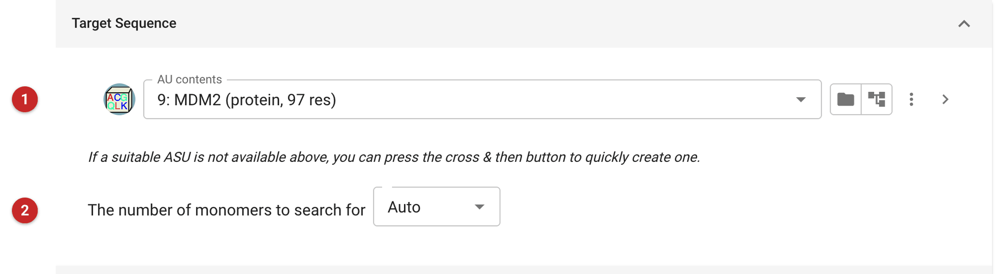
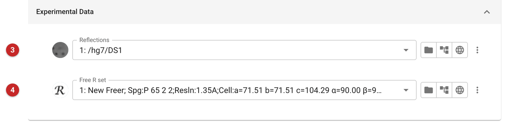
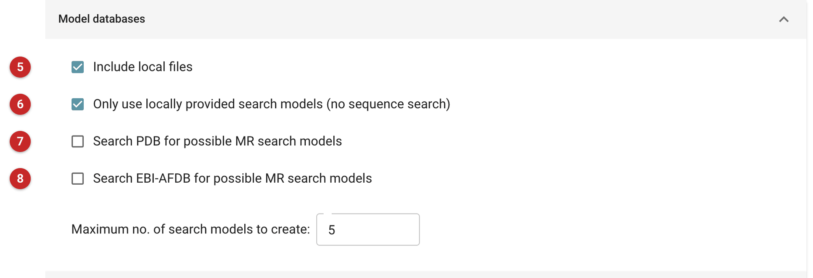
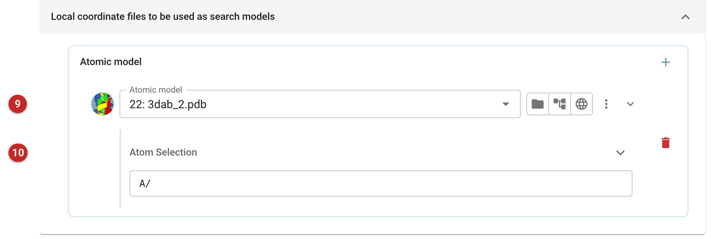
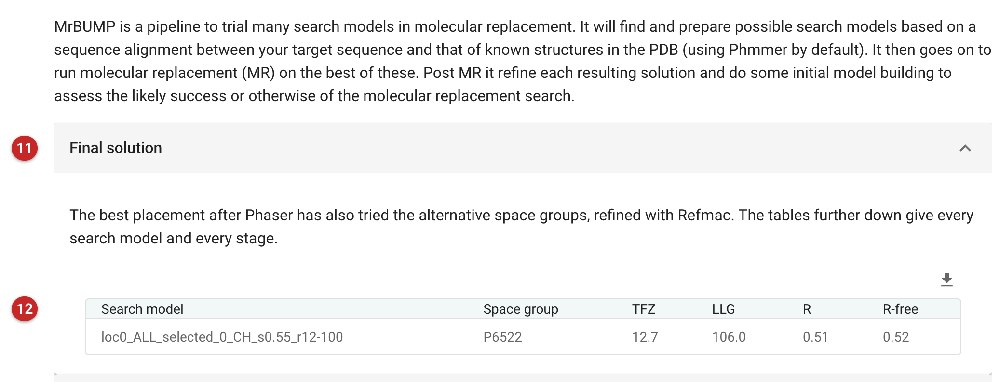

####################################################
Automated Molecular Replacement from target sequence
####################################################

.. note:: This page is a draft: the figures come from the running app, but
   the science has not been reviewed by a crystallographer who knows MrBUMP.

MrBUMP automates the whole of a straightforward molecular replacement
(MR) problem. Given only the sequence of what is in the crystal and the
reflections, it

-  finds homologous structures in the PDB (and, optionally, predicted
   models in the EBI AlphaFold database), or takes search models you
   supply;
-  aligns each to your sequence and edits it into a search model (here
   with Chainsaw);
-  runs Phaser with each search model, trying alternative space groups
   where the space group is ambiguous;
-  refines each placed solution with Refmac5 to see whether it is
   credible.

Use it when you have the sequence and the data but no model you trust as a
search model, and you would like the program to choose. If you already
have a model and want only the placement, use the Phaser tasks
(:doc:`../phaser_simple_phil/index`, :doc:`../phaser_pipeline/index`),
which give you control of each step. If you have no sequence at all,
:doc:`../SIMBAD/index` searches for a model by the cell alone.

The pictures on this page come from the MDM2 project, which is a
deliberately hard case for a sequence search. The target is the N-terminal
domain of MDM2; the search model is its paralogue MDMX (PDB 3dab, chain
A), with 54.5% sequence identity. To keep everything on this machine, every
online search was switched off and the one model was supplied from a file:
nothing was sent to any outside service.

Input
=====

   Figure 1: MrBUMP target sequence

In Figure 1 the *AU contents* **(1)** carry the sequence of everything expected
in the asymmetric unit; MrBUMP searches with those sequences. (When the
contents list several sequences, a *Select chains* choice lets you leave some
out.) The number of monomers to search for **(2)** can be left on *Auto*, when
the program works it out, or set if you know it.

   Figure 2: MrBUMP experimental data

In Figure 2 the reflections **(3)** and the free R set **(4)**. The free set is
what makes the final R-free of each solution meaningful.

The second tab, *Search models*, says where the search models come from.

   Figure 3: MrBUMP search model sources

In Figure 3, *Search PDB* **(7)** and *Search EBI-AFDB* **(8)** send the
sequence to those databases (the first with a non-redundancy level, the second
with a pLDDT cut-off for the predicted residues). Here both are off. *Include
local files* **(5)** lets you supply your own models, and *Only use locally
provided search models* **(6)** stops MrBUMP looking for more.

   Figure 4: MrBUMP local search models

The models themselves are listed further down the tab **(9)** (Figure 4), each
with an optional atom selection **(10)**: here chain A of 3dab, written ``A/``.
Every model in this list is searched; the list stays in view whenever it
holds one. The maximum number of search models
limits how many are tried in Phaser (here 5, though only one was supplied).
The *Options* tab sets the number of cores for Phaser, the number of
Refmac cycles for each refinement (10 here), and whether Buccaneer is
run after refinement.

Results
=======

   Figure 5: MrBUMP report

The report of Figure 5 opens with the final solution **(11)**: the search
model, the space group Phaser placed it in **(12)**, its TFZ and LLG, and R and
R-free after refinement. Below it, MrBUMP's own tables give every stage, which
the rest of this section walks through.

The search model was aligned to the target (54.5% identity, 0.91
coverage; Phaser's expected LLG for it, eLLG, was 2928) and edited by
Chainsaw, which trims the model to the aligned residues and prunes side
chains where the sequences differ: here residues 12 to 100 were kept.

Phaser's first, quick search, in the space group of the data, **failed**:
the rigid-body refined LLG was 11.0 with TFZ 5.6, and Refmac gave R/R-free
of 0.57/0.59, which is no better than nothing. This is not the verdict.
MrBUMP then runs a final Phaser search that also tries the alternative
space groups, and that found the solution, in the enantiomorph P6\ :sub:`5`\ 22
rather than P6\ :sub:`1`\ 22: rotation Z-score (RFZ) 3.4, translation
Z-score (TFZ) 12.7, LLG 106.0, and, after Refmac with jelly-body
restraints, R/R-free of 0.51/0.52. The same model placed with the Phaser
task, in the same space group, also gives TFZ 12.7.

So read the final solution, and its space group, not the first table.
Here the placement that worked had TFZ 12.7 and the one that failed 5.6.
R-free of 0.52 is a homologue placed correctly but not yet rebuilt: better
than the 0.59 of the failed attempt, and far from finished.

The job's outputs are the placed and refined model, the map coefficients
(weighted map and difference map) and the reflections.

What to do next: refine (:doc:`../prosmart_refmac/index`), rebuild the
missing and mismatched parts of the model, by hand in Coot or with
automated building, and use the free set you already have. Look at the
model against the map first: positive difference density shows what the
search model lacks (side chains, termini, other components). The
:doc:`../coot_refinement/index` page completes the same homologue, as placed by the Phaser task.
