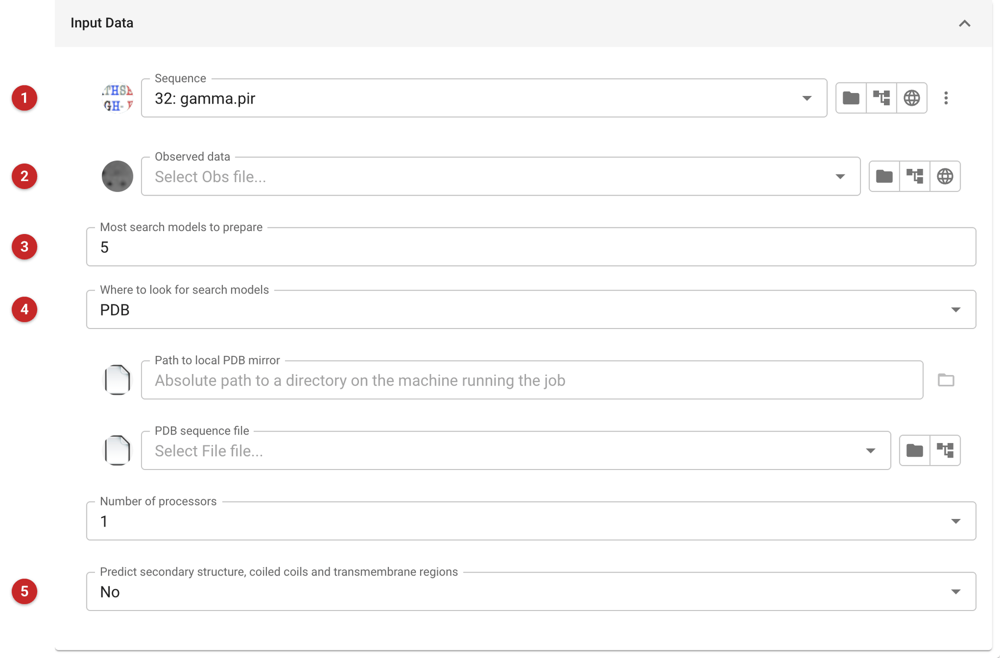
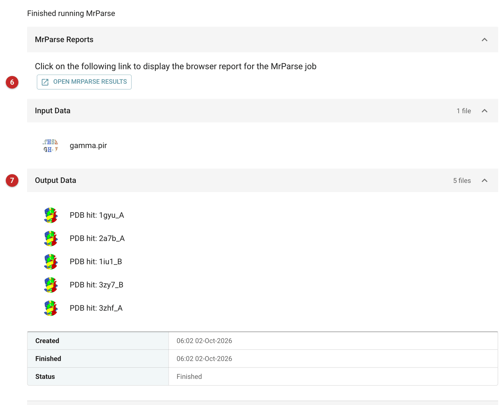

###########################################################
MrParse: search models for molecular replacement
###########################################################

MrParse takes the sequence of what you crystallised and looks for models to
use in molecular replacement (MR). It searches the sequences of the PDB (and,
if you ask, of the AlphaFold database) with phmmer, downloads each match,
trims it to the part that aligns with your sequence, and writes one model
file per match. It can also classify the sequence (secondary structure,
coiled coils, transmembrane regions) to say which parts are likely to be
hard.

Use it when you know the sequence and want to see what is available before
choosing a search model, or to get models you will place yourself with
:doc:`Phaser <../phaser_simple_phil/index>`. If you want the models
prepared, placed and refined in one go, use :doc:`MrBUMP
<../mrbump_basic/index>` instead. If you have no sequence, :doc:`SIMBAD
<../SIMBAD/index>` searches on the unit cell. For models predicted by
AlphaFold itself, see the :doc:`AlphaFold utilities
<../alphafold_utilities/alphafold_utilities>`.

The pictures on this page come from the Gamma project: the sequence of
gamma only, searched against the PDB, with no reflections.

Input
=====

   Figure 1: MrParse input

All you need is the sequence **(1)**. Reflections **(2)** are optional, but
give them if you have them: with reflections MrParse estimates the expected
log-likelihood gain (eLLG) of each PDB match as a search model, and the
wrapper then orders the models by eLLG instead of by sequence identity. eLLG
predicts whether a model will work in MR better than identity does.

*Most search models to prepare* **(3)** is how many models to prepare from each database (5 by
default). *Where to look for search models* **(4)** chooses what to search: *PDB*, *AFDB* (the
AlphaFold database) or *All*, the default. Only the options relevant to the
choice are shown. With *PDB* or *All* you may give a local PDB mirror or an
alternative PDB sequence file; with *AFDB* or *All* the option *USEAPI* and
an alternative AlphaFold sequence file appear. *Number of processors* is the number of
processors phmmer may use. *Predict secondary structure, coiled coils and transmembrane regions* **(5)** switches on the sequence
classification.

Where the sequence goes
-----------------------

The searches are run on your machine with phmmer against sequence files
held with CCP4: the log of the run shown here says "Running phmmer pdb
database search locally" and "Using CCP4 pdb sequence file". Downloading the
matched entries then asks the PDB for them by identifier, so the sequence
itself is not sent.

*USEAPI* is described by MrParse as running the AlphaFold search through an
EBI web service, and it is on by default. In the MrParse installed with the
CCP4 tree used for these pictures (version 0.4.3) the code that would do so
is commented out, the flag is stored and no search reads it, and the AlphaFold
search is a local phmmer search of a sequence file. We have not tested a
run with *AFDB* or *All*; treat what USEAPI does as version dependent, and
turn it off if the sequence must not leave your machine. The AlphaFold
models themselves are downloaded from alphafold.ebi.ac.uk by name.

Sequence classification, if you switch it on, uses further programs
(DeepCoil for coiled coils, TMHMM for transmembrane regions, the JPred
server for secondary structure) that must be installed or reachable
separately; their paths are set in MrParse's configuration file,
``$CCP4/share/mrparse/data/mrparse.config``. This was not run for these
pictures.

Results
=======

   Figure 2: MrParse report

The job page lists one model file per match under *Output Data* **(7)**,
named for the entry and chain ("PDB hit: 1gyu_A"), and a button **(6)** that
opens MrParse's own report in the browser. That report has sections for the
reflection data (when given), the sequence-based predictions, the PDB
matches, and the AlphaFold, Big Fantastic Virus Database and ESMFold Atlas
matches, each with a picture of where along your sequence the matches lie.

For the gamma sequence MrParse found five PDB matches:

=====  =====  ==========  ==========  ============
Entry  Chain  Identity    Resolution  Aligned with
                          (Å)         your residues
=====  =====  ==========  ==========  ============
1gyu   A      100%        1.81        15-134
2a7b   A      100%        1.65        15-134
1iu1   B      99%         1.80        16-134
3zy7   B      88%         1.09        15-134
3zhf   A      45%         1.70        12-134
=====  =====  ==========  ==========  ============

The matches begin at about residue 15 of the sequence. Three entries
are identical, or nearly, to the target; 3zy7 is at 88% identity, and
3zhf, at 45%, is the most distant. 1gyu is also
the structure found by the lattice search of :doc:`SIMBAD
<../SIMBAD/index>` for the same data, which is a useful cross-check.

**eLLG is 0.0 for every match here, because no reflections were given.** It
is not a prediction that the models will fail: MrParse cannot estimate it
without data. Give the reflections, and the matches are ranked by eLLG.

The model files are written to the job directory beside the report, and
each is also an output of the job, ready to use as a search model. The file
names carry the entry, the chain and a residue range
(``1gyu_A_704-823.pdb``). The numbers are the entry's own residue numbering,
not your sequence's: that file's residues run from 704 to 822, so the second
number is one past the last residue. The sequence range in the table is
where those residues fall on your sequence. Each file keeps the unit cell
and space group of the entry it came from and a header line recording the
identity (``REMARK PHASER ENSEMBLE MODEL 1 ID 100.0``).

What to do next
---------------

Take the best model or models to :doc:`Phaser
<../phaser_simple_phil/index>`, giving the sequence identity if the task
asks for it, or hand the sequence to :doc:`MrBUMP <../mrbump_basic/index>`
to try them all.
