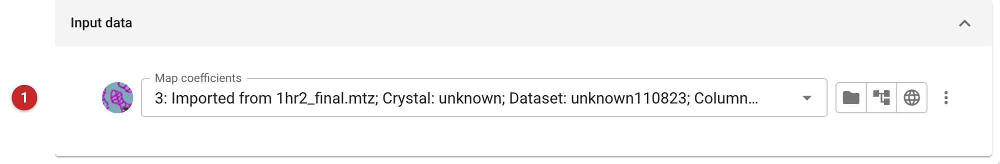
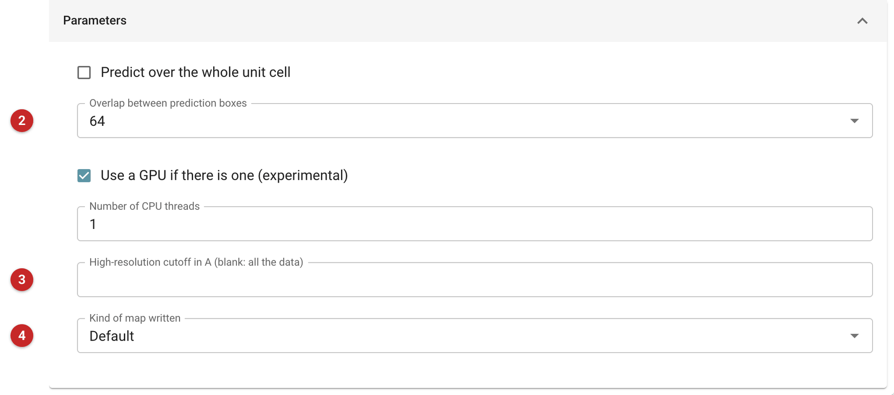
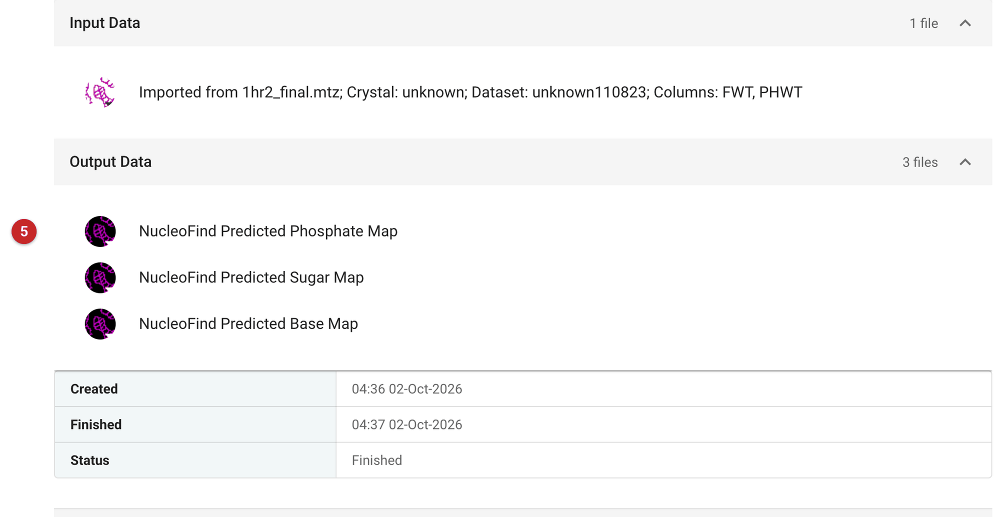

################################
NucleoFind
################################

NucleoFind is a neural network that looks at a map and says, for every
point, how likely it is to lie on the phosphate, the sugar or the base of a
nucleic acid. The task gives you those three predictions as three maps. It
builds no model: the maps are there to be looked at, in Coot or Moorhen, to
see where RNA or DNA is in density that is hard to read, or to guide
building by hand. To have a model built, use ModelCraft or
:doc:`Autobuild RNA <../nautilus_build_refine/index>`, which build nucleic
acids as well as protein; to check the geometry of a nucleic-acid model once
you have one, use :doc:`../dnatco_pipe/index`.

Use it when you suspect nucleic acid in a map and want an independent
reading of it: an RNA or DNA component in a complex, or a map at the
resolution where backbone and bases are hard to tell from solvent. It needs
only map coefficients (an amplitude and a phase), no model and no sequence.

The pictures on this page come from the RNA_1hr2 project of the refinement
tail route. The input is the PDB-REDO map coefficients of 1hr2, the P4-P6
domain of a group I intron, a pure RNA structure.

Input
=====

   Figure 1: NucleoFind input

The only input is the map coefficients **(1)**: a file of an amplitude and a
phase, the 2mFo-DFc map of a refinement for instance. Here, the FWT and PHWT
columns of the PDB-REDO file. The task passes the columns to the program as
``F`` and ``PHI``, so it takes the map-coefficient file as the program
expects it, with those labels set when the file is imported.

The task always runs the program's "core" model; the program's smaller "nano"
model is not offered.

Parameters
==========

   Figure 2: NucleoFind parameters

The parameters:

* **Overlap between prediction boxes (2)**: the program predicts the map in overlapping boxes, and this
  is the amount of overlap used (128, 64, 32, 16 or 8; the default is 64).
  The program describes it only as "the amount of overlap to use". More
  overlap should cost more time; this was not tested here.
* **High-resolution cutoff (3)**: a resolution cutoff for the input map. Left empty, none is
  given to the program.
* **Kind of map written (4)**: *Default* writes the predictions after the program's
  final choice among the classes (its "argmax"); *Raw values (no argmax)*
  writes the raw network output instead; *Variance of repeat predictions*
  writes a map of how much the repeated predictions of the same point vary.
* **Predict over the whole unit cell**: compute predictions for the whole unit cell rather than only
  the program's default region (the program's own help gives no more).
* **Use a GPU if there is one** and **Number of CPU threads**: whether to try a GPU (the program calls this
  experimental) and how many threads to use. The run shown here took about 70
  seconds on a CPU.

Results
=======

   Figure 3: NucleoFind report

The task has no report of its own beyond the files it made **(5)**: three
maps, *Predicted Phosphate Map*, *Predicted Sugar Map* and *Predicted Base
Map*, and the literature reference. NucleoFind writes no summary or score, so
the maps are the result and have to be judged by eye or against a model.

The values run from 0 to 1, high where the network thinks the atom type is
present. How far to trust them was checked on this run against the deposited
RNA model. The phosphate map is above 0.5 over only 0.95% of the cell, but
at 96.5% of the 313 phosphorus atoms of the deposited model (median value at
a phosphorus atom 0.996). In this case the phosphate map marks nearly all
the phosphates of the real structure and almost nothing else. That is one
RNA at good resolution, with the sugar and base maps unchecked: expect
weaker predictions in poorer maps, and look at them against the density.

Next, open the three maps with the map coefficients in Coot or Moorhen (the
*What next* buttons below the report open Coot) and contour the phosphate map
high (in this run, 0.5 separated the phosphates from the rest): a chain of
phosphates is a backbone to build along, and the sugar and base maps show
where the rings and bases lie. Once
a model is built, run :doc:`../dnatco_pipe/index` on it to check the backbone conformations.

**Reference**

Dialpuri, J. S., Agirre, J. & Cowtan, K. (2024). NucleoFind: a deep-learning
network for interpreting nucleic acid electron density. Nucleic Acids Res.
52(19), e91.
