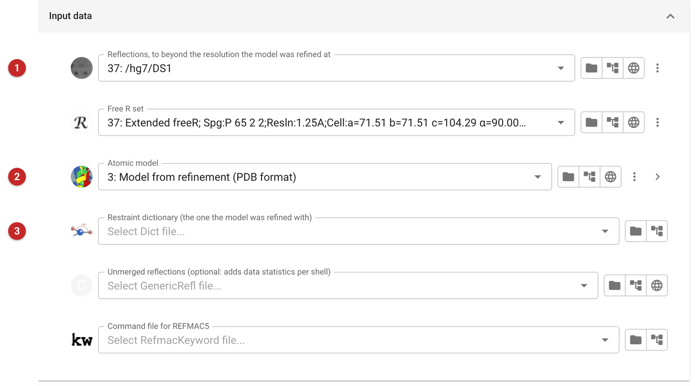
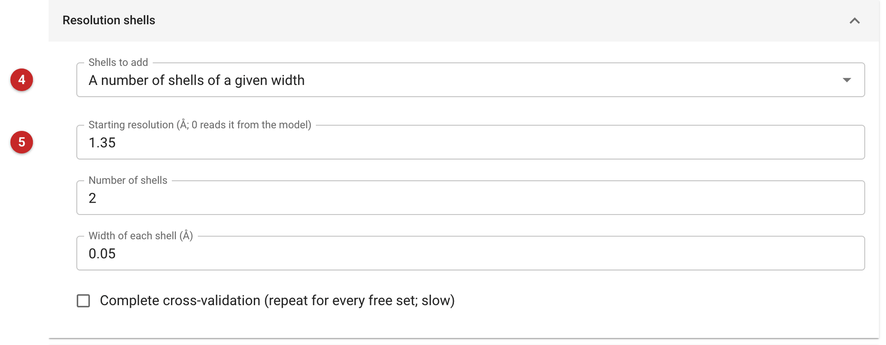
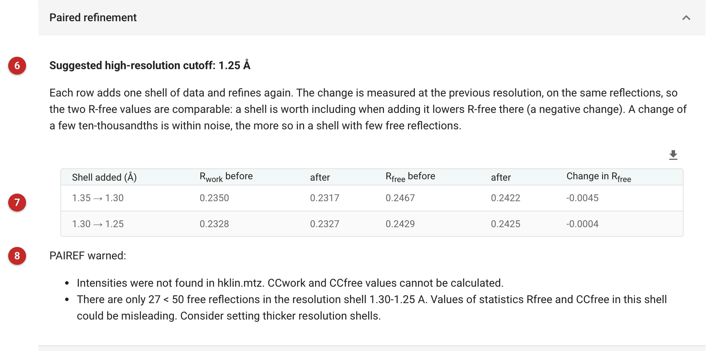

################################
Paired refinement (PAIREF)
################################

PAIREF decides where to cut the data by asking whether each extra shell
improves the model. Statistics of the data alone (CC\ :sub:`1/2`,
I/σ(I), completeness) say how much signal a shell has, not whether using
it helps; paired refinement answers the second question directly. It
refines the model at the current resolution limit, adds one thin shell and
refines again, then compares the two models *at the previous resolution*,
on the same reflections. If the model refined with the extra shell fits
those reflections better (lower R-free), the shell carries information
worth having; the next shell is then tested the same way.

Use it when the resolution cutoff is in doubt: when the data were
integrated further than the automatic cutoff kept, or before deposition,
to justify the limit. It needs a model already refined at the starting
resolution, and reflections to beyond it.

The pictures on this page come from the MDM2 project of the refinement
route. The images were integrated to 1.25 Å; Aimless's automatic cutoff
(:doc:`../aimless_pipe/aimless_pipe`) kept data to 1.35 Å, and the model
was refined there. To test the shells beyond, Aimless was run again
without the cutoff, *completing* the free set it had already made rather
than drawing a new one: reflections the model has already been refined
against are not free.

Input
=====

   Figure 1: PAIREF input

In Figure 1, the reflections, to beyond the model's resolution **(1)**; their
free set; the refined model **(2)**; and the restraint dictionary for any
ligand, which must be the one the model was refined with **(3)**. Here that
means none: the model was refined with the monomer library's Nutlin-3a, whose
atom names it carries, and a dictionary made afresh from SMILES names the
same atoms differently, so Refmac would find no restraints for any of
them.

   Figure 2: PAIREF resolution shells

In Figure 2 the shells **(4)**: a number of shells of a given width, an
explicit list of limits, or automatic 0.05 Å shells. The starting resolution
**(5)** is normally read from the model; give it when the model does not record
it. Here two shells of 0.05 Å took the data from 1.35 Å to 1.25 Å.

Results
=======

   Figure 3: PAIREF report

In Figure 3 the suggested cutoff comes first **(6)**, then one row per added
shell **(7)**: R and R-free of the model refined without the shell and with
it, both calculated at the previous resolution, and the change in R-free.
PAIREF suggests keeping every shell whose change is negative.

Read the size of the change as well as its sign. Here the shell from 1.35
to 1.30 Å lowered R-free by 0.0045: that shell helps, and the automatic
cutoff was too conservative. The shell from 1.30 to 1.25 Å lowered it by
only 0.0004, which is within noise, and PAIREF's warnings **(8)** say
why the evidence is thin: only 27 free reflections in that shell. So
PAIREF suggests 1.25 Å, but a careful reading is that 1.30 Å is justified
and 1.25 Å undecided. Thicker shells give each test more free
reflections; intensities as the input (rather than amplitudes) add
CC\ :sub:`work` and CC\ :sub:`free` to the comparison.

PAIREF's own report, with its graphs and the log of every refinement, is
linked below the results.

**Reference**

`Malý, M., Diederichs, K., Dohnálek, J. & Kolenko, P. (2020). Paired
refinement under the control of PAIREF. IUCrJ 7, 681-692.
<https://doi.org/10.1107/S2052252520005916>`_
