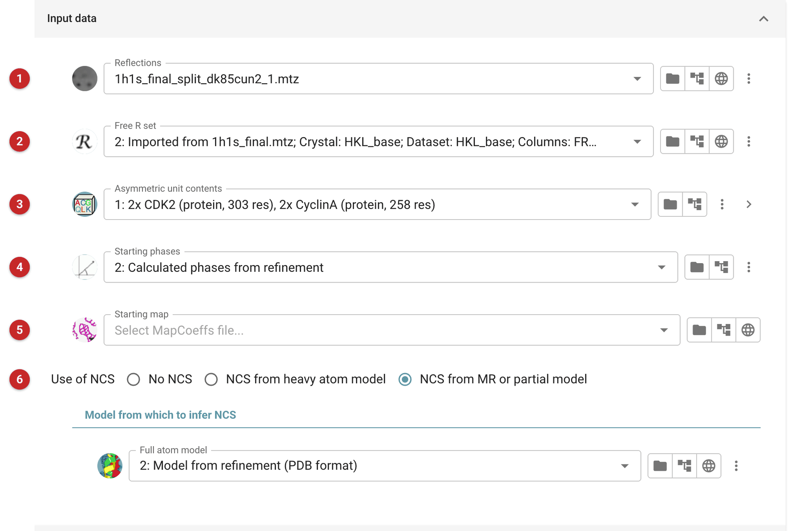
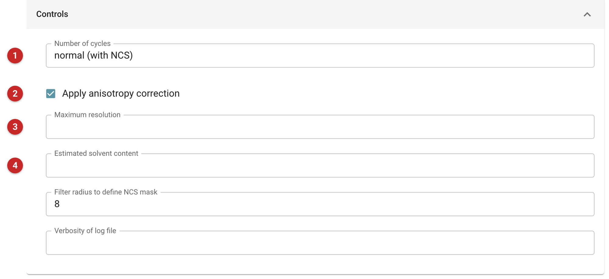
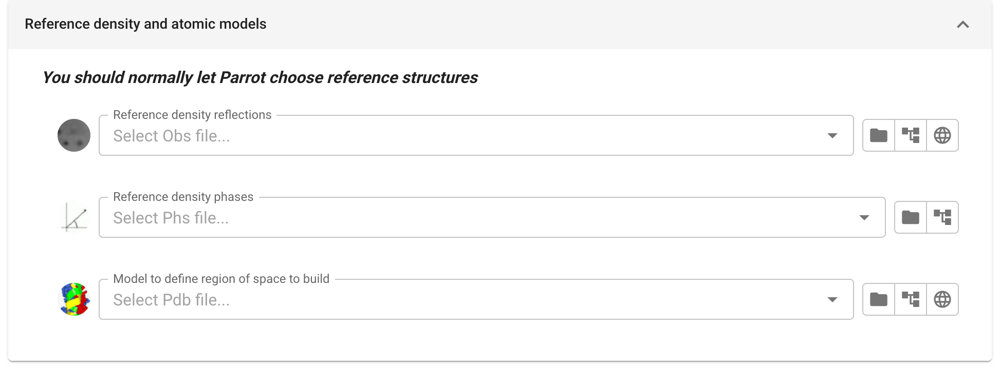
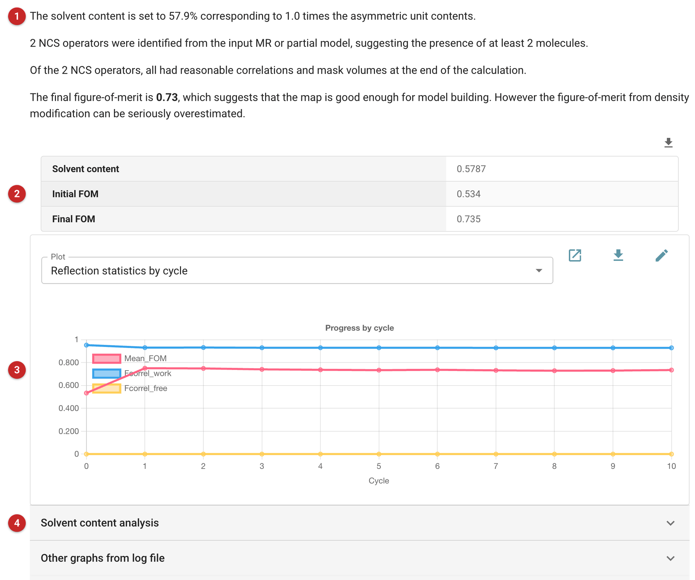

#############################
Density Modification (parrot)
#############################

   The "Density modification" task is used to improve initial phase
   estimates to produce a more interpretable electron density map using
   the "Parrot" software. Density modification is always applied as a
   follow on to experimental phasing to resolve phase ambiguities,
   particularly in the case of SAD phasing. It may also be applied after
   molecular replacement to reduce bias towards the search model. Phase
   improvement is performed using solvent flattening, histogram
   matching, and optionally non-crystallographic symmetry averaging. The
   minimum required inputs are the protein sequence, a set of
   observations, and a set of phases.

   The pictures on this page come from PDB entry 1h1s, phospho-CDK2 in
   complex with cyclin A, with two complexes in the asymmetric unit. The
   starting phases were calculated from a partial model, the two CDK2
   molecules without their cyclins, as they might be after molecular
   replacement with CDK2 alone.

Input
=====

The task has two tabs. *Main inputs* holds the input data and the
controls; *Reference structures* is rarely needed.

Input data
----------

   |input|

   First the experimental data must be selected: the observations
   **(1)** and a set of phases **(4)**, from experimental phasing or
   from refinement of a molecular replacement model.

   You can optionally provide a set of Free-R flags **(2)** to prevent
   Parrot using the free set in map calculation. This is not normally
   necessary, as density modification does not tend to bias the
   refinement Free-R, and introduces noise into the map which degrades
   the results.

   The *AU contents* must be selected **(3)**. These should have been
   entered in the *Define AU contents* task. They are used to estimate
   the proportion of the asymmetric unit occupied by solvent (the
   solvent content), so give the number of copies of each sequence the
   asymmetric unit really holds: here two CDK2 and two cyclin A. If you
   have a better estimate of the solvent content, you can provide it
   under *Controls*.

   Map coefficients for a starting map may also be provided **(5)**.
   This option is useful when a good starting map is available but the
   corresponding phases are known to be biased, for example after a
   combined MR-SAD calculation. In this case, the electron density from
   the refined model would be entered as the starting map, and the SAD
   phases as the starting phases.

   Parrot can optionally perform non-crystallographic symmetry (NCS)
   averaging **(6)**. The NCS rotations and translations are determined
   from a set of atomic coordinates. These may be from the coordinates of
   the anomalous scatterers or heavy atoms in the case of experimental
   phasing, or from an initial molecular replacement model or incomplete
   partial model in the case of either molecular replacement or
   experimental phasing. To use NCS averaging, choose the kind of model
   and then select the model to be used. Here the partial model's two
   CDK2 molecules define the two-fold NCS.

Controls
--------

   |controls|

   The most important option is the number of cycles of density
   modification to perform **(1)**. By default, a conservative 3 cycles
   ("normal (no NCS)") are run, to limit the bias which is introduced by
   running too many cycles. However when NCS is being used (or
   occasionally when the solvent content is very high) bias is less of a
   problem and more cycles may be performed: "normal (with NCS)" runs 10
   and "many (with NCS)" 100. You may also type your own number.

   An anisotropy correction is applied to the data by default **(2)**.
   This step is robust and would not normally be turned off. If
   observations have been measured beyond the realistic limit of the
   data, they may be removed by entering a resolution cutoff **(3)**.

   If you have a good estimate of the solvent content from another
   source, or think that Parrot has inferred the wrong number of
   molecules in the asymmetric unit, you can override the solvent
   content by entering a value **(4)**.

Reference structures
--------------------

   |reference|

   Biological macromolecules do not vary sufficiently in their electron
   density histograms for the choice of reference structure to matter.
   You should not need to change these.

Results
=======

   |report|

   The report summary **(1)** describes how well the calculation has
   worked and provides important numbers for you to check. First, Parrot
   reports the solvent content it used and how many times the asymmetric
   unit contents that corresponds to. Check that this agrees with your
   expectations, e.g. from molecular replacement or anomalous
   scatterers: a value other than 1.0 means the solvent content does not
   match the AU contents you gave. If the solvent content is wrong,
   override it under *Controls*.

   If a non-crystallographic model has been provided, the number of
   operators found is reported. In most simple cases, this should match
   the number of molecules determined previously. The NCS operators are
   also checked against the electron density; in some cases the
   operators are not supported by the density, in which case they will
   refine away. The number of operators surviving to the end of the
   calculation is reported. If most of the operators have been lost,
   either the NCS model or the initial phases may be poor. Here both
   operators survive.

   The final figure of merit is reported, along with a rough assessment
   of the likely quality of the map. This is little more than guesswork
   however: the only real test of a map is whether it can be built.

   The results table **(2)** summarizes the density modification
   statistics. The reflection statistics by cycle graph **(3)** tells
   you how the phases are improving over the course of the calculation.
   Detailed analysis of the likely solvent content, and further
   statistics, can be seen in the sections below it **(4)**.

   Follow-on tasks include manual model building, usually to inspect the
   quality of the map, and automated model building.

