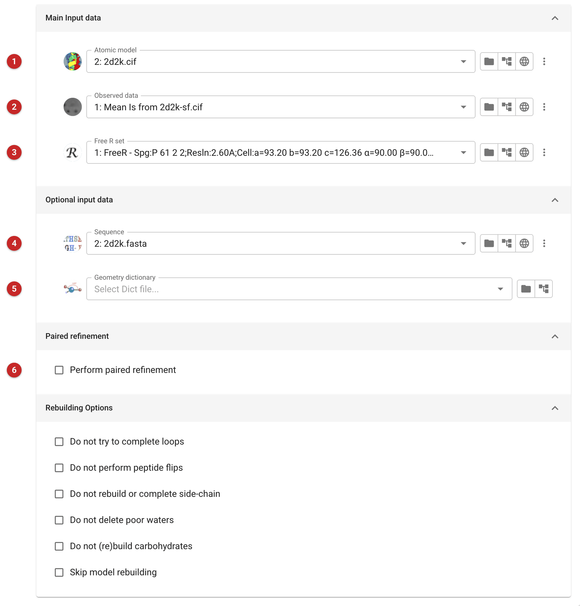
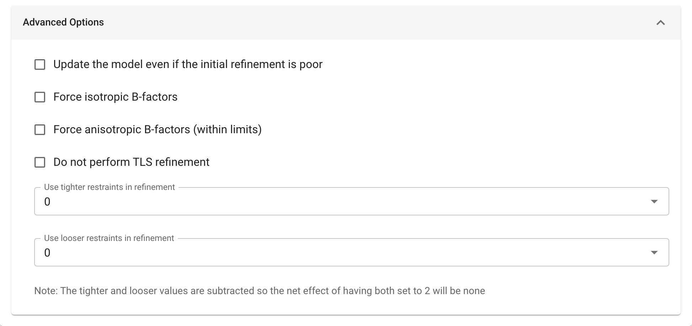
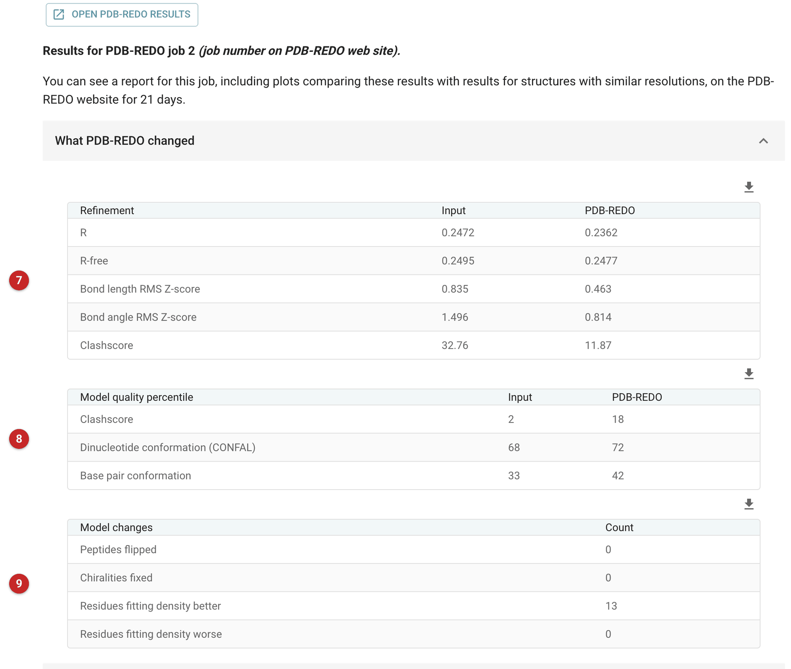

################################
PDB-REDO web service
################################

.. warning::

   This task **sends your model and your reflection data to the PDB-REDO
   server** (pdb-redo.eu, in the Netherlands) and waits for the result. Use it
   only for data you are allowed to share with an outside service. Nothing
   leaves your machine until you press Run.

PDB-REDO re-refines a model with REFMAC5 and then rebuilds and optimises it
(rotamers, peptide flips, loops, waters, TLS groups and so on), on the
PDB-REDO group's servers rather than on your own computer. Use it when you
want to see what an independent, automated re-refinement and rebuild does
to a model: before deposition, or to compare it with the model you have
refined yourself. The refinement tasks in the Refinement category
(:doc:`../prosmart_refmac/index`, :doc:`../servalcat_pipe/index`) run
locally and keep your data on your machine; this one does not. The
:doc:`../dnatco_pipe/index` page compares a deposited model with its PDB-REDO
re-refinement.

The example on this page is a deposited structure sent to the service: the
minimal hairpin ribozyme 2d2k, an all-RNA structure of 73 nucleotides at
2.65 Å, with the structure factors and free set its authors deposited.

Before you run: the token
=========================

The service needs an API token, which is free from
`pdb-redo.eu/token <https://pdb-redo.eu/token>`_. A token is a pair, a
*token ID* and a *token secret*. It is not a task parameter: it is not kept
in the job, the project database or an exported project. Set it from the
banner at the top of the task's interface (a *Set token...* button, with a
*Test* and a *Replace* button once one is set), or under
Preferences, Credentials. It can also be given by the environment variables
``PDB_REDO_TOKEN_ID`` and ``PDB_REDO_TOKEN_SECRET``, which win over a stored
one. The secret is used to sign requests on your machine.

Without a token the job fails validation, with an error naming the missing
token. When you press Run, the task also asks the service whether the
token is accepted, so a revoked or mistyped token is found before anything
is uploaded.

Input
=====

   Figure 1: PDB-REDO input

In Figure 1, the model to be refined **(1)**, the observed data **(2)** and
the free R set that goes with them **(3)** are required. The model may be
mmCIF or PDB format; here it is the deposited ``2d2k.cif``. The observed data
are converted to mean amplitudes and combined with the free R set into one
MTZ file for upload. The sequence **(4)** and a geometry dictionary for any
ligand **(5)** are optional and are uploaded too if given. As with any
refinement, use the free R set the model was last refined against: here, the
1081 reflections the authors flagged as free in their deposited data.

**Paired refinement (6)** asks the service to do a paired refinement, to
help judge the resolution limit (compare :doc:`../pairef/index`).

The **Rebuilding Options** switch parts of PDB-REDO's rebuilding off: loop
completion, peptide flips, side-chain rebuilding or completion, deleting
poor waters, rebuilding carbohydrates, or all rebuilding.

   Figure 2: PDB-REDO advanced options

The Advanced Options tab (Figure 2): update the model even if the initial
refinement is poor; force isotropic or anisotropic B-factors; do not use
TLS; and tighter or looser restraints, each 0, 1 or 2 (the two values are
subtracted, so setting both to 2 has no net effect). Each option is sent
to the service as a flag; what the service does with it is described in
PDB-REDO's own documentation.

The run
=======

The task uploads the files, then asks the service about the run every few
seconds, less often as the wait grows (every 60 seconds at most), and
reports "still running" in the log every ten minutes. The 2d2k run took six
minutes; a large structure takes much longer, and the task sets no limit on
the wait for a run that is going well.
Brief network failures are retried; after twelve failures in a row (about
ten minutes) the task gives up waiting, and says which PDB-REDO run number
to look for at pdb-redo.eu, since the run itself is probably still going.
If the token stops being accepted, or the service reports the run stopped,
the job fails with the run number; after a stop the task tries to bring
back PDB-REDO's logs for diagnosis.

Results
=======

When the run ends, the task downloads the results and unpacks from them:

- the fully optimised model and its map coefficients (density and
  difference map);
- the "conservatively optimised" model (the best-TLS result) and its maps;
- the service's logs, including the final REFMAC5 log, shown in folds in
  the report;
- R and R-free from the run's own summary, recorded as the job's
  performance.

The models are taken as mmCIF; PDB-REDO is giving up PDB format, and a run
that returns no model at all fails the job rather than finishing without
one.

   Figure 3: PDB-REDO report

The report (Figure 3) gives PDB-REDO's own measures before and after: R,
R-free and geometry **(7)**, model-quality percentiles, where higher is
better **(8)**, and counts of what was changed **(9)**. A row appears only where the run measured it, so a protein's
Ramachandran and rotamer rows are absent for an RNA, and its dinucleotide
and base-pair rows present. The "Input" column is PDB-REDO's recalculation
from the model you sent, not the R factors in its header: for 2d2k the
deposition reports R-free 0.270, and the same model and data give 0.2495.

Reading the numbers
===================

**First, check whether R-free can be trusted.** PDB-REDO predicts the
R-free a model should have from its R and resolution, and says so in its
log ("Model-to-data fit details"). For 2d2k it expected 0.2955 and found
0.2495, six standard deviations too good; its log reports "Severe
R-free/R ratio bias and possible test set problem!". An R-free that close to
R usually means the free reflections have influenced the model at some
point, so they no longer test it. PDB-REDO answers with more refinement
cycles (30 instead of 20), but after the run R-free is still 4.6 standard
deviations below the value expected.

**Then judge the change by what can be trusted.** Here R-free moved from
0.2495 to 0.2477, less than its own uncertainty (0.0075): no evidence either
way. The geometry is the result: the bond-length and bond-angle RMS
Z-scores fell from 0.84 to 0.46 and from 1.50 to 0.81, and the clashscore
from 32.8 to 11.9 (from the 2nd to the 18th percentile), refined with the
58 nucleic-acid restraints PDB-REDO generated for this structure. Thirteen residues
fit the density better and none worse. Nothing was rebuilt, since loops,
peptide flips and side chains are protein features. With a trustworthy free
set, a drop in R-free well beyond its uncertainty is what to look for.

**Compare like with like.** PDB-REDO's R and R-free are on amplitudes
(the task uploads mean amplitudes) and use every reflection. A
:doc:`../servalcat_pipe/index` job refined against intensities reports R1
and R1-free instead, calculated only for reflections with I/σ(I) > 2, so its
numbers are not the same measure and are usually lower. To compare R
factors with a local refinement, refine locally against amplitudes too.

Which model to take is for you to judge: the fully optimised model has
had the most rebuilding; the conservatively optimised one the least change.
Compare either with your own model by these measures and, more importantly,
by what changed (rotamers, flipped peptides, deleted waters) and by looking
at the maps in Moorhen before accepting any change. An automated rebuild
is a suggestion, not a verdict.

The report links to PDB-REDO's results page, and says the service keeps
the run's own report on its website for 21 days. The results page loads
its content from pdb-redo.eu, so opening it contacts the service again.

**Reference**

Joosten, R. P., Long, F., Murshudov, G. N. & Perrakis, A. (2014). The
PDB_REDO server for macromolecular structure model optimization. IUCrJ 1,
213-220. https://doi.org/10.1107/S2052252514009324
