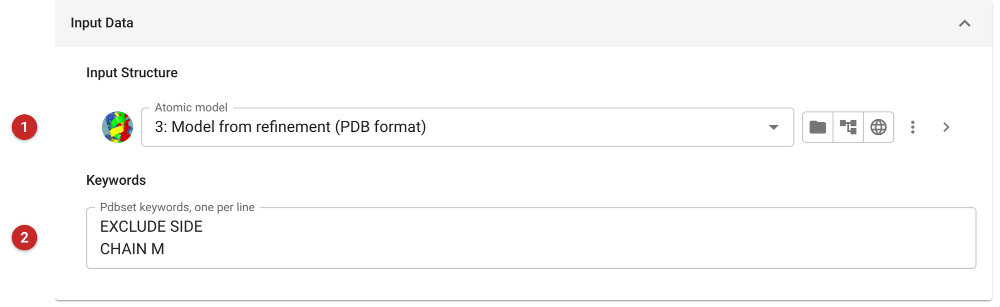
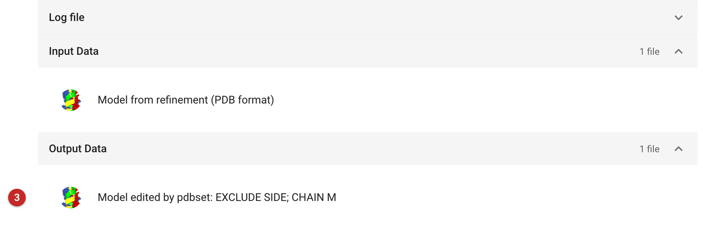

######################################
Scripted structure edits (Pdbset)
######################################

This task runs `Pdbset <https://www.ccp4.ac.uk/html/pdbset.html>`_ on a
model with keywords you write: the edits that are easier to state than to
make by hand, applied to the whole model at once. Among the common ones:

- ``EXCLUDE SIDE``: cut every residue back to its Cβ, making a
  poly-alanine model (the residue names are kept), and remove everything
  that is not protein: ligands and waters too. A search model for
  molecular replacement whose side chains are not to be trusted.
- ``EXCLUDE WATER``, ``EXCLUDE HYDROGENS``: remove waters, or hydrogens.
- ``CHAIN A B``: rename chain A to B; ``CHAIN B`` renames every chain.
- ``RENUMBER 1 CHAIN A``: renumber chain A from 1;
  ``RENUMBER INCREMENT 100 ...`` adds a constant.
- ``BFACTOR 30``: set every B-factor to 30.
- ``SHIFT FRACTIONAL 0 0.5 0``, ``ROTATE ...``, ``TRANSFORM ...``: move
  the model.
- ``CELL``, ``SPACEGROUP``: set the crystal information written out.

The keyword documentation lists the rest. For selecting part of a model,
:doc:`../coordinate_selector/index` is simpler; for editing by eye, use
Coot or Moorhen.

The pictures on this page come from the MDM2 project of the refinement
route: the refined model made into a poly-alanine model, with its chain
renamed M.

Input
=====

   Figure 1: Pdbset input

In Figure 1 the model **(1)** and the keywords **(2)**, one per line, applied
in the order Pdbset documents (chains are renamed before residues are
renumbered, for example).

Results
=======

   Figure 2: Pdbset output

In Figure 2 the edited model **(3)** is annotated with the keywords that made
it. The report lists only the files: open the model, or Pdbset's log, to see
the result. Here every residue keeps only its main chain and Cβ, the
ligand, sulphates and waters are gone, and chain A has become chain M.
