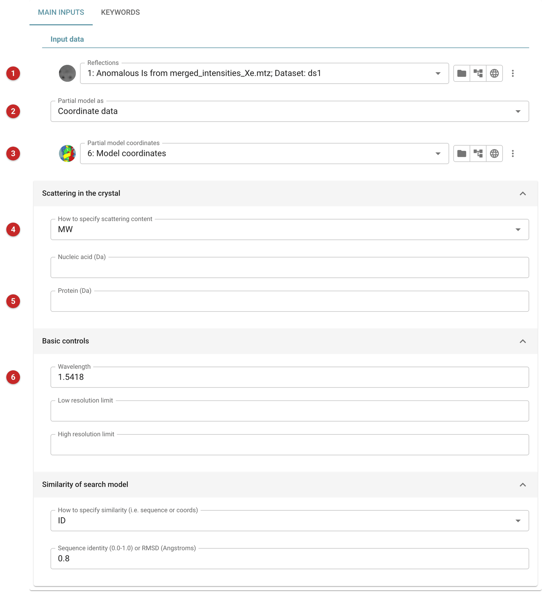
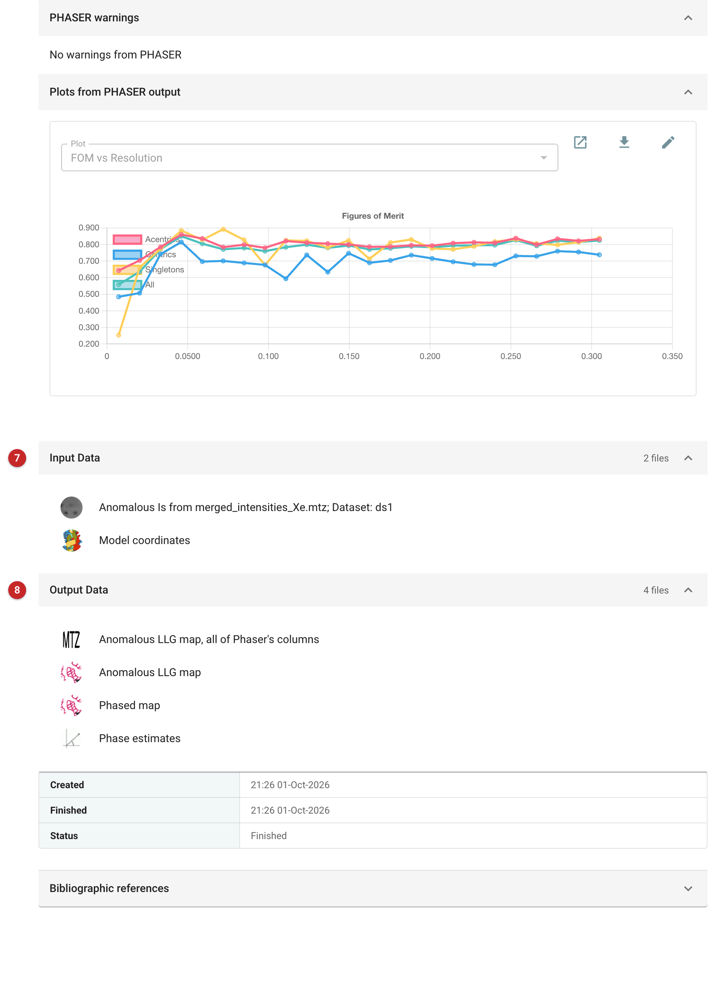

===================================================
Anomalous LLG map from coordinates (Phaser)
===================================================

The anomalous LLG map shows where the crystal scatters anomalously that
your model does not yet explain. Phaser takes the phases from a model you
already have, compares the anomalous differences in your data with what
that model predicts, and writes the log-likelihood gradient (LLG) of the
mismatch as a map. Peaks in it are places where adding an anomalous
scatterer would improve the fit: a heavy atom or ion you did not know was
there, a missing sulfur, a metal in a site you had built as water.

Use it when you have a *partial* structure and anomalous data, most often
after molecular replacement or after a SAD or SIRAS run has built a model,
and you want to find the anomalous scatterers the model lacks. It is not
the task for finding the substructure from nothing (use
Phaser EP, :doc:`../crank2/index` or :doc:`../shelx/index`), and it is not
a refinement: the model is not changed, and no coordinates of the
scatterers are fitted. You read the peaks off the map and decide.

The pictures on this page come from the GammaXe project: xenon-derivatised
crystals measured with copper radiation, and the model built by Crank2 from
them, which contains protein only (942 atoms: carbon, nitrogen, oxygen and
four sulfurs, no xenon).

Input
=====

   Figure 1: Anomalous LLG map input

The reflection data **(1)** must contain anomalous pairs: intensities or
amplitudes kept as separate I(+) and I(-) (here, the Xe derivative data from the
merging step). The partial model is given as coordinates, as a map, or not
at all **(2)**; here it is the model built by Crank2 **(3)**. Choose
*Coordinate data* or *Map coefficients* when you have phases from a model
or a density-modified map. With *No partial model* there are no phases to
compare against: use the Phaser EP task to find the substructure instead.

The **composition of the unit cell** **(4, 5)** tells Phaser how much
scattering matter is not accounted for by the partial model, so that its
contribution to the expected structure factor can be evaluated; give it as
molecular weights or from a sequence file. The map in the figures was made
without it. Resolution limits, the wavelength and
the expected similarity of the model to the true structure (sequence
identity or RMS error) are set below it; the wavelength matters for the
anomalous scattering factors (the default is copper, 1.5418 Å), so
set it for the beamline if you did not measure at the copper edge. A
resolution limit can reduce noise from missing low-resolution terms or
from poor phases at high resolution.

The **Keywords** tab takes Phaser keywords not otherwise offered; see the
`Phaser documentation <http://www.phaser.cimr.cam.ac.uk/index.php/Keywords>`__.

Results
=======

   Figure 2: Anomalous LLG map report

Phaser's report gives its warnings, the figure of merit against
resolution, and the files **(7, 8)**. The figure of merit for the SAD
refinement against the partial model was 0.79 here. The report does not
list peaks, and the task does not search the map for them: the result
is the map file *Anomalous LLG map* (and, beside it, the
phased map and the phase estimates), which you open in Moorhen or Coot
with *Model building - COOT* under **What next**, or from the file's own
menu.

Reading the map
---------------

Peak heights below are in multiples of the map's standard deviation
(sd). Here every peak above 4 sd was real, and they were of two kinds: a
peak with nothing of the model under it is a scatterer the model lacks,
and a peak on an atom of the model says that atom scatters anomalously.

In the GammaXe map the strongest peaks are 42.9 sd and 17.5 sd, each within
0.4 Å of a xenon site and in a pocket of the protein (3.4 Å from Ile90 CG2
for the stronger, 3.6 Å from Asn113 OD1 for the other): the xenon atoms
that the protein-only model lacks. Two weaker peaks, 6.3 sd on the SD of
Met106 and 4.5 sd on the SD of Met57, lie on sulfurs that are in the model.
So the map shows two kinds of thing: the scatterers the model is missing,
and the weaker anomalous signal of sulfur the model does have, since it
is an anomalous map and not a difference map against the model's own
anomalous scattering. Check what is under each peak before calling it a
heavy atom: a ligand or ion is as likely as the atom you were looking for.

What next
---------

Add the atoms at the strong peaks to the model as the right element
(:doc:`../coot_rebuild/index`, or Moorhen), then refine with anomalous
scattering switched on and re-run this task: the peaks you have explained
should vanish, and what is left is what you still have to find. Where the
new atoms improve the phases, run density modification
(:doc:`../parrot/index`) and rebuild.

Read more about Phaser's experimental phasing on the
`Phaser wiki <https://www.phaser.cimr.cam.ac.uk/index.php/Experimental_Phasing>`_.

**References**

`A.J. McCoy, R.W. Grosse-Kunstleve, P.D. Adams, M.D. Winn, L.C. Storoni & R.J. Read. "Phaser Crystallographic Software". J. Appl. Cryst. (2007). 40, 658-674 <https://doi.org/10.1107/S0021889807021206>`_
