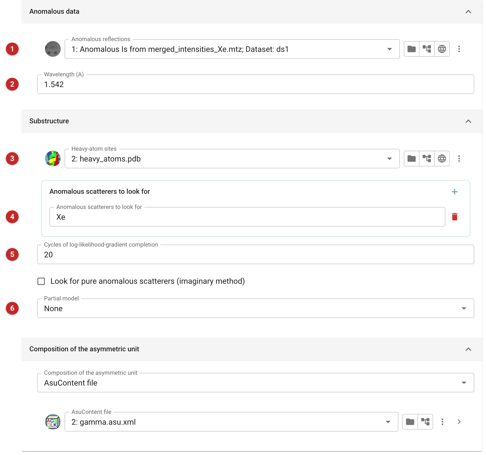
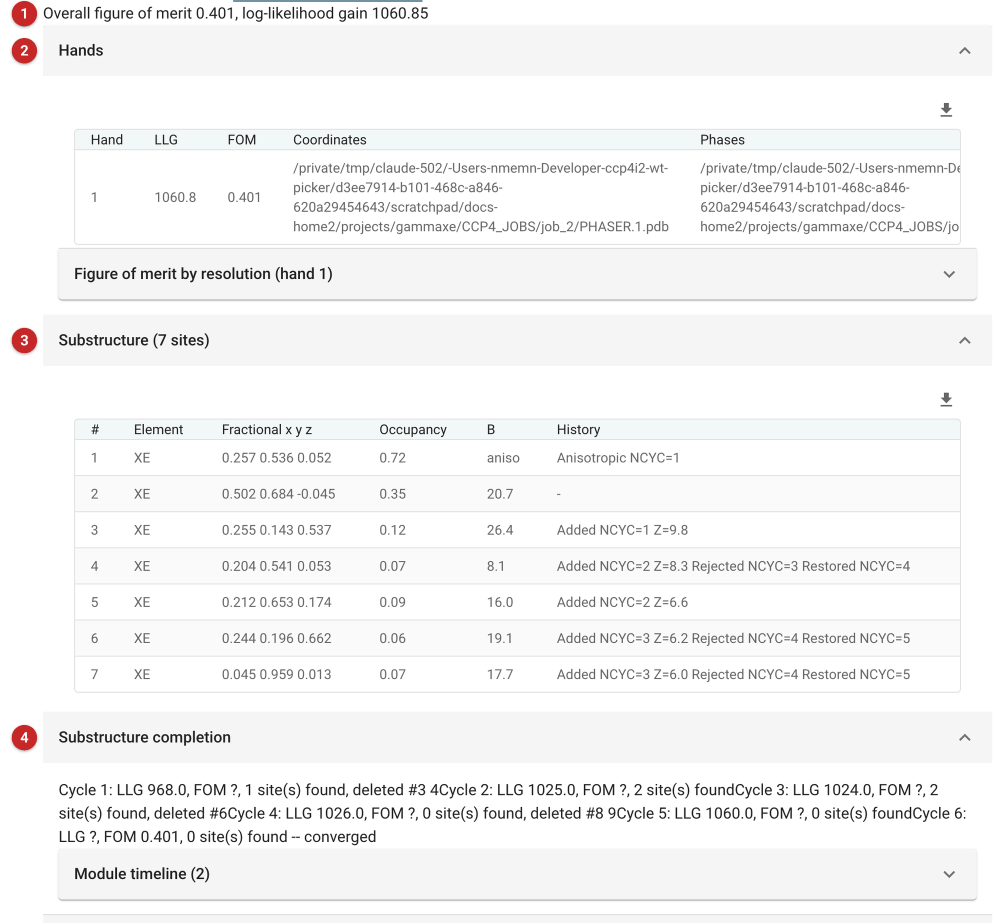

#######################################
SAD experimental phasing (Phaser)
#######################################

   This task runs Phaser once for single-wavelength anomalous diffraction
   (SAD) phasing: from anomalous data and the sites of the anomalous
   scatterers it calculates phases and completes the substructure from
   log-likelihood-gradient (LLG) maps. It stops there: to go on to density
   modification and model building for each hand in one task, use the
   *SAD Experimental Phasing pipeline*, whose page also explains the
   inputs and choosing the hand in more detail.

   Use this task to phase or complete a substructure and look at the
   result before deciding what to do next, or to phase one hand only.

   The pictures on this page come from the demo data that ships with
   CCP4i2: gamma-adaptin soaked in xenon, home-source data to 1.8 Å, with
   four xenon sites given.

.. note::

   This page is a draft, written from the task's interface, parameters
   and code. It has not yet been reviewed by Phaser's developers.

Input
=====

   |input|

   Give the anomalous data as Friedel pairs **(1)** and the wavelength
   **(2)**, which is taken from the data file when you choose it. Give the
   sites you have **(3)**, and name the anomalous scatterers to look for
   **(4)**. Substructure completion adds sites of these elements from the
   LLG maps and removes those that do not refine, for up to the number of
   cycles given **(5)**; one cycle is the default, and a few more are cheap
   and often worth it. A partial model of the protein **(6)** can be given
   as well as, or instead of, the sites.

   Give the composition of the asymmetric unit, the AU contents if you
   have them. By default only the hand of the sites as given is phased;
   the *Phaser parameters* tab can phase the other hand, or both.

Results
=======

   |report|

   The verdict **(1)** gives the overall figure of merit and the
   log-likelihood gain; the *Hands* table **(2)** gives each hand phased.
   The substructure **(3)** lists the sites after completion, with their
   occupancies, and *Substructure completion* **(4)** follows it cycle by
   cycle.

   Here, allowed 20 cycles, completion added sites in the first three
   cycles, removed those that did not refine, and converged after five,
   raising the LLG from 806 (the given sites, once refined) to 1060 and
   giving a figure of merit of 0.40. Of the seven sites, two are strong
   xenons and one weaker; of the four very weak ones, three sit on
   methionine sulfurs and one is a shoulder of the main xenon site.

   The phases (as Hendrickson-Lattman coefficients), the map and the sites
   are the outputs: density modification with Parrot usually comes next.

