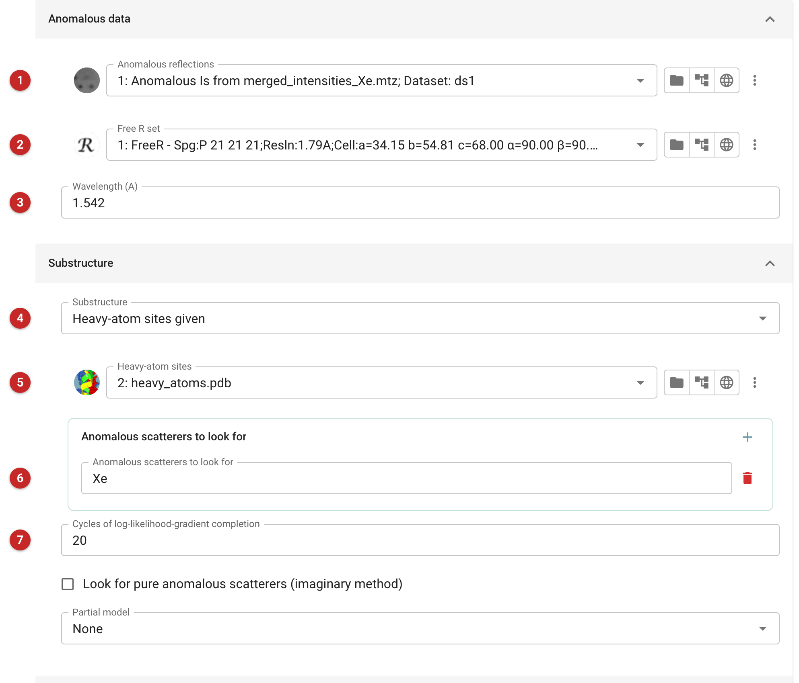
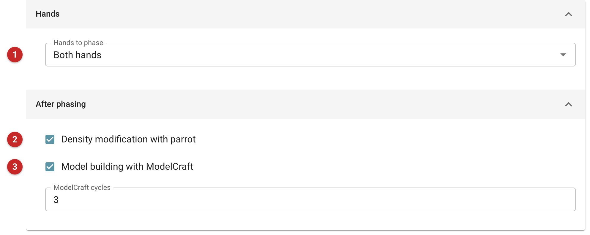
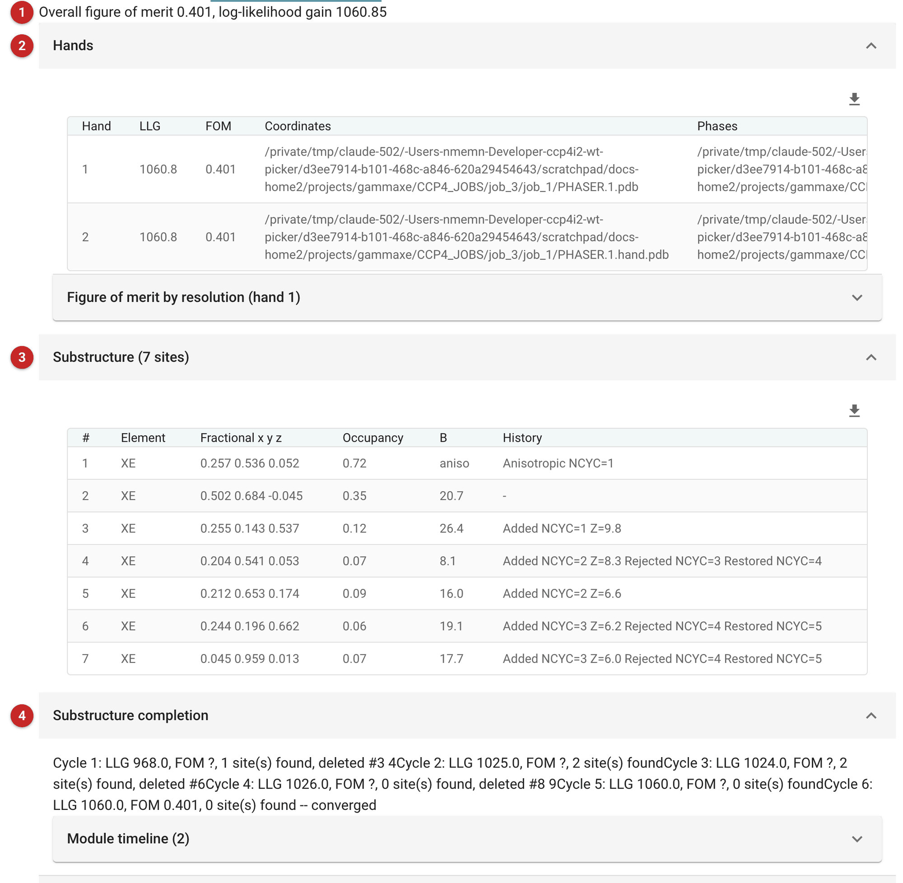
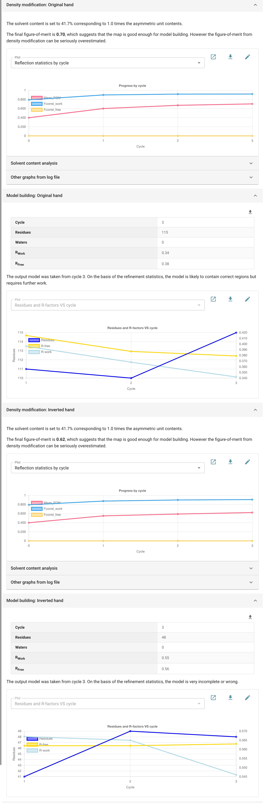

########################################
SAD phasing pipeline (Phaser)
########################################

   This task solves a structure by single-wavelength anomalous
   diffraction (SAD) with `Phaser <https://www.phaser.cimr.cam.ac.uk>`__:
   from anomalous data and the sites of the anomalous scatterers (the
   *substructure*) it calculates phases, completes the substructure from
   log-likelihood-gradient maps, and then, for each hand of the
   substructure, improves the phases by density modification with Parrot
   and can build a first model with ModelCraft. It is the usual choice for
   experimental phasing in CCP4i2 when the sites are known, or when SHELX
   is installed to find them.

   To phase or complete a substructure in a single Phaser run, and go on by
   hand, use *SAD Experimental Phasing - Phaser* instead.

   The pictures on this page come from the demo data that ships with
   CCP4i2: the ear domain of gamma-adaptin soaked in xenon, measured on a
   home source (Cu K-alpha, 1.54 Å) to 1.8 Å, with four xenon sites given.

.. note::

   This page is a draft, written from the task's interface, parameters
   and code, and from the pages for the Qt interface. It has not yet been
   reviewed by Phaser's developers.

Input
=====

   The task has three tabs: *Input data*, *Hands and follow-on*, and
   *Phaser parameters*.

   |input|

   Give the anomalous data **(1)**: intensities or amplitudes as Friedel
   pairs (I+ and I-, or F+ and F-). The Free R set **(2)** is used by the
   model building. The wavelength **(3)** sets the scatterers' anomalous
   scattering; it is taken from the data file when you choose it, but
   check it, and prefer the values from a fluorescence scan near an
   absorption edge (the *Phaser parameters* tab takes f' and f'' at the
   *Advanced* level).

   Say where the substructure comes from **(4)**: sites you already have
   **(5)**, for example from SHELXD or another program, or a search with
   SHELXC/D run by the task (this needs SHELX, which is licensed
   separately). A partial model of the protein can also be given; its
   phases are used to find the anomalous scatterers, but not its own
   anomalous signal.

   Name the anomalous scatterers to look for **(6)**: here Xe. Phaser adds
   sites of these elements from the log-likelihood-gradient maps, and
   removes sites that do not refine, for up to the number of cycles given
   **(7)**. Also look for pure anomalous scatterers to find sites of
   elements you did not name.

   Give the composition of the asymmetric unit, as for molecular
   replacement: the AU contents are best.

Hands and what follows
----------------------

   |hands|

   A substructure and its mirror image explain the anomalous differences
   equally well, so SAD phasing alone cannot tell which hand is right.
   By default both hands are phased **(1)**, and each is density-modified
   with Parrot **(2)**; ModelCraft can then build into each **(3)**, for a
   few quick cycles. The better hand is the one that gives the better map
   and, above all, the better model.

Results
=======

   |report|

   The verdict gives the overall figure of merit and the log-likelihood
   gain **(1)**. The figure of merit is the expected cosine of the phase
   error: above about 0.3 after SAD phasing is usually enough to go on.
   Here it is 0.40 (0.45 for acentric reflections), with an LLG of 1060.

   The *Hands* table **(2)** gives each hand's LLG and figure of merit:
   here identical, as they must be. The substructure **(3)** lists the
   sites after completion, with their occupancies, and *Substructure
   completion* **(4)** follows the cycles of adding and removing sites.
   Here completion found seven sites: two strong xenons (occupancies 0.72
   and 0.35), a weaker one, and four very weak ones: three sit on
   methionine sulfurs (the sequence has no cysteine) and the fourth is a
   shoulder of the main xenon site.

Choosing the hand
-----------------

   |report_hands|

   Density modification and model building for each hand follow. Here the
   original hand reaches a Parrot figure of merit of 0.70, the inverted
   one 0.62: a difference, but Parrot calls both maps good enough to
   build. The building decides it: in three ModelCraft cycles (set for this
   example; building is off by default, and one cycle when on) it builds
   115 of the 134 residues into the original hand's map (R-free 0.38) and
   only 48 into the inverted hand's (R-free 0.56), a model it calls very
   incomplete or wrong. The original hand is right.

   A density-modification figure of merit is not proof of a good map. When
   the hands are close, compare the maps themselves, and build.

