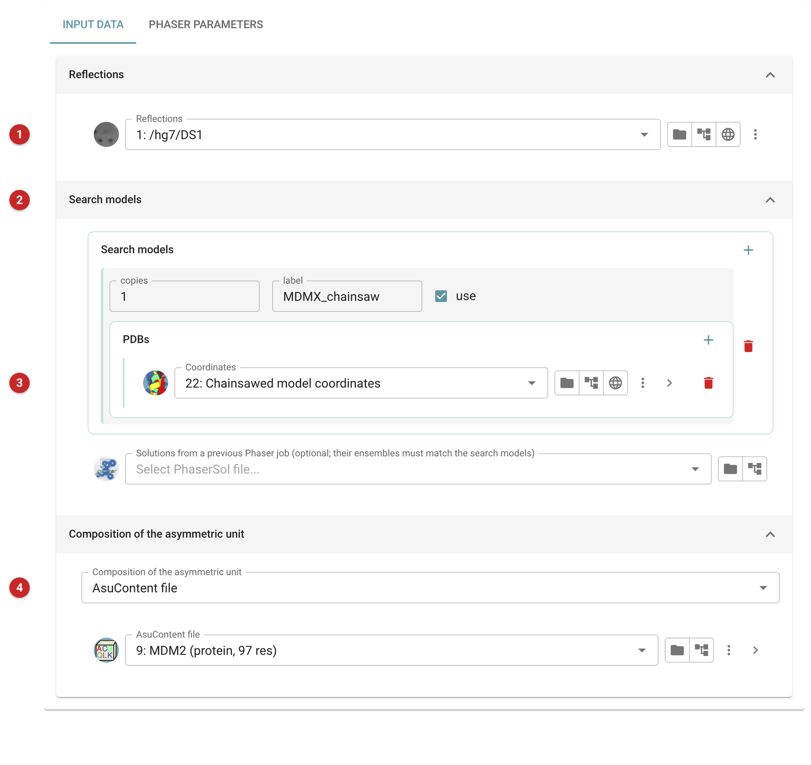
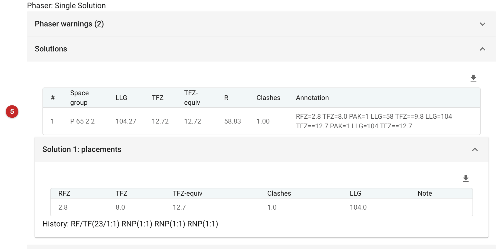
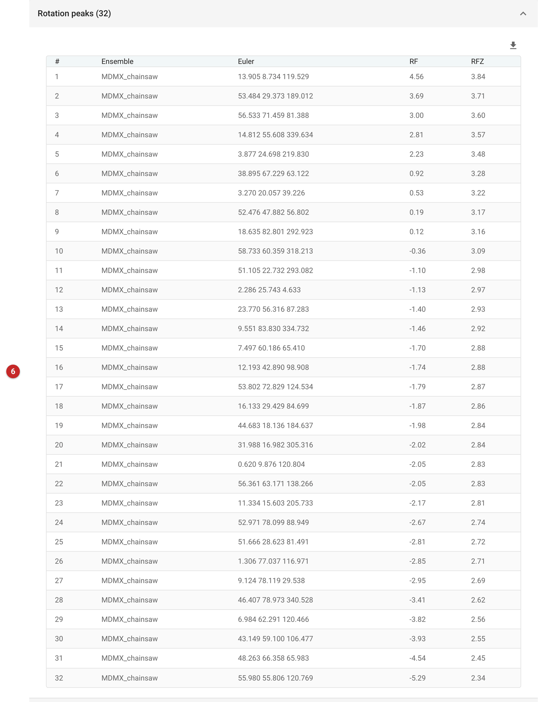
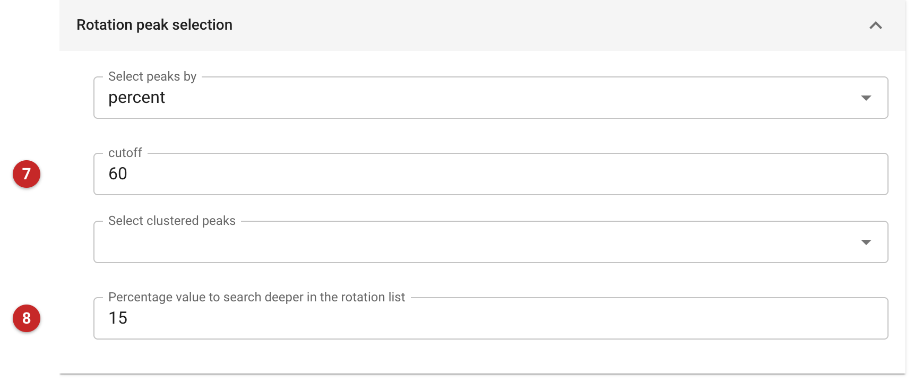
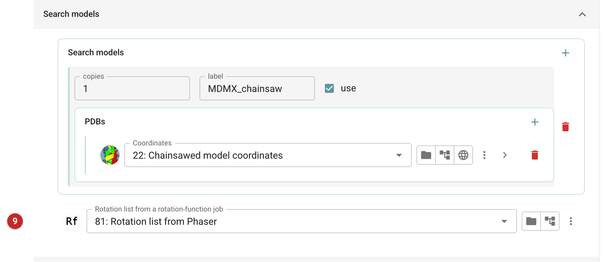
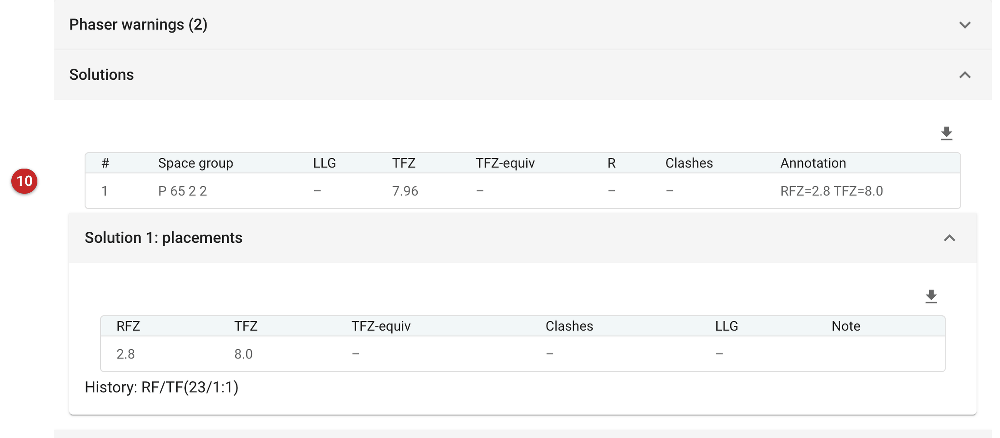
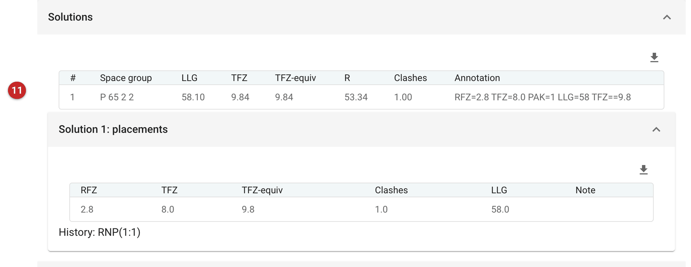

############################################################
Molecular replacement with Phaser, whole or in steps (PHIL)
############################################################

These five tasks run Phaser's molecular replacement through its own
parameter interface (PHIL), all with the same input:

- **Molecular Replacement - Phaser (PHIL)** runs the whole search: the
  rotation function, the translation function, the packing test and
  refinement, in one job.
- **Rotation function**, **Translation function**, **Packing test** and
  **Rigid-body refinement of MR solutions** run one of those steps each,
  taking the previous step's output.

Use the whole search first. It is what Phaser is tuned for, and on this
page it finds the answer the steps miss with their defaults. Run the
steps when you want to see or steer what happens between them: how
strong the rotation function's signal is, which orientations go forward,
whether the translation function's best solution packs, or to refine
solutions from elsewhere. For a single search model with nothing to
steer, :doc:`../phaser_simple_phil/index` is simpler.

The pictures on this page come from the MDM2 project of the refinement
route. The search model is the Chainsaw model of MDMX
(:doc:`../chainsaw/index`): 57% identical to MDM2, with the side chains
that differ cut back. That is a hard enough case for the difference
between the whole search and the steps to show.

Input
=====

   Figure 1: Phaser MR input (the whole search)

The reflections **(1)**. The search models **(2)**: each is an ensemble,
with a label, the number of copies to look for, and its coordinates
**(3)**. The steps after the rotation function work on the solutions
they are given, so for them the number of copies does not matter. The
composition of the asymmetric unit **(4)**, here from the AU contents
defined for MDM2.

Results of the whole search
===========================

   Figure 2: The whole search's solutions

The solutions **(5)**: here one, in P6\ :sub:`5`\ 22, with LLG 104 and a
TFZ-equivalent of 12.7. Phaser tests all six space groups of the data's
point group, 622, and reports the one the solution was found in. Phaser's
guide to the TFZ of the last component placed: above 8, almost certainly
correct; 7 to 8, probably; 6 to 7, possibly; below that, look for other
evidence. The LLG should rise as components are placed and refined.

Taking it in steps
==================

The rotation function
---------------------

   Figure 3: The rotation function's peaks

The rotation function scores orientations of the search model and keeps
the peaks **(6)**, with their RF score and Z-score (RFZ). For a model this
distant, no peak stands out: the top RFZ is 3.8, and the right
orientation is not the top one. That is normal. The rotation function is
the weakest step, and the translation function is what tells the right
orientation from the rest.

How many peaks go forward decides whether the right one is among them.
Run with its defaults, the rotation function keeps those within 75% of
the top: 12 orientations here. The right one is not among them, and the
steps that follow find nothing (their best LLG was 12, in the wrong space
group). The whole search keeps those within 60% and searches a further
15% down (its *deep search*): 33 orientations, of which the 23rd led to
the solution.

   Figure 4: Rotation peak selection (Phaser parameters, expert level *All*)

To go as deep as the whole search, set the rotation peak selection under
*Phaser parameters*, with the expert level at *All*: the cutoff **(7)**
to 60 (per cent of the top peak), and the percentage to search deeper
**(8)** to 15. These are the
settings used for the run on this page, which kept 32 orientations.

The translation function
------------------------

   Figure 5: Translation function input

The translation function takes the rotation list **(9)** and places each
orientation in the cell, in each candidate space group.

   Figure 6: Translation function solutions

Its solutions **(10)** carry the translation function's Z-score, TFZ. A
score this step did not calculate is shown as "–": the LLG, the
TFZ-equivalent and R come with refinement, and clashes with the packing
test. Here one solution survives, in P6\ :sub:`5`\ 22 with TFZ 8.0, from
the 23rd orientation (the history *RF/TF(23/1:1)*). The packing test
keeps it: it has one clash.

Rigid-body refinement
---------------------

   Figure 7: The refined solution

Refinement scores the solution by its LLG **(11)**: 58, with a
TFZ-equivalent of 9.8. It is the same placement as the whole search's
(the two models agree to 0.25 Å r.m.s.d. over their Cα atoms), but the
whole search ends by refining at the full resolution of the data, 1.35 Å,
and this step refined at 3.85 Å, the limit the solutions came with. An
LLG depends on the data it is calculated from, so compare LLGs only from
the same resolution.

Next
====

Refine the placed model (:doc:`../prosmart_refmac/index`, after
:doc:`../shift_field/index` for a model this distant), and rebuild what
the search model lacked.
