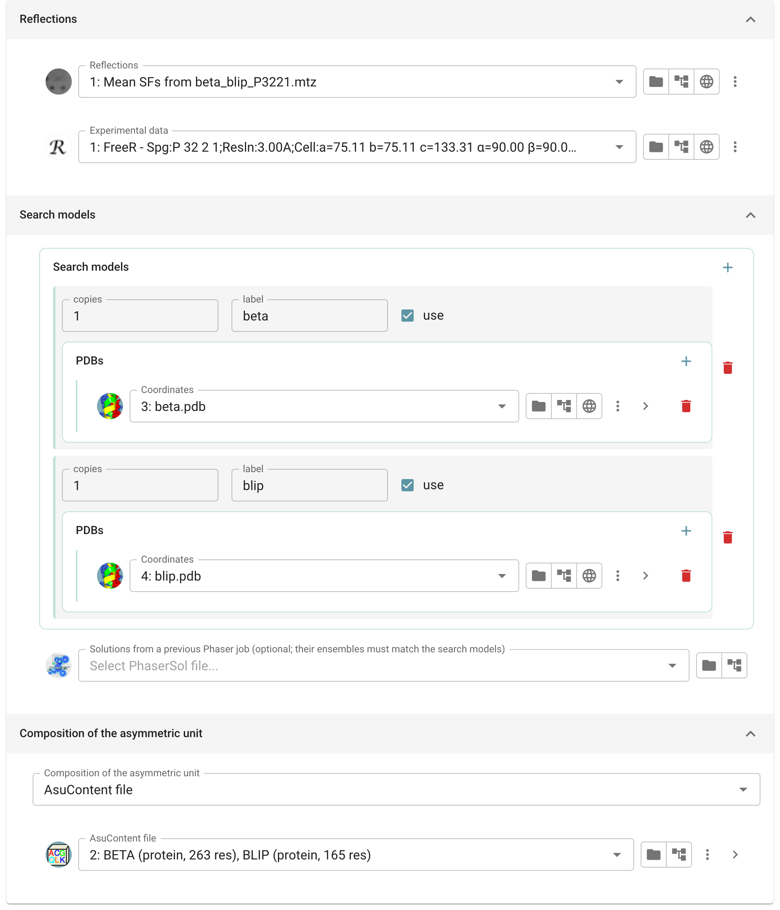
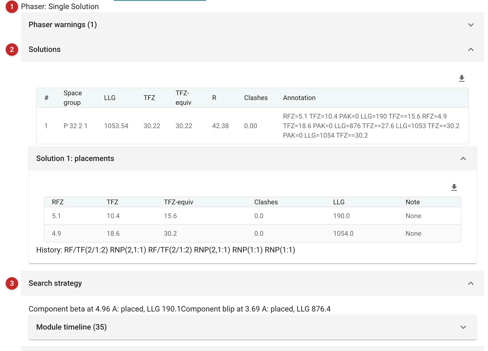

###############################################
Expert molecular replacement (Phaser)
###############################################

   This task solves a structure by molecular replacement with `Phaser
   <https://www.phaser.cimr.cam.ac.uk>`__ when the basic task is not
   enough: a complex of different molecules, several copies to be placed
   in turn, components each described by an ensemble of superimposed
   models, or a search continued from an earlier solution. The solution
   can then be refined and matched to a reference structure.

   The pictures on this page come from the demo data that ships with
   CCP4i2: the beta-lactamase / BLIP complex, both components searched for
   in one run.

.. note::

   This page is a draft, written from the task's interface, parameters
   and code, and from the page for the Qt interface. It has not yet been
   reviewed by Phaser's developers.

Input
=====

   The task has three tabs: *Input data*, *After Phaser* and *Phaser
   parameters*.

   |input|

   Give the reflections **(1)** and the Free R set **(2)**. Phaser does not
   use the Free R set; the refinement after it does, so give the one you
   use for this crystal.

Search models
-------------

   Each entry in the list is one component of the asymmetric unit:
   here beta-lactamase and BLIP. For each, give

   - a one-word **label**, used in the report to say what was placed;
   - how many **copies** of it to search for **(3)**;
   - its **models**: one structure, or several superimposed structures of
     the same component making an *ensemble*. Superimpose them yourself
     first; Phaser does not. An ensemble lets Phaser weight what the
     models agree on, and is often better than any one of them.
   - for each model, its **similarity** to your molecule, as sequence
     identity or expected RMS deviation. Phaser's likelihood needs it; a
     rough value is better than none (0.9 identity is a common guess for a
     model of the same protein). The *Identity* and *Rms* fields are behind
     the arrow at the end of the model's row; they open by themselves only
     when neither is set.

   Use each model's atom selection to leave out what is unlikely to match,
   such as flexible termini and loops. Components are searched for in the
   order Phaser judges best, largest expected signal first, unless you set
   otherwise. To continue from an earlier run, for example with part of the
   complex already placed, give its solution **(4)**.

Composition
-----------

   Phaser works best when it knows the total scattering in the asymmetric
   unit **(5)**: give the AU contents, sequences with their numbers of
   copies, or a molecular weight. Without any, Phaser assumes 50% solvent.
   Give the whole contents, including molecules you are not searching
   for: they still scatter. The report says how many copies of the given
   composition best fit the cell.

After Phaser, and Phaser's parameters
-------------------------------------

   By default the solution is refined with shift-field refinement
   (Sheetbend) and then REFMAC, and it can be moved to match a reference
   structure's origin and symmetry. The *Phaser parameters* tab holds
   Phaser's own settings, by expert level: the resolution limits, the
   packing test, the handling of translational NCS and alternative space
   groups, and much else. Phaser chooses the resolution to search at from
   the signal it expects, and tries the alternative space groups of the
   point group by default; data reduction usually settles the point group
   but not always the space group.

Results
=======

   |report|

   Phaser's verdict comes first **(1)**, then the solutions **(2)**: the
   space group, the log-likelihood gain (LLG), the translation function
   Z-score (TFZ) and its full-resolution equivalent, and clashes. Each
   solution can be opened to show its placements, one per component copy,
   each with the TFZ of its own search. That search TFZ is the one Phaser's
   rule of thumb is for: 8 or more is usually a solution. The solution's
   TFZ, after refinement of all placements, is always higher, so a
   borderline search can look clear-cut there.

   Here beta-lactamase is placed first (search TFZ 10.4) and BLIP second
   (18.6), for an LLG of 1054: more than twice the 474 beta-lactamase
   reached when searched for on its own. *Search strategy* **(3)** follows each component through the
   search. After REFMAC the model has R 0.30 and R-free 0.34 at 3.0 Å: a
   good starting point for model building.

