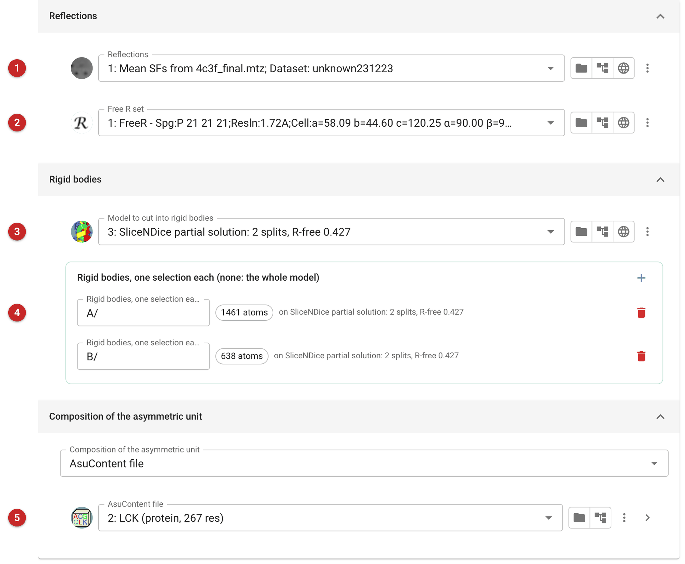
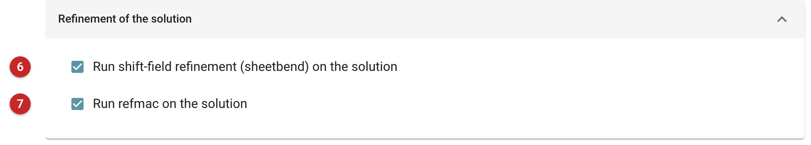
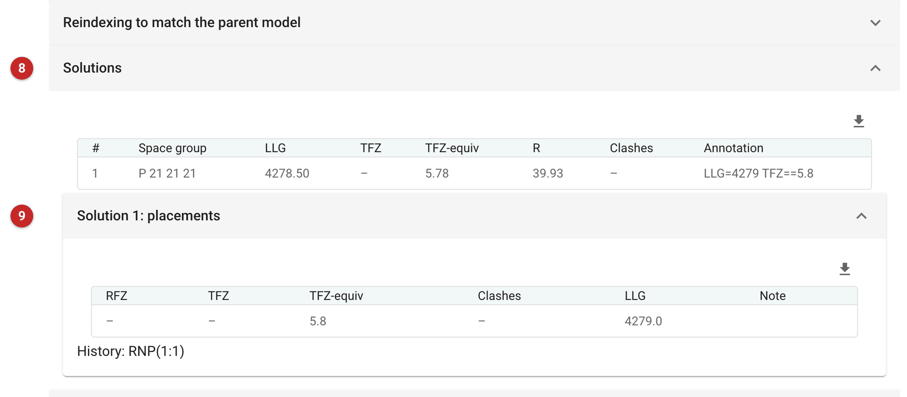
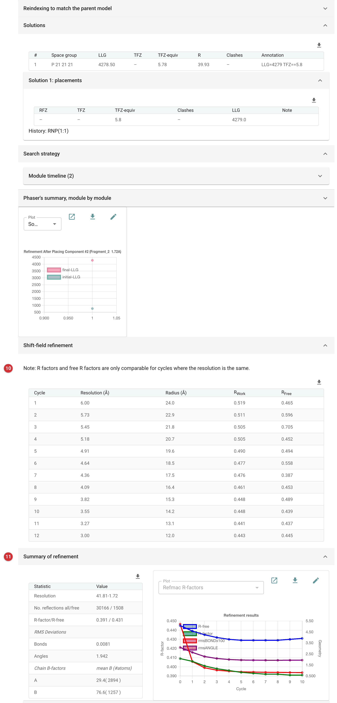

#############################################
Rigid-body refinement (Phaser)
#############################################

   This task refines a model that is already placed in the crystal by
   treating pieces of it as rigid bodies, using the rigid-body mode of
   `Phaser <https://www.phaser.cimr.cam.ac.uk>`__ (the task's name in the
   chooser is *Rigid-body refinement - Phaser*). You cut the model
   into bodies with atom selections, one per body; Phaser moves and rotates
   each body to maximise the log-likelihood gain (LLG), and the result can
   then be taken through shift-field refinement (Sheetbend) and REFMAC.

   Use it when a model was placed correctly as one body but its parts have
   moved relative to each other: the domains or lobes of a protein, or
   copies of a molecule that differ in hinge angle. Phaser then has far
   fewer parameters to find than in a full refinement. It is a refinement, not a search: the model must
   already be in the right place, from molecular replacement
   (:doc:`../phaser_simple_phil/index`) or from :doc:`../slicendice/index`.
   If the model is not placed, use one of those first. If the pieces are
   already where they should be, rigid-body refinement adds nothing: see
   *Results*.

.. note::

   This page is a draft, written from the task's interface, parameters
   and code. It has not yet been reviewed by Phaser's developers. There is
   no earlier page for this task: it is new in this help.

   The pictures on this page come from the Lck kinase project of the
   SliceNDice route. SliceNDice (:doc:`../slicendice/index`) placed the
   kinase domain after splitting it into two pieces, the C-lobe (chain A,
   residues 288-506) and the N-lobe (chain B, residues 225-319), and
   refined them as separate bodies to an R-free of 0.427. Here that
   placement is cut into the same two bodies and handed to Phaser. The data
   reach 1.72 Å, in space group P2\ :sub:`1`\ 2\ :sub:`1`\ 2\ :sub:`1`.

Input
=====

   The task has three tabs: *Input data*, *After Phaser* and *Phaser
   parameters*.

   |input|

   Give the reflections **(1)**, and the Free R set **(2)** the model was
   refined against: the refinement after Phaser reports R-free on it, and
   a new free set would make that number meaningless for a model already
   refined (see :doc:`../pairef/index`).

   Give the model to cut **(3)** and the rigid bodies **(4)**, one atom
   selection each. Look at the atom count shown under each selection, to
   be sure each matches what you meant: here
   ``A/`` is 1461 atoms and ``B/`` is 638. With no selection at all, the
   whole model is one body, which only repositions it as a whole. The bodies
   should be pieces you believe move as units: a domain, a lobe, a
   subunit; not arbitrary slices of one fold.

   Say what the asymmetric unit contains **(5)**, as for the other Phaser
   tasks: the AU contents file from *Define AU contents* is the most
   informative, a molecular weight or solvent fraction will do, and
   without any Phaser assumes 50% solvent. Give the whole contents even
   when the model holds only part of them.

   |after|

   After Phaser the solution is refined by default, first by shift-field
   refinement **(6)**, then by REFMAC **(7)**. Switch either off to stop
   after the rigid-body step. The *Phaser parameters* tab holds Phaser's
   own settings by expert level; most runs need none.

Results
=======

   |report|

   Phaser's solutions table **(8)** has one row for the refined model:
   space group, LLG, the R-factor and the translation Z-score equivalent
   (TFZ-equiv). The placements below it **(9)** repeat the LLG and TFZ-equiv for each body
   as a group. The TFZ column of the first table is empty: this is not a
   search, so there is no
   translation function to score. Judge the result by how the LLG changed,
   and by the R-free after refinement, not by a TFZ.

   In this run the LLG went from 4278.5 to 4279.0, and the TFZ-equiv is
   5.8: essentially no change, and the number says little by itself. This
   is the expected outcome here, not a failure. SliceNDice had already
   refined these two lobes as rigid bodies, so Phaser found them where they
   should be. **Rigid-body refinement helps a model placed as one body
   whose parts have since moved; on a solution that was already refined as
   rigid bodies it adds nothing.** Before running it, ask which of the two
   you have; and after it, compare the LLG with the LLG of the model you
   gave: a large rise says the bodies were out of place; here it rose by
   0.5, and they were not.

   |refmac|

   The rest of the report shows what the later steps did. Shift-field
   refinement **(10)**, run to 3 Å resolution, ended with R/R-free
   0.443/0.445, which on its own is poor. REFMAC then refined the model
   over ten cycles **(11)**: R-free fell from 0.445 at cycle 0 to 0.431 at cycle 10, and
   R from 0.409 to 0.391. The R-free curve flattens after about cycle 5 and creeps up slightly by
   cycle 10, which says ten cycles were more than this model needed. The
   bond-length RMS deviation falls from
   0.052 to 0.008 Å over the same cycles, so most of the early gain is the
   geometry settling. The Free R set carries through, so 0.431 can be compared with
   the 0.427 SliceNDice reached: it is no better. A further round of
   refinement did not improve a model that had already been refined, and
   an R-free of 0.43 at 1.72 Å means the remaining error is in the model
   itself, to be rebuilt, not in the placement of its lobes.

   The pipeline's Pointless step prints "High resolution limit
   reset to 1.80". The data used keep their full 1.72 Å; the message is
   not a cut, and the reflections passed on keep their full range.

   The outputs are the positioned coordinates, the shift-field model, the
   refined model, and the maps and phases of the Phaser solution and of
   the refinement. The *What next* buttons at the foot of the report lead to
   further refinement, ModelCraft and Coot.

   **Related tasks.** :doc:`../slicendice/index` and
   :doc:`../phaser_simple_phil/index` place the model; :doc:`../shift_field/index`
   is the shift-field step run on its own, and :doc:`../prosmart_refmac/index`
   is refinement with REFMAC, which has its own rigid-body option.

