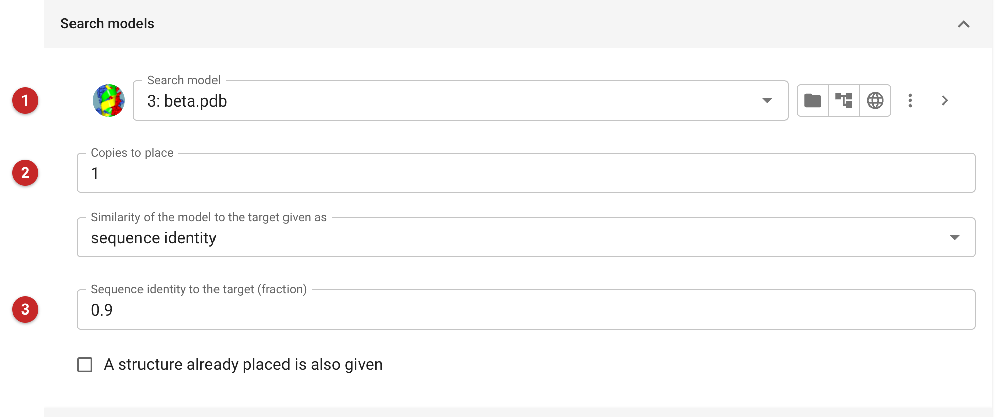
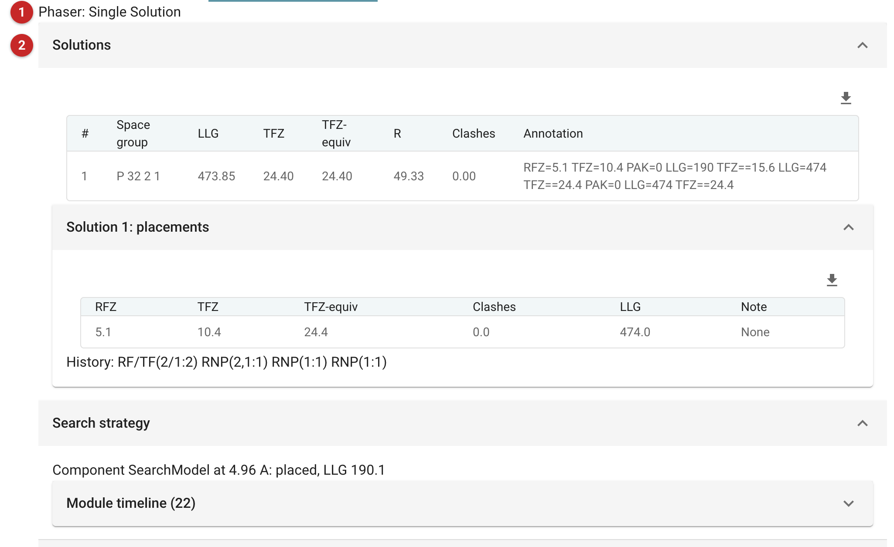

#####################################
Basic molecular replacement (Phaser)
#####################################

   This task places one search model, as many copies of it as you ask
   for, in the crystal by molecular replacement with `Phaser
   <https://www.phaser.cimr.cam.ac.uk>`__, then refines the solution. It
   is the quickest route when the asymmetric unit holds one kind of
   molecule and you have a model of it. For a complex of different
   molecules, for ensembles of several models, or to search in steps, use
   *Expert Molecular Replacement - Phaser*.

   The pictures on this page come from the demo data that ships with
   CCP4i2: the beta-lactamase / BLIP complex, searched here with
   beta-lactamase alone. That finds beta-lactamase, but half the complex
   is left to find: see *Results*.

.. note::

   This page is a draft, written from the task's interface, parameters
   and code. It has not yet been reviewed by Phaser's developers.

Input
=====

   The task has three tabs: *Input data*, *After Phaser* and *Phaser
   parameters*.

   |input|

   Give the reflections **(1)**; intensities are used when you have them.
   A Free R set **(2)** is not used by Phaser, but by the refinement after
   it, so give the one you use for this crystal.

   The search model **(3)** is the model to place. Use its atom selection
   to leave out what is unlikely to be in the same conformation in your
   crystal, such as flexible termini and loops, or other chains of the
   file you downloaded. Say how many copies to place **(4)**. Phaser needs
   to know how similar the model is to your molecule **(5)**, as sequence
   identity or as an expected RMS deviation: a homologous model at 40%
   identity is placed differently from a model of the same protein. If a
   structure already placed is to be kept, give it too; it is not
   searched for.

   Phaser works best when it knows how much the crystal scatters: say
   what the asymmetric unit contains **(6)**. The AU contents from *Define
   AU contents* are the most informative; a molecular weight or a solvent
   fraction will do, and without any Phaser assumes 50% solvent. Give the
   whole contents even when the model is only part of it, as here: the
   AU contents hold beta-lactamase and BLIP, and the search model is
   beta-lactamase.

   After Phaser, the solution is refined by default, with shift-field
   refinement (Sheetbend) and then REFMAC, and can be moved to match a
   reference structure's origin and symmetry. The *Phaser parameters* tab
   holds Phaser's own settings, by expert level; most runs need none of
   them. The resolution limits are at the *Advanced* level. By default
   Phaser also tries the alternative space groups of the point group, and
   the data are reindexed if the solution is in another.

Results
=======

   |report|

   Phaser's verdict comes first **(1)**: here *Single Solution*. The
   solutions table **(2)** gives, for each solution, the space group, the
   log-likelihood gain (LLG), the translation function Z-score (TFZ) and
   its equivalent at full resolution, and the number of clashes. A TFZ of
   8 or more is usually a solution; the LLG measures how much better the
   placed model explains the data than none.

   Here beta-lactamase is placed with a TFZ of 10.4, and the LLG is 474.
   The solution is clear, but it is not complete: the AU contents say BLIP
   is there too. Searching for both with the expert task places BLIP as
   well (TFZ 18.6), and the LLG rises to 1054. When the LLG is well below
   what the contents lead you to expect, look for what is missing.

   *Search strategy* follows each component's search, and the refinement
   after Phaser is summarised below it. The positioned model, the maps
   and the refined model are the outputs.

