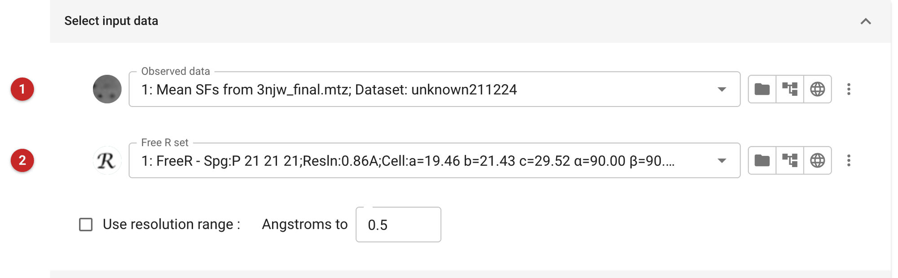
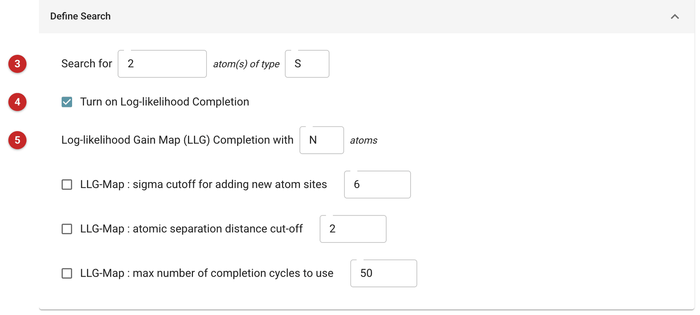
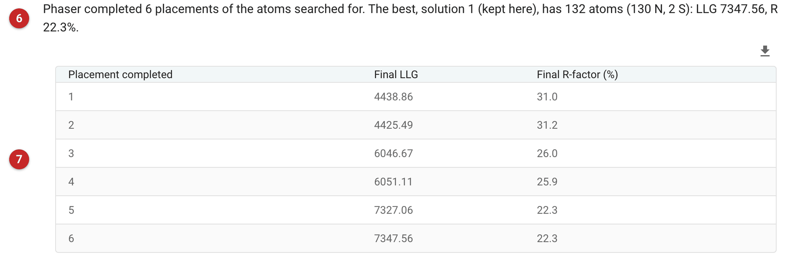

#################################
Single Atom Molecular Replacement
#################################

At atomic resolution a handful of well-placed atoms can be enough to phase
a whole structure. This task treats a few single atoms as if they were a
molecular-replacement search model, then lets Phaser complete the rest of the
structure itself, atom by atom, from log-likelihood-gain (LLG) maps. It
combines the MR and SAD phasing modes of Phaser, but uses neither a model
of the protein nor anomalous differences: only the mean structure
factors, and the knowledge of what is in the asymmetric unit.

Use it when the data are very high resolution and the structure contains
atoms heavier than the average: sulfurs (cysteines, methionines), metals,
or any other scatterer that stands out in the Patterson map. Phaser's
documentation says only that single-atom MR is possible with high-resolution
data, without a limit; the example below used data to 0.86 Å. If you have a search model, use ordinary
molecular replacement (:doc:`../phaser_pipeline/index`); if you have
anomalous differences from a derivative or a native crystal, use the
experimental phasing tasks; if you already have phases and want to improve
them, density modification (:doc:`ACORN <../acorn/index>`) is the next step,
and is where this task's output leads.

The pictures on this page come from the LassoPeptide project: PDB entry
3njw, the first high-resolution structure of a lasso peptide, 19 residues
(GLPWGCPSDIPGWNTPWAC) with two cysteines, space group P2\ :sub:`1`\ 2\ :sub:`1`\ 2\ :sub:`1`,
10795 reflections to 0.86 Å, with the data and free set from PDB-REDO.

Input
=====

   Figure 1: Input data

The observed data **(1)** and the free-R set **(2)**; a resolution range can
be set if you want to limit the data used. The contents of the asymmetric
unit are given in the next section, *Composition*: here from an AU contents
file (made with the *Define AU contents* task) holding the one peptide, or
alternatively from molecular weights. Phaser needs to know what is in the
cell to judge how many atoms there are to find.

   Figure 2: Define search

The search **(3)** is for a number of atoms of one type: here 2 atoms of
type S, the two cysteine sulfurs. Choose the heaviest type present, and the
number you expect. Log-likelihood completion **(4)** is on by default: after
the atoms are placed, Phaser adds atoms at peaks in LLG maps **(5)** until
the structure is complete. The completion atoms are always placed as one
element, N by default, whatever they really are; the carbons and oxygens in
the output are N atoms at the right positions, and the element names are
not to be trusted. The optional limits below set a sigma cutoff for new
atom sites, the minimum separation between atoms, and the maximum number of
completion cycles. The *Expert Settings* tab holds Phaser's packing and
translation-search criteria, which seldom need changing.

Results
=======

   Figure 3: Report

The report begins with the result **(6)**. Phaser found six candidate
placements of the two sulfurs and completed each one; it ranks its
solutions by LLG, and CCP4i2 keeps solution 1, the best. Here that solution
has 132 atoms (the 2 sulfurs and 130 N completion atoms), LLG 7347.56 and
R-factor 22.3%. The table **(7)** gives the final LLG and R-factor of each
completed placement, in the order Phaser completed them. Here two reached
nearly the same result (LLG 7327 and 7348, both R 22.3%), and the other
four less (LLG 4425 to 6051, R 25.9% to 31.2%).

Below are Phaser's own text and graphs for all six solutions. The outputs
are the coordinates (the placed atoms), map coefficients, phases as
Hendrickson-Lattman coefficients, and the data with phases and map
coefficients, each annotated with the atom count and R-factor, e.g.
"Single-atom MR, 132 atoms, R 22.3%: phases (HL coefficients)".

**What to do next.** The coordinates are an atomic scaffold, not a
sequence-correct model. The phases are what is valuable. In this project
they went to ACORN, which raised its correlation coefficient from 0.552 in
cycle 1 to 0.690 in cycle 4, giving a map in which the peptide can be
traced and built.

**Reference**

`McCoy AJ, Oeffner RD, Wrobel AG, Ojala JRM, Tryggvason K, Lohkamp B, Read RJ (2017) Ab initio solution of macromolecular crystal structures without direct methods. Proc Natl Acad Sci U S A 114:3637-3641 <https://doi.org/10.1073/pnas.1701640114>`_

`Phaser wiki: Single Atom Molecular Replacement <https://www.phaser.cimr.cam.ac.uk/index.php/Single_Atom_Molecular_Replacement>`_
