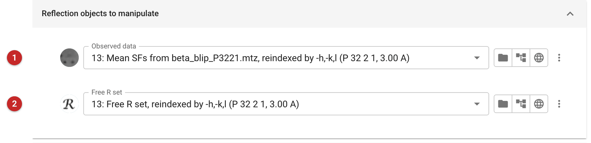
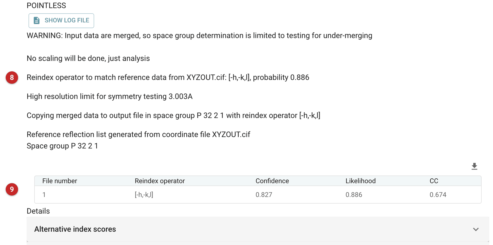
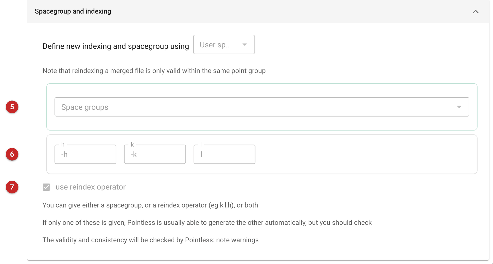

############################
Reindex or change spacegroup
############################

This task changes how a set of merged reflection data is indexed, or its
space group, without changing the data. It reindexes a set of observations,
and optionally the Free-R flags that go with them, either to match a
reference (another data set, map coefficients or a model) or by an operator
you give. It can also expand the data to P1, remove lattice absences, or
just analyse the symmetry of the data. It runs Pointless.

When to use it
==============

* **Making two data sets consistent.** When a second crystal of the same
  protein (another ligand soak, a different crystal form with similar
  packing) is processed independently, its indices may follow a different
  convention from the first. Before comparing, merging, calculating
  difference maps or refining the new data against the old model, reindex
  it to match the first data, or the model.
* **Changing space group within a point group**, for example P 2\ :sub:`1`
  2\ :sub:`1` 2\ :sub:`1` to P 2\ :sub:`1` 2\ :sub:`1` 2, when a symmetry
  present in the data was over- or under-assigned. If the *point group* has
  changed, repeat the data reduction instead, to obtain a correct list of
  unique reflections: illegal changes will fail.
* **Expanding to P1**, or **removing lattice absences** (below), for
  checking and special cases.

The alternative-indexing problem
================================

Some space groups allow the same crystal to be indexed in more than one way
that the symmetry of the point group cannot relate: the cell and the space
group are identical, but a reflection called *h,k,l* in one indexing is
called something else in the other. In P 3\ :sub:`2` 2 1, for example, the
two indexings are *h,k,l* and *-h,-k,l* (Pointless lists these as the
alternative indexings). Which one a program chooses is arbitrary, so two
data sets from the same kind of crystal can disagree.

This matters because everything downstream assumes the indices agree. A
model refined against data indexed one way will give a poor R factor and
unusable maps against data indexed the other. Difference maps between a
soak and its native, or the electron density for a ligand, are noise if the
two sets are not indexed alike. And a **Free-R set** must follow its
data: if the data are reindexed and the flags are not, the free reflections
are no longer the same ones the model was refined against. This task
reindexes the Free-R set together with the data, so give it both.

The pictures on this page come from the BetaBlip project. The data were
first reindexed deliberately by *-h,-k,l*, to stand for a second crystal
processed independently and indexed the other way; the reindexed data were
then matched back to the ModelCraft model of the first.

Input
=====

   Figure 1: the reflections to reindex

The observed data **(1)** are required (Figure 1); the Free-R set **(2)**, if
you have one, is reindexed in step with them.

   Figure 2: the reference, here a coordinate file

The menu **(3)** in Figure 2 says what to do. Choices that need a reference
show a file selector for it; here the model **(4)**.

#. **Observed data reference**: another observed-data file. The input is
   reindexed to agree with it.
#. **Calculated data reference**: a reflection file of calculated
   structure factors, used as reference data like observed data.
#. **2FoFc coefficient reference**: map coefficients, for example from
   Refmac.
#. **Coordinate reference** (the default): a model. Pointless calculates
   intensities from it and reindexes the data to match.
#. **User specified spacegroup and reindex**: no reference; you give the
   new space group, the operator, or both (below).
#. **Remove lattice absences**: below.
#. **Just analyse data symmetry**: no output file is produced. Useful after
   an explicit reindex, to check the result.
#. **Expand to space group P1**: expands the data to P1.

A model is usually the best reference when you will refine against the
data, since it fixes the indexing to the one the model uses; a data
reference suits comparing two data sets for which no model exists yet.

Results
=======

   Figure 3: the report of the match to the model

The report (Figure 3) states the operator chosen **(8)** and its probability,
and tabulates the match **(9)**: the operator, a confidence, a likelihood and
the correlation coefficient (CC) between the observed intensities and those
calculated from the reference. Below it, the fold *Alternative index
scores* (closed in the picture) lists every possible operator with its own
likelihood and CC.

Here the possible operators were *h,k,l* and *-h,-k,l*. Pointless chose
*-h,-k,l*, with likelihood 0.886, confidence 0.827 and CC 0.674; the other
indexing, *h,k,l*, had likelihood 0.114 and CC 0.07. That is the operator
that was applied to make these data: the match recovered it. The outputs are
named with it, for example *Mean SFs from beta_blip_P3221.mtz, reindexed by
-h,-k,l (P 32 2 1, 3.00 A)*, and the Free-R set likewise, so a later job's
file menu shows what was done to each file.

Reading the match
-----------------

* A clear match has one operator with a high likelihood and CC clearly
  above the others, as here (a CC of 0.67 against 0.07).
* If the likelihoods are close to equal, and the CCs similar, the data do
  not distinguish the alternatives and the choice is a guess. This happens
  with near-perfect twinning (twin-related reflections are almost
  identical), with very weak or low-resolution data, and when the model is
  poor. Do not accept the result as it stands: check the data for twinning
  (the data reduction report), or try a better reference.
* A low CC for *every* operator, including the best, means the reference
  does not resemble the data at all: the reference or the space group is
  wrong, not the indexing.
* If the choice is not obvious, test it where it will matter: refine
  against each and compare R-free.

Explicit space group and reindex
================================

   Figure 4: giving the operator (this is the job that reindexed the data
   by -h,-k,l)

In Figure 4, give a new space group **(5)** (in the same point group), a
reindex operator **(6)** (tick *use reindex operator* **(7)**), or both.
Pointless will try to generate the other, but it does not always work in
complicated cases, and it checks the validity and consistency and reports
warnings: read them. If the reindexing operator leads to non-integral *hkl*
indices, these are removed, eg [h/2, k, l] will halve the cell in the a
direction (**a drastic step, be careful that you know what you are doing!**):
such operators change the space group, so check that you think it correct, and
if necessary run "Just analyse data symmetry" on the output.

Examples:

- P 3\ :sub:`1` to P 3\ :sub:`2`
- P 2\ :sub:`1` 2\ :sub:`1` 2\ :sub:`1` to P 2\ :sub:`1` 2\ :sub:`1` 2
- Reindex P 2 2\ :sub:`1` 2\ :sub:`1` to P 2\ :sub:`1` 2\ :sub:`1` 2 using the reindex operator [k,l,h] (a cyclic permutation to preserve the hand)
- C 2 to I 2
- [k, h, -l] in P 3 etc
- [h/2+k/2, -h/2+k/2, l] to remove reflections which would be C-centred: rotates the axes by 45°

Remove lattice absences
=======================

.. WARNING:: THIS IS NOT RECOMMENDED UNLESS YOU KNOW WHAT YOU ARE DOING.

Occasionally a dataset has been wrongly integrated with a doubled cell, such
that eg half the spots are absent, or you would like to see what happens in a
half-cell when there is tNCS. Choose the desired lattice centering type
(P, A, B, C, I, F or R:H; P is ignored); spots corresponding to centred
lattices are removed, eg h+k+l odd for an I lattice. This is easier than
working out the equivalent reindexing operator. The space group will change:
check that you think the new space group is correct, and that the centring is
consistent with the lattice.

.. note:: an equivalent option is available in the Data reduction pipeline
   (under Additional options), with the same caveats. Maybe you should go
   back and look closely at your images.

What to do next
===============

Use the reindexed data, and the reindexed Free-R set that came with them,
in place of the originals: for molecular replacement, refinement
(:doc:`../prosmart_refmac/index`) or a comparison with the first data set. Do not
mix the reindexed data with the original Free-R set. If the data were
reindexed to a model, refine that model against them.
