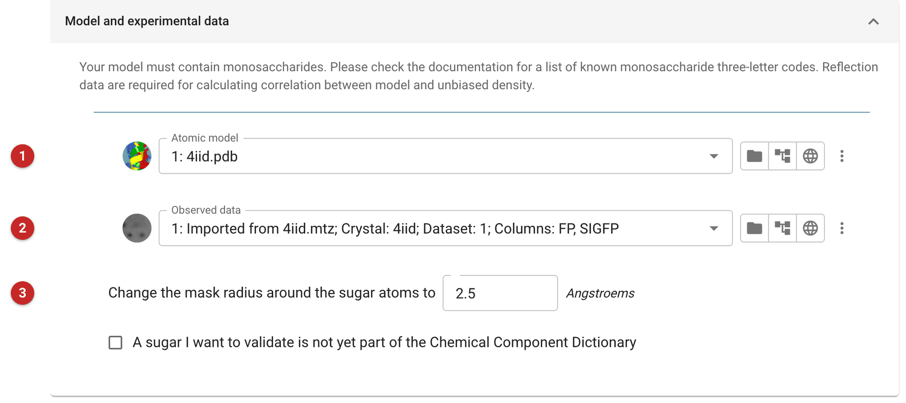
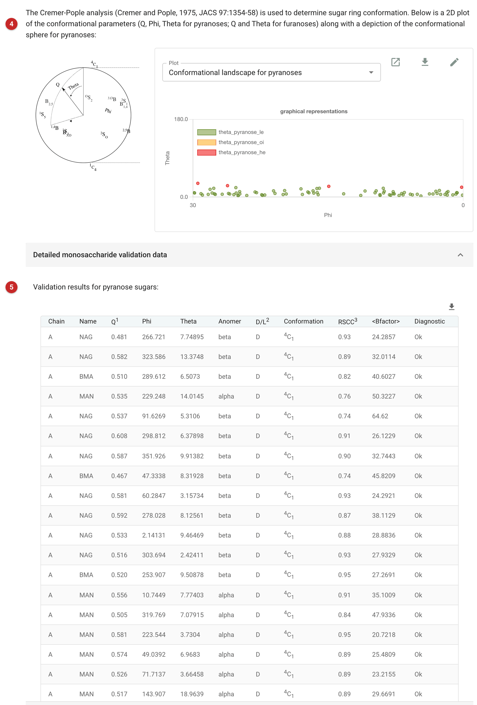

#################################################
Validation of carbohydrate structures (Privateer)
#################################################

Privateer validates the sugars in a model. For every cyclic carbohydrate
it finds, it reports the ring conformation, the anomer and handedness,
the geometry, and how well the sugar fits *omit* density: density
calculated with the sugars left out of the phases, so the model cannot
bias it. It draws each glycan in the standard (SNFG) cartoon and matches
it against the glycan databases.

Use it on any model with glycosylation or bound sugars, before deposition
and after each round of building. Sugars go wrong in ways other
validation misses: a ring refined into an unlikely conformation, the
wrong anomer, or a sugar built into density that is not there.

The pictures on this page come from the *glyco* demo that comes with
CCP4i2: 4iid, a fungal glycoprotein with two chains and 19 N-glycans,
some of whose sugars sit in higher-energy conformations.

Input
=====

   Figure 1: Privateer input

The model **(1)** and the observed data **(2)** (Figure 1), needed for the omit
density. The mask radius **(3)** sets how much density around each sugar
counts in the correlation: smaller values (1.5 Å) forgive modelling
errors, larger ones (2.5 Å) are stricter. A sugar not yet in the Chemical
Component Dictionary can be described explicitly (its code, ring atoms
and expected conformation) with the checkbox below.

Results
=======

   Figure 2: Privateer report

The conformational landscape **(4)** of Figure 2 plots every pyranose by its
Cremer-Pople angles, beside a key to the sphere they come from. Pyranoses
nearly always sit in a chair: for D-sugars the ⁴C₁ chair, at the north
pole (θ near 0°). Points coloured as higher-energy conformations deserve
a look.

The table **(5)** gives one row per sugar: the puckering amplitude Q, the
angles φ and θ, the anomer, D or L, the conformation, the real-space
correlation with the omit density (RSCC), the mean B-factor and a
diagnostic. Here 79 of the 83 pyranoses are *Ok*. Four are flagged
"Conformation might be mistaken": NAG 922 and MAN 936 in chain A, MAN 933
and MAN 940 in chain B, all envelopes with θ between 23° and 32°. They
are also the least well supported: RSCC 0.64–0.76 against about 0.9 for
most of the others, and B-factors of 58–76. That combination (a
distorted ring, weak density, high B) usually means refinement pulled a
poorly ordered sugar out of shape, not that the protein holds it
strained; genuine distortion is expected mainly in an enzyme's active
site. The remedy is to refine with torsion restraints that hold each ring
in its chair.

Further down, each glycan is drawn as an SNFG cartoon with its
GlyTouCan and GlyConnect identifiers where the databases know it.

Privateer's outputs support that remedy: Refmac keywords that switch on
unimodal torsion restraints for the sugars, a Coot script for a guided
tour of the reported issues, and the 2mFo-DFc and omit mFo-DFc map
coefficients.

The conformation analysis uses the Cremer-Pople algorithm (Cremer and
Pople, 1975, *JACS* 97:1354-58). For a deeper nomenclature check, the
`pdb-care <http://www.glycosciences.de/tools/pdb-care>`__ server at
glycosciences.de checks sugar names and linkages.
