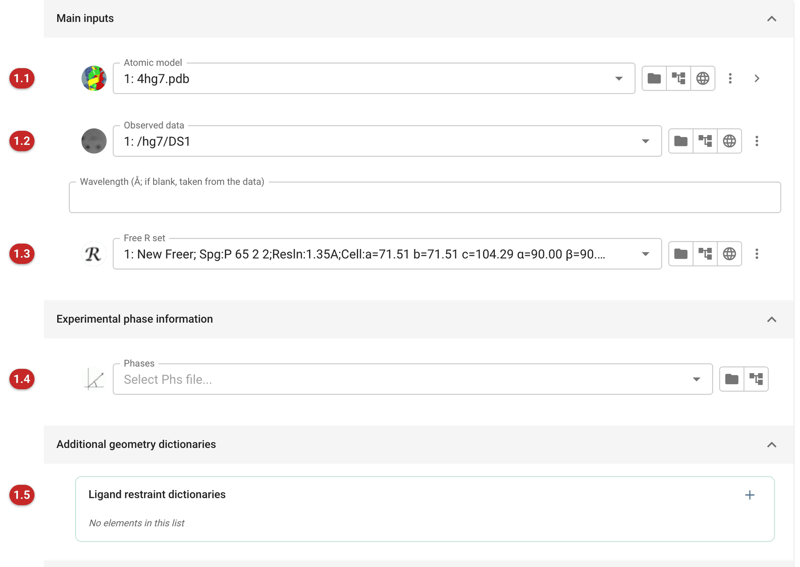
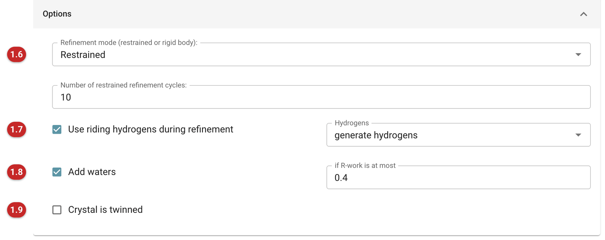
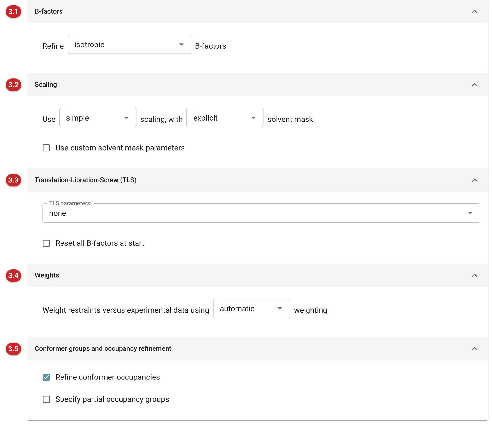
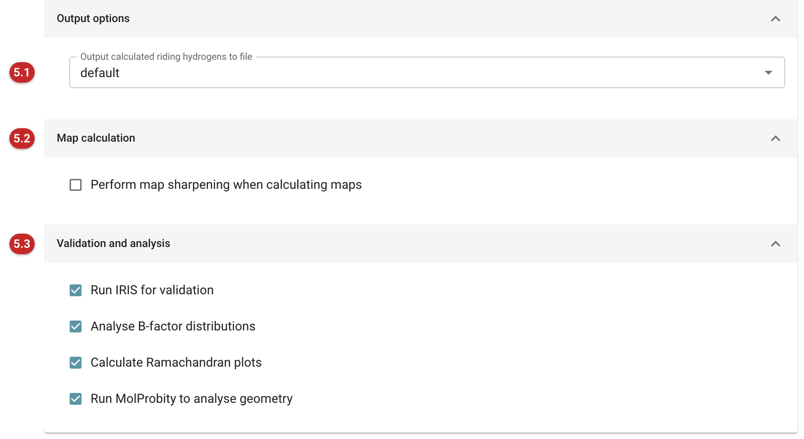
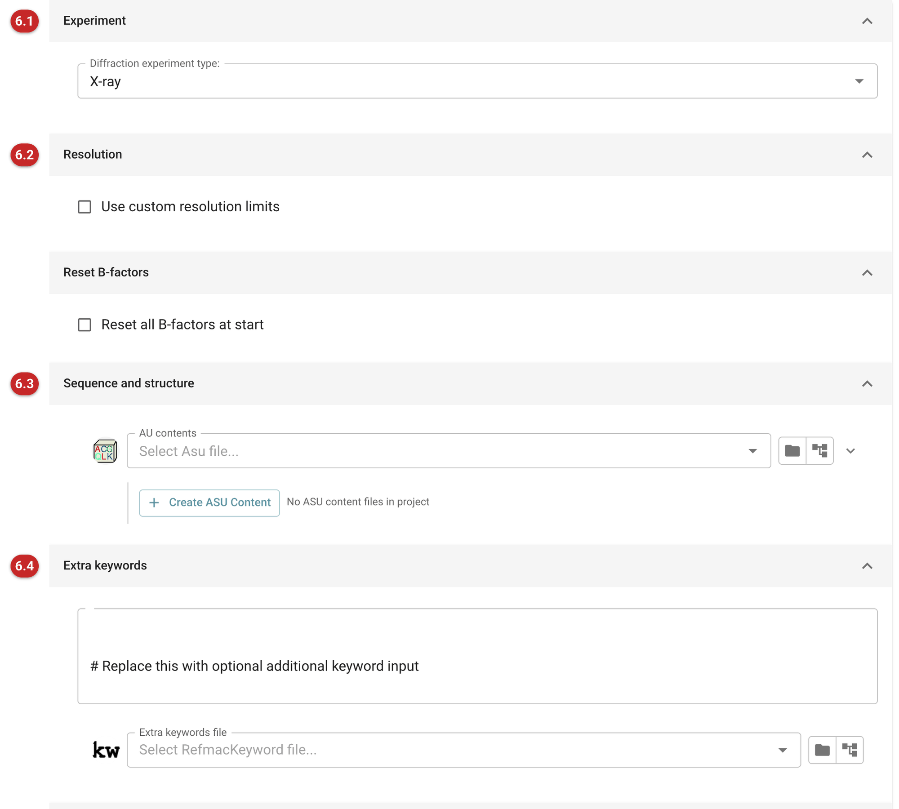
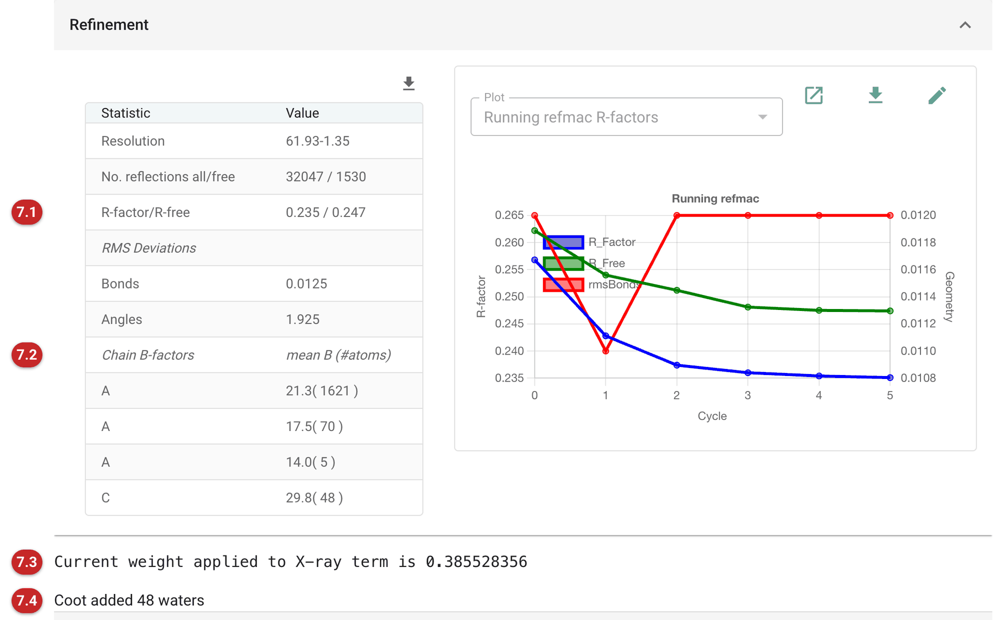
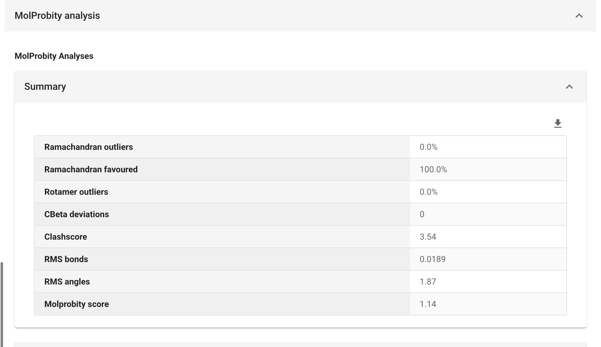

##########
Refinement
##########

The Refinement pipeline uses *REFMAC5* to refine an atomic model against
experimental data, optionally with additional restraints generated by
*ProSMART* from related structures (most useful at low resolution), and
then validates the result.

For more information, see:

-  `REFMAC5
   documentation <http://www2.mrc-lmb.cam.ac.uk/groups/murshudov/content/refmac/refmac_keywords.html>`__
   - list of REFMAC5 keywords and features.
-  `REFMAC5
   tutorial <http://www2.mrc-lmb.cam.ac.uk/groups/murshudov/content/tutorials/refmac_tutorial/index.html>`__
   - introduction to refinement with REFMAC5.
-  `ProSMART
   tutorial <http://www2.mrc-lmb.cam.ac.uk/groups/murshudov/content/tutorials/prosmart_tutorial/index.html>`__
   - guide to low-resolution refinement with REFMAC5 and ProSMART.

The pictures on this page follow MDM2 in complex with Nutlin-3a, from the
Ligand Tutorial data that comes with CCP4i2: the deposited model 4hg7,
without its waters, refined against data reduced from the deposited
images, with ProSMART restraints to an independent MDM2 structure, 4qo4.

The task is arranged in five tabs: *Input data*, *Parameterisation*,
*Restraints*, *Output* and *Advanced*. Most refinements need only the
first.

Input data
==========

   Figure 1: Main inputs

Minimally, the Refinement pipeline requires a model **(1.1)** and
experimental data **(1.2)** (Figure 1).

*Atomic model* **(1.1)** -- the model to be refined, in PDB or mmCIF
format. A selection may be applied to it (here ``not (HOH)``, to rebuild
the waters from scratch); only the selected atoms are refined.

*Reflections* **(1.2)** -- structure factor amplitudes or intensities with
their uncertainties (F/SigF or I/SigI). When intensities are given, the
choice of refining against intensities or amplitudes is offered under
*Options* **(1.6)**.

*Free R set* **(1.3)** -- the free R set that belongs with the data. Unlike
the Qt interface, the reflection data and the free R set are always
separate data objects in CCP4i2: data reduction and data import make both,
so pick the free R set from the same job as the reflections. Refinement
without a free R set is possible but is warned against: there is then no
unbiased measure of whether the refinement is improving the model.

*Experimental phase information* **(1.4)** -- Hendrickson-Lattman
coefficients from experimental phasing, if available, to be used as
additional restraints (MLHL refinement).

*Additional geometry dictionaries* **(1.5)** -- restraint dictionaries for
ligands and other monomers that are not in the CCP4 monomer library. A
dictionary made by the *Make Ligand* task (Acedrg) is chosen here. Nutlin
(``NUT``) is in the library, so this example needs none; a new compound
would. The atom names in the dictionary must match those in the model.

   Figure 2: Options

*Refinement mode* **(1.6)** (Figure 2) -- restrained refinement (the usual
choice) or rigid body refinement, with the number of cycles for each. The
number of restrained cycles should be enough for the refinement to converge: R
and R-free should be stable over the last cycles. Around 10 is typical when a
model is nearly complete, 30-40 at intermediate stages or with external
or jelly-body restraints, and up to 200 with jelly-body restraints
straight after molecular replacement.

*Use riding hydrogens during refinement* **(1.7)** -- riding hydrogens add
no parameters (their positions follow their parent atoms) and usually
improve the geometry, by describing each atom's surroundings more
completely. Choose whether hydrogens are generated for all atoms, or used
only where already present in the model.

*Add waters* **(1.8)** -- after the refinement, find water sites in the
difference map with Coot and refine once more with them, provided R-work
has reached the limit given (default 0.40): before that, the map is not
yet good enough for peaks to be trusted as waters. The example rebuilds
its waters this way.

*Crystal is twinned* **(1.9)** -- refine a twinned model. If unsure,
assume the crystal is not twinned until the model is as good as it can be
made: twin refinement of a poor model can mislead.

If the reflection data are anomalous pairs, an *Anomalous signal*
section appears, offering to refine against the anomalous data (for SAD
refinement, give the wavelength so that the form factors of the
anomalous scatterers can be looked up).

Parameterisation
================

   Figure 3: Parameterisation

*B-factors* **(3.1)** (Figure 3) -- the atomic displacement model, which should
match the ratio of observations to parameters, and so the resolution:
*isotropic* (one parameter per atom, the default), *anisotropic* (six per
atom; usually only better than about 1.5 Å, so worth trying for this
1.35 Å example), *overall*, or *mixed* (as specified per atom in the input
model).

*Scaling* **(3.2)** -- the bulk solvent model and scaling. The solvent
mask can be adjusted by the custom mask parameters, but the defaults are
rarely worth changing.

*Translation-Libration-Screw (TLS)* **(3.3)** -- TLS describes the
concerted anisotropic motion of rigid groups with 20 parameters per
group, which suits medium and low resolution well. Groups can be found
automatically, read from a TLS file (from an earlier refinement, or made
by the *Define TLS groups* task), or typed in. TLS parameters are refined
first, in their own cycles (5-10 are usually enough); resetting all
B-factors to a fixed value before that is generally advised. *Add TLS
contribution to output B-factors* writes the total displacement into the
output model, which is needed for deposition.

When rigid body refinement is chosen, a *Rigid body groups* section
appears here too, for the domains to be treated as rigid bodies.

*Weights* **(3.4)** -- the relative weight of the data and the geometric
restraints. With automatic weighting REFMAC5 adjusts the weight each
cycle so that the RMS deviations from ideal geometry are neither too
large nor too small; the weight it used is in the log (search for
"WEIGHT MATRIX"). A manual weight is fixed for every cycle.

*Conformer groups and occupancy refinement* **(3.5)** -- refine the
occupancies of alternative conformations, and of groups of atoms defined
by selection: *complete* groups whose occupancies sum to 1 (alternative
conformations of the same residues), and *incomplete* groups (a partially
occupied ligand).

Restraints
==========

   Figure 4: Restraints

*Non-crystallographic symmetry (NCS)* **(4.1)** (Figure 4) -- restrain
NCS-related molecules to be similar. Generally recommended, especially at
medium and low resolution and when R and R-free diverge. *Local* restraints
(the default) keep corresponding local interatomic distances similar and so
allow global differences between the copies; *global* restraints hold the
copies to the same overall structure.

*Jelly-body* **(4.2)** -- restraints that keep the model from changing too
much from one cycle to the next, preserving local structure while allowing
larger movements of domains. They stabilise refinement and reduce
overfitting, especially at low resolution and straight after molecular
replacement. The sigma controls how much the model may move (lower is
stiffer; default 0.01) and the maximum distance which atom pairs are
restrained (default 4.2 Å). Convergence is slower: allow 40 cycles, or up
to 200 early on.

*ProSMART - protein* **(4.3)** and *ProSMART - nucleic acids* -- external
restraints generated by ProSMART from one or more reference models
**(4.4)**: structures of the same or homologous molecules, ideally at
higher resolution. The restraints pull local conformations towards those
of the reference where they agree, and are relaxed where they do not, so
genuine differences survive. Here 4qo4, an independent MDM2 structure,
serves as the reference. Most useful at low resolution; at 1.35 Å, as
here, the data dominate and the restraints change little. The advanced
options control which chains are restrained, the sequence identity
required, and the weight and robustness of the restraints.

*External restraints* **(4.5)** -- a file of restraints in REFMAC5's
external restraint format, from another program. Covalent links can be
detected from the coordinates, and the LINK records in the input model
can be ignored.

*Platonyzer* **(4.6)** -- restraints for metal sites of ideal geometry,
generated by Platonyzer, for zinc and sodium/magnesium sites.

Output
======

   Figure 5: Output options

*Output calculated riding hydrogens to file* **(5.1)** (Figure 5) -- include
the riding hydrogens in the output model.

*Map calculation* **(5.2)** -- anisotropic regularised map sharpening for
the output maps, useful at lower resolution. It changes only how the maps
look, not the refinement. By default the sharpening B-factor is the
overall B-factor after refinement, which tends to oversharpen slightly: a
little re-blurring in Coot reduces the noise.

*Validation and analysis* **(5.3)** -- the analyses run on the refined
model and shown in the report: B-factor distributions, Ramachandran
plots, MolProbity geometry analysis and IRIS.

Advanced
========

   Figure 6: Advanced options

*Experiment* **(6.1)** (Figure 6) -- the kind of data: X-ray (the default),
electron or neutron. Electron diffraction needs a form factor calculation
method; neutron refinement has its own options for hydrogen and deuterium:
their initial fractions, whether to refine them, and hydrogen positions and
torsion restraints.

*Resolution* **(6.2)** -- by default all the data are used. Custom limits
truncate the data at high and/or low resolution.

*Sequence and structure* **(6.3)** -- the asymmetric unit contents, for
tasks that follow refinement and need the sequence.

*Extra keywords* **(6.4)** -- text typed here, or a file of keywords, is
passed to REFMAC5 as is. See the
`REFMAC5 keyword documentation <http://www2.mrc-lmb.cam.ac.uk/groups/murshudov/content/refmac/refmac_keywords.html>`__.

Results
=======

   Figure 7: Refinement statistics

The report opens with the statistics of the refinement (Figure 7): the
resolution range, the numbers of reflections used and set aside, R-work and
R-free **(7.1)**, and the RMS deviations of bonds and angles from their ideal
values. R-free is the measure that matters: it is calculated from
reflections never used in refinement, so it falls only if the model gets
better. A gap between R-work and R-free that grows during refinement is a
sign of overfitting; tighter restraints (a lower weight, jelly-body or NCS
restraints) are the remedy. Here R-work and R-free end at 0.235 and 0.247
at 1.35 Å, a small gap; anisotropic B-factors and riding hydrogens would
be the next things to try at this resolution.

The mean B-factor is given for each chain **(7.2)**, with the number of
atoms. A chain can appear more than once: Refmac lists each stretch of it
separately, so the protein, the ligand and the waters of chain A, say,
have rows of their own.

Beside the table, the graph follows R-work, R-free and the RMS bond
deviation cycle by cycle (other graphs are in the menu): R-work and
R-free should level off by the last cycles. If they are still falling,
run more cycles. The weight on the X-ray term that the automatic
weighting chose is given below **(7.3)**, and, when waters were added, how
many Coot found **(7.4)**; the statistics are those of the refinement that
followed.

The folds below hold the per-cycle statistics, the outliers Refmac found
(atoms whose geometry deviates most from the restraints, often the first
places to look), and further graphs from the log.

   Figure 8: MolProbity analysis

The validation that follows (IRIS, B-factor analysis, MolProbity and
Ramachandran plots; Figure 8) points to the parts of the model that need
attention. MolProbity's summary gives the clashscore and the rotamer and
Ramachandran statistics, with percentiles against structures at similar
resolution; the detailed breakdown lists the residues concerned. For the
MDM2 model there are no Ramachandran or rotamer outliers and the
clashscore is 3.5. (MolProbity measures bond and angle deviations against
its own ideal values, so its RMS figures differ from Refmac's.)

The outputs are the refined model, the 2mFo-DFc and mFo-DFc map
coefficients, and an anomalous map where there are anomalous data. Manual
model building (Coot or Moorhen) is the usual next step, to look at the
model and the difference density together. The *Verdict* at the end of
the report assesses the refinement and may suggest parameters for the
next run.
