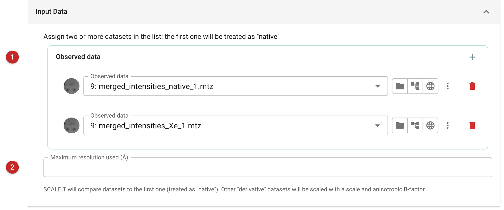
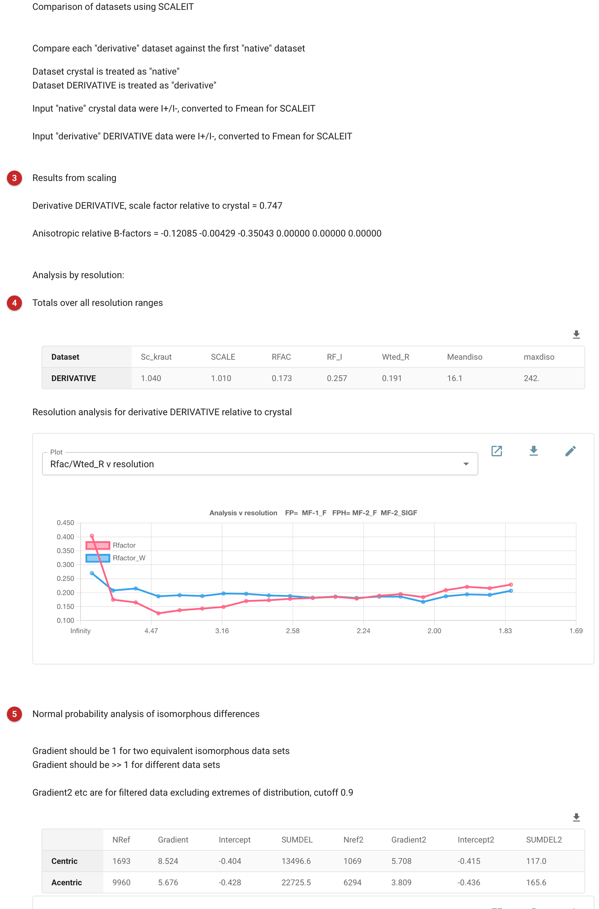

#############################################
Compare and scale datasets together (SCALEIT)
#############################################

SCALEIT scales one or more datasets to a reference ("native") dataset,
with an overall scale and an anisotropic B-factor, and reports how
different they are. Its classic use is with a heavy-atom derivative:
before trying isomorphous replacement, it tells you whether the
derivative differs from the native by more than noise, and whether the
two are isomorphous enough to be compared at all. It is also a quick way
to compare any two datasets of the same crystal form, from soaks or
different crystals.

The pictures on this page compare the native and xenon-derivative data
of the *gamma* demo that comes with CCP4i2.

Input
=====

   Figure 1: SCALEIT input

The datasets **(1)**: the first is treated as the native, and each of the
others is compared with it. Intensities are converted to mean amplitudes.
A resolution limit **(2)** can exclude weak high-resolution data from the
comparison.

Results
=======

   Figure 2: SCALEIT report

The report gives each derivative's scale and anisotropic B-factors
relative to the native **(3)**, then the differences overall and by
resolution **(4)**: the R-factor between the scaled datasets (here 0.17)
and a weighted R, with the mean and largest isomorphous differences. For a
useful heavy-atom derivative the differences should be well above what the
measurement errors explain, and should not rise steeply with resolution,
which would mean the crystals are not isomorphous.

The normal probability analysis **(5)** says whether the differences are
real: its gradient is about 1 when two datasets differ only by noise, and
well above 1 when they differ. Here it is 5.7 for acentric reflections:
the xenon has changed the data substantially, as a derivative should.
