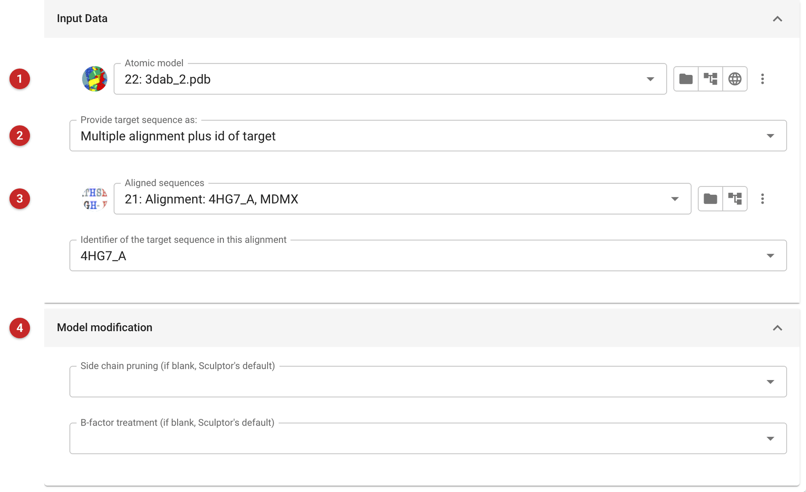

################################
Truncate search model - SCULPTOR
################################

Difficult molecular replacement problems (homology below about 30%, say)
can be helped by trimming loops and side chains from the search model
where they align poorly with the target. Sculptor, from Phenix, does this
with finer control than *Chainsaw*: over how gaps and poorly aligned
regions are deleted, how side chains are pruned, and how B-factors are
set to express which parts of the model are least reliable. Give it
either the target sequence, which it aligns with the model itself, or
your own alignment; a better alignment than a simple pairwise one may be
had from HHpred, PROMALS3D or FFAS. The supported formats are described in
the `Model data documentation <../../general/model_data.html>`__.

The pictures on this page set Sculptor up on the same MDMX model and
alignment as the *Chainsaw* page.

Input
=====

   Figure 1: Sculptor input

The model to edit **(1)**. Whether the target is given as an alignment
(with the identifier of the target sequence in it) or as a sequence to be
aligned **(2)**. The alignment and the target in it **(3)**.

*Model modification* **(4)**: how side chains are pruned, and how the
B-factors of the output are set. Left blank, each takes Sculptor's own
default. The pruning choices (see the
`Phenix documentation <https://www.phenix-online.org/documentation/reference/sculptor.html>`__):

- *schwarzenbacher*: truncate a side chain aligned with a non-identical
  residue, by default to the gamma atom; keep identical residues whole.
- *similarity*: decide from the similarity of the aligned residues:
  residues above a similarity limit are kept whole, those well below it
  truncated to the beta carbon, and those between truncated part way.
  Results are similar to Schwarzenbacher's, but a similar substitution
  (Tyr to Phe, say) keeps its side chain, and low-similarity regions may
  be cut back to the beta carbon.

The B-factor choices: *original* keeps the model's own; *asa* sets them
from the accessible surface area of the isolated chain (exposed atoms are
more likely to be flexible); *similarity* raises them where the sequence
similarity is low, where the model is least likely to be right.

Results
=======

The edited model is the output, ready to use as a search model; the
report says whether the job finished. Compare it with the input in
Coot or Moorhen to see what was removed.
