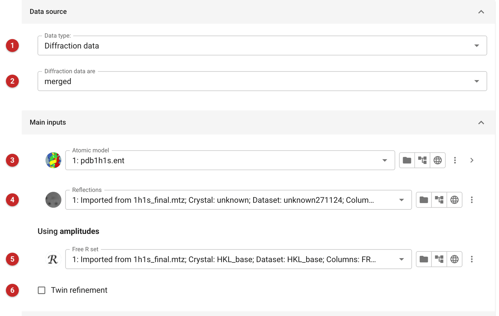
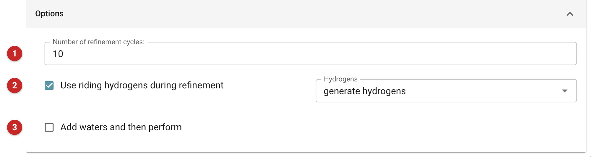
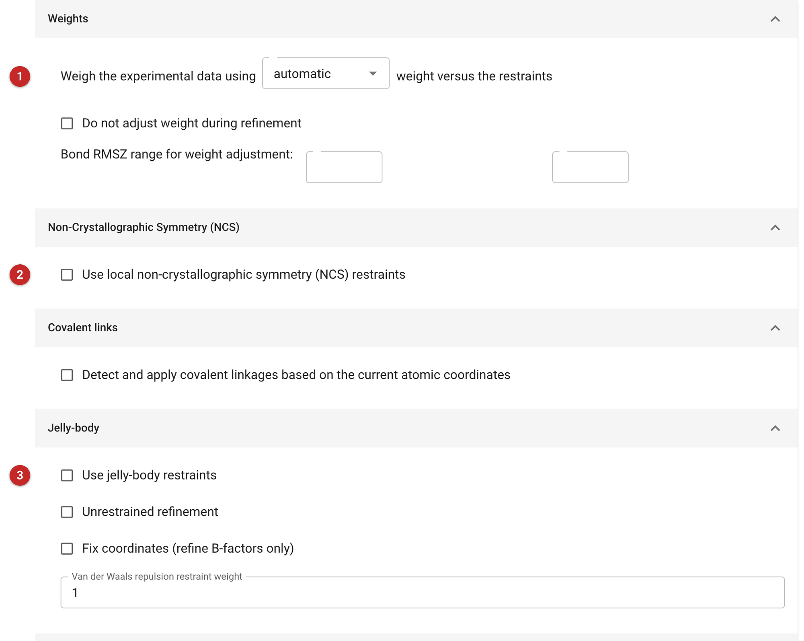
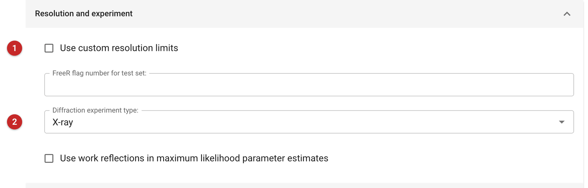
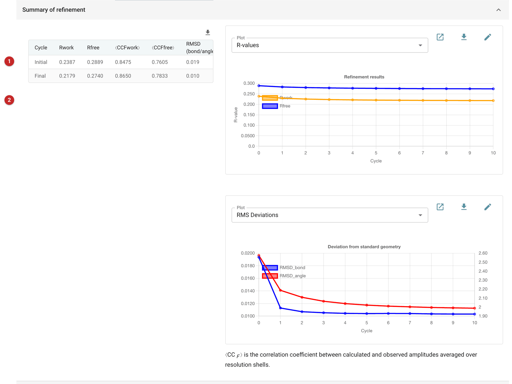

###########################
Refinement (Servalcat)
###########################

   The *Refinement - Servalcat* task refines an atomic model against
   X-ray, electron or neutron diffraction data, or against the half maps
   of a cryo-EM single-particle reconstruction, using `Servalcat
   <https://github.com/keitaroyam/servalcat>`__. It uses the same
   monomer library and restraints as REFMAC5, refines against amplitudes
   or intensities by maximum likelihood, and can add restraints from
   homologous models (ProSMART) and for metal sites (MetalCoord). It is
   the first choice for refinement in the *Refinement* category.

   The pictures on this page come from PDB entry 1h1s, phospho-CDK2 and
   cyclin A with the inhibitor NU6102, re-refined against the PDB-REDO
   reflections: the everyday use of the task, a complete model against
   the data it was built into.

.. note::

   This page is a draft, written from the task's interface, parameters
   and code. It has not yet been reviewed by the program's developers.

Input
=====

The task has four tabs. *Input Data* is all most refinements need;
*Parameterisation*, *Restraints* and *Advanced* hold the rest.

Data and model
--------------

   |input|

   First say what the model is refined against **(1)**: diffraction
   data, or the maps of a single-particle cryo-EM reconstruction; and for
   diffraction data whether they are merged or unmerged **(2)**.

   The atomic model **(3)** is refined against the reflections **(4)**.
   If the file holds intensities you can choose to refine against
   intensities or amplitudes; intensities are preferred when you have
   them, because the likelihood treats weak and negative measurements
   properly. A Free R set **(5)** is strongly recommended: without it the
   task warns you, and the report can give no R-free to judge the
   refinement by. For unmerged data, give the unmerged file and a Free R
   set; the data are merged for refinement.

   Tick *Twin refinement* **(6)** when the crystal is twinned (for
   example when intensity statistics or Zanuda suggest it): the twin
   operators are found and their fractions refined.

   For cryo-EM, give the two half maps, optionally a mask, and the
   resolution of the map, which is required.

   Ligands, and any other residue not in the monomer library, need a
   restraint dictionary under *Additional geometry dictionaries*, for
   example one made by the *Make Ligand* task. Before the job starts the
   task checks that every residue in the model has one, and names any
   that do not.

Options
-------

   |options|

   Ten cycles **(1)** is usually enough to converge. Riding hydrogens
   **(2)** are generated and used by default: they improve the geometry
   and the fit even at modest resolution, and are not written to the
   output model unless you ask for them under *Advanced*. You can choose
   instead to use only the hydrogens already in the file.

   *Add waters* **(3)** finds waters in the difference density with Coot
   after refinement, then refines the model with them for a further
   number of cycles.

Parameterisation
----------------

   Atomic displacement parameters (ADPs) are isotropic by default.
   Anisotropic ADPs need high resolution, around 1.5 Å or better, and
   enough data per atom; *fixed* keeps them as they are. Bulk solvent is
   modelled unless you turn it off.

   Occupancy refinement is on by default, every cycle; you can make it
   less frequent or turn it off. To refine alternative conformations
   together, define occupancy groups (a group ID, chain and residue
   range each) and say which groups overlap: those whose occupancies sum
   to one, and those whose occupancies may sum to less.

Restraints
----------

   |restraints|

   The weight of the X-ray (or map) term against the geometric
   restraints **(1)** is chosen automatically, and adjusted during
   refinement to keep the bond-length RMS Z-score in a sensible range
   (by default 0.5 to 1.0; you can set the range). A manual weight is
   rarely better.

   Local NCS restraints **(2)** tie together chains the model contains
   several copies of; they help most at low resolution. *Covalent links*
   detects bonds between residues from the coordinates. *Jelly-body*
   restraints **(3)** hold the model's local shape while it moves as a
   whole, and are the main tool at low resolution.

   The remaining folders add external restraints. *ProSMART* restraints
   hold protein or nucleic-acid chains close to a homologous model,
   useful at low resolution when a higher-resolution structure of a
   related molecule is known. *MetalCoord* generates restraints for metal
   sites from the coordination seen in small-molecule structures in the
   Crystallography Open Database;
   the folder says when the model has no metal sites. *ADP restraints*
   set how strongly neighbouring atoms' ADPs are kept similar.

Advanced
--------

   |advanced|

   Custom resolution limits **(1)** restrict the data used. The
   diffraction experiment type **(2)** selects X-ray, electron or neutron
   scattering factors: electron diffraction (for example microED) and
   neutron data need their own. The *Advanced* tab also controls
   hydrogens in the output model, resetting or shaking the model before
   refinement, extra keywords for the refinement program, and the
   validation run after it.

Results
=======

   |report|

   *Summary of refinement* **(1)** compares the start and end of the
   refinement: R-work and R-free (or R1 and the correlations for
   intensities), the correlation between observed and calculated
   structure factors, and the RMS deviations and Z-scores from ideal
   geometry. The graphs **(2)** follow the same quantities cycle by
   cycle: R-free should fall and level off, and the gap between R-work
   and R-free should stay modest.

   Below the summary, *Statistics vs. resolution* shows the fit and the
   data shell by shell, *Validation* lists geometric outliers, clashes,
   the Ramachandran plots and MolProbity analysis, and *Changes in
   coordinates and ADPs* lists the atoms that moved most. If waters were
   added, a second summary follows for the refinement after adding them.

   The refined model, the map coefficients for the 2mFo-DFc and mFo-DFc
   maps, and a complete reflection file are the outputs. Model building
   in Coot, or another round of refinement, usually follows.

