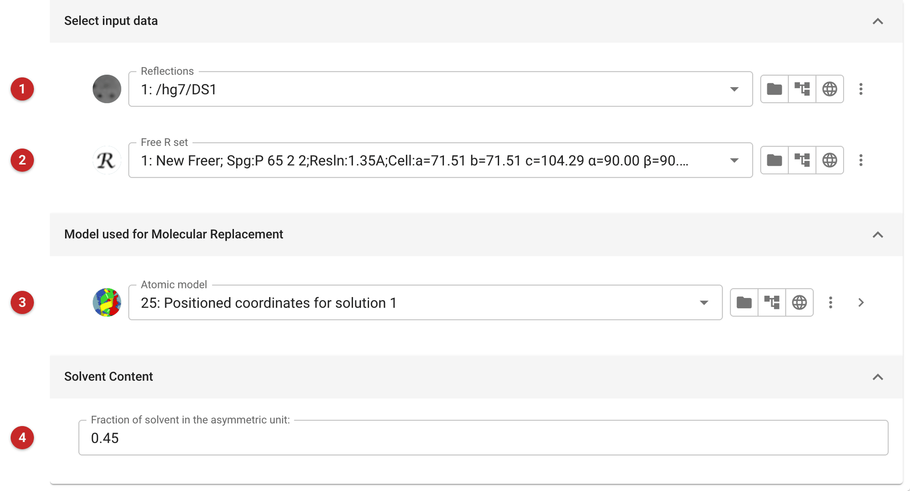
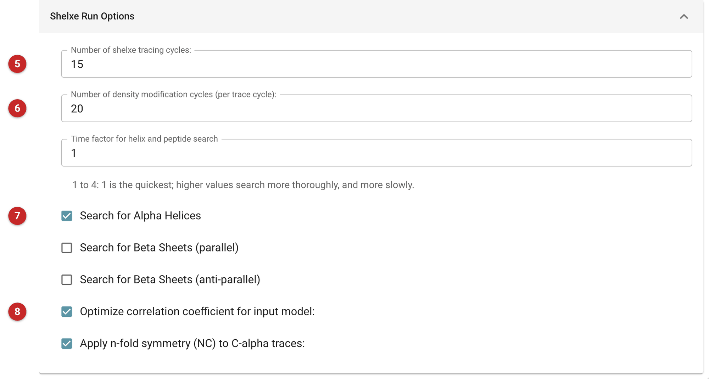
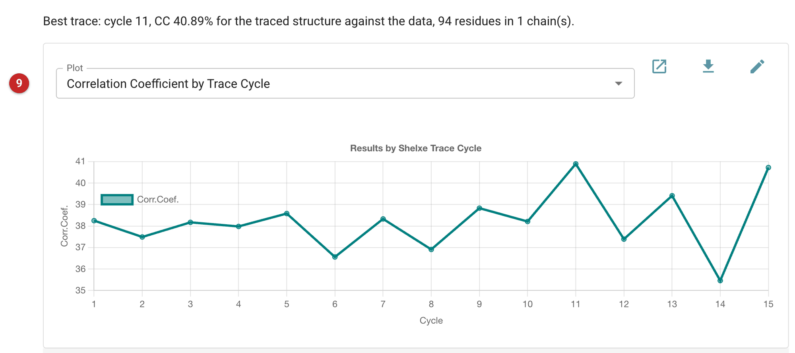

######################################
Using SHELXE for Molecular Replacement
######################################

SHELXE was written for experimental phasing, but its density modification
and C-alpha autotracing also work from a molecular replacement solution.
Given a placed model, it calculates a map from that model's phases,
improves the map by density modification, traces a poly-alanine chain
into it, and repeats, so the chain it builds can be better than the
model it started from. Use it when MR has placed a model but the model is
incomplete or distant from the target, so that rebuilding by hand
(:doc:`../coot_refinement/index`) would be long, and the data are good
enough to trace in (1.35 Å here). It builds main chain only. For a model
with side chains on a placement that is already good, ModelCraft (:doc:`../modelcraft/index`) or
Buccaneer (:doc:`../buccaneer_build_refine_mr/index`) are the usual choices; to improve a placement itself, go back
to :doc:`../phaser_simple_phil/index`.

The pictures on this page come from the MDM2 project. The model is
Phaser's placement of a Chainsaw-pruned MDMX model in the MDM2 data (TFZ
12.7), refined only to an R-free of about 0.50: correct, but a long way
from finished. MDM2 has 97 residues in the structure; the data extend
to 1.35 Å.

Input
=====

   Figure 1: SHELXE-MR input

In Figure 1, the reflections **(1)** and their free set **(2)**, the placed
model **(3)** (here job 25, Phaser's solution) and the fraction of solvent in
the asymmetric unit **(4)**, which SHELXE uses in density modification.
The default is 0.45; if you know your crystal's solvent fraction (the
task for the asymmetric unit contents estimates it), enter that. Beneath the
model there is an atom selection, to pass only part of it to SHELXE.

   Figure 2: SHELXE-MR run options

The Run Options tab (Figure 2) sets how SHELXE works. The number of tracing
cycles **(5)**, 15 by default, is how many times SHELXE traces a chain and
recalculates the map from it, and the number of density modification
cycles **(6)**, 20 by default, is how many it runs per tracing cycle. The
search for alpha helices **(7)** is on by default; searches for parallel
and anti-parallel beta sheets are available and off. "Optimize
correlation coefficient for input model" **(8)** has SHELXE omit residues
of the starting model that lower the correlation with the data: in this
run it eliminated 26 of the 85 residues of the Chainsaw model, raising
the correlation of the fragment with the data from 10.85 to 14.02%
before it began. The time factor (1 to 4; 1 is quickest, higher is more
thorough and slower) governs the initial helix and tripeptide searches.
These defaults took about 13 minutes (772 s) on this 97-residue protein.

Results
=======

   Figure 3: SHELXE-MR report

The report (Figure 3) opens with the best trace in numbers (its cycle, CC,
residues and chains), then plots the correlation coefficient (CC) of the traced
partial structure against the native data, cycle by cycle **(9)**; the
menu above the plot switches it to the average chain length per cycle.
The CC is the figure to watch: it measures how well the trace explains
the data, and SHELXE keeps the trace of the cycle where it is highest
("Best trace ... was saved"). The report links the two outputs: the
model SHELXE built, offered to later tasks as "SHELXE poly-Ala trace"
with its residues and CC, and the map coefficients.

Here the CC ran between 35.5 and 40.9% over the 15 cycles. The first
cycle was already at 38.25% with a single chain of 91 residues, so the
placement was good enough to trace from the start, and the later cycles
did not change that much: the best trace was in cycle 11, CC 40.89%, one
chain of 94 residues (MDM2 has 97), and the last cycle, 15, gave 40.72%
and cycle 14 only 35.46%. The rise from the first to the best cycle is
small and the cycle-to-cycle swings are as large as the rise, so do not
read much into which cycle is best. The chain-length plot shows
whether the trace holds together: cycles 2 and 3 broke it into 3 and 2
chains, and it was a single chain again by cycle 4.

SHELXE's log also gives the quality of the map: here an estimated mean
FOM of 0.754 and a pseudo-free CC of 78.55%, with the FOM falling from
0.86 at 2.4 Å to 0.49 in the highest-resolution shell (1.35 Å), as the
data weaken. Both are in SHELXE's own listing (shelxrun.lst), not in the report.

What to do next. The output is poly-alanine, so: refine it (Refmac or
Servalcat), look at the map and model together, and add side chains and
missing residues with ModelCraft or Buccaneer, or by hand in Coot. Judge
success by what the refinement does to R-free, not by the CC alone,
which is a correlation of a partial structure with the data. Keep the
free set the job was given for the refinement that follows.

**Reference**

Usón, I. & Sheldrick, G. M. (2018). An introduction to experimental
phasing of macromolecules illustrated by SHELX; new autotracing
features. Acta Cryst. D74, 106-116.

`SHELXE for Molecular Replacement
<https://www.ncbi.nlm.nih.gov/pmc/articles/PMC3817699/>`__
