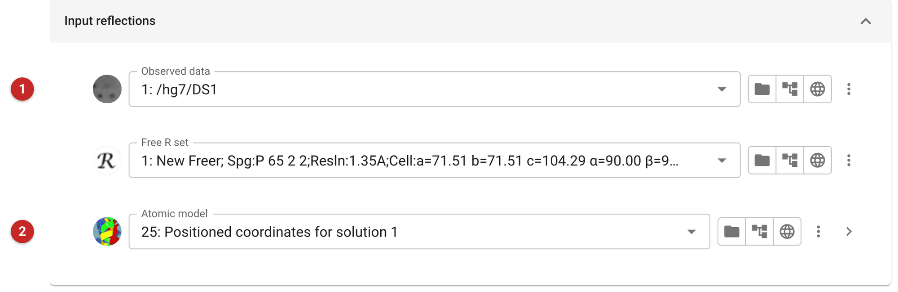
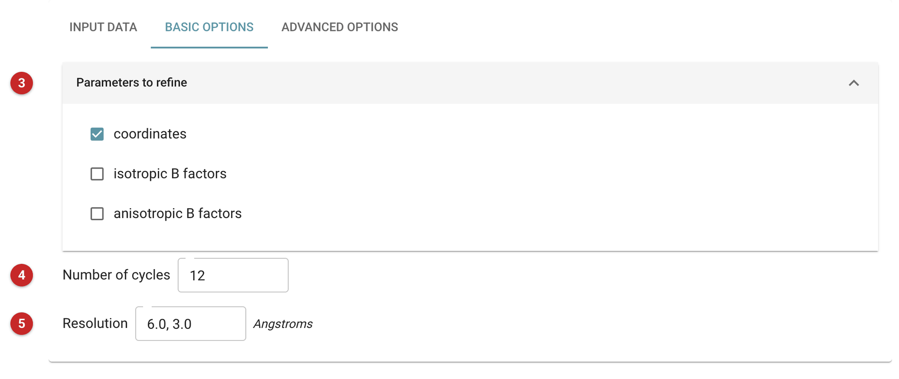
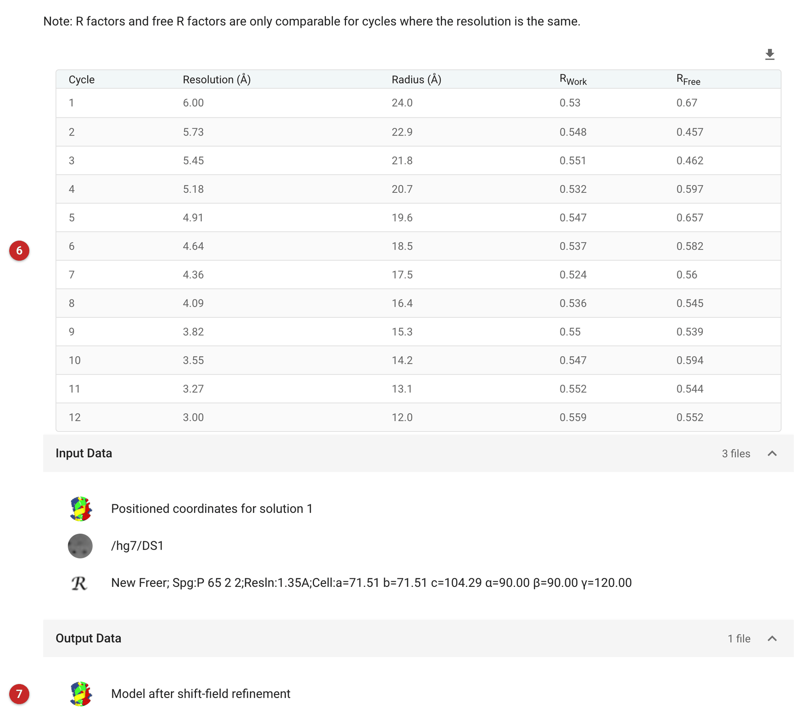

###################################
Shift field refinement (Sheetbend)
###################################

Sheetbend moves a model towards the data by refining a *shift field*: a
smooth displacement, fitted over the whole cell, that every atom follows.
Because the field is smooth, it can move whole secondary-structure elements
at once from low-resolution data, which is what a molecular replacement
solution from a homologue usually needs before conventional refinement can
take over. It is very fast, and can refine B-factors the same way.

Use it on a fresh molecular replacement solution, or on a model placed in a
cryo-EM map or a different crystal form. Do not use it on a model that is
already refined: atomic refinement does better from there.

The pictures on this page come from the MDM2 project of the refinement
route: Sheetbend applied to the molecular replacement solution that Phaser
found with a Chainsaw model of MDMX (see :doc:`../ensemble_phaser/index`).

Input
=====

   Figure 1: Sheetbend input

The data and free R set **(1)**, and the model to move **(2)**. The free R
set is optional: at the low resolution Sheetbend starts from, very few
reflections are free, and their R factor is noisy.

   Figure 2: Sheetbend options

What to refine **(3)**: coordinates by default; isotropic or anisotropic
B-factors as well or instead. The number of cycles **(4)** and the
resolution **(5)**: "6.0, 3.0" means the first cycle uses data to 6 Å and
the last to 3 Å, stepping between them, so the large shifts are fitted
first. The radius of each cycle's shift field is the resolution times the
sphere-radius factor in the advanced options.

Results
=======

   Figure 3: Sheetbend report

The report lists R and R-free at the start of each cycle **(6)**. They are
calculated with that cycle's data only, so they can be compared only
between cycles at the same resolution: the numbers rise as the resolution
extends, even while the model improves.

To see what Sheetbend achieved, compare the model before and after at one
resolution. Here, at 3 Å, R fell from 0.566 to 0.557 and R-free from 0.564
to 0.551; at 6 Å, R-free fell from 0.670 to 0.621. That is a real but
modest improvement, as it should be for this model: Chainsaw has already
cut back the side chains that differ between MDMX and MDM2, and a smooth
shift cannot rebuild what is missing. Take the moved model into
refinement (:doc:`../prosmart_refmac/index`) or model building.

The output model **(7)** is annotated "Model after shift-field refinement".

----------------
Acknowledgements
----------------

This page uses material provided by **Professor Kevin Cowtan**.

`Macromolecular refinement using shift field optimization and
regularization, a talk by K. Cowtan
<https://www.youtube.com/watch?v=V9EmwP0mqUY&t=135s>`_

**Reference**

`Cowtan, K., Metcalfe, S. & Bond, P. (2020). Acta Cryst. D76, 1192-1200.
<https://journals.iucr.org/d/issues/2020/12/00/di5041/>`_
