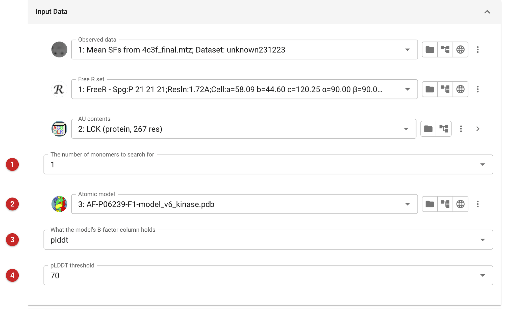
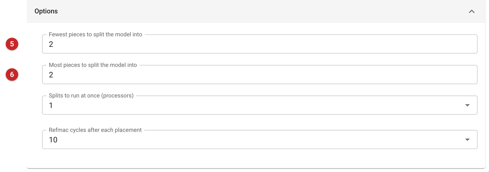
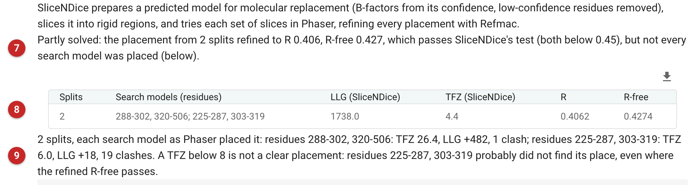

==========================================
MR with model splitting using Slice-n-Dice
==========================================

SliceNDice is an automated molecular replacement (MR) pipeline for
predicted models (AlphaFold2, RoseTTAFold). It prepares the model, cuts it
into rigid pieces, searches for the pieces with Phaser, and refines the
result with Refmac. Predicted models are often right within each domain and
wrong between them, so a single search with the whole model fails; searching
for the pieces separately lets each find its own place.

The preparation alone, without MR, is the task
:doc:`Process Predicted Models <../editbfac/index>`. For a model searched
as one piece, use the Phaser tasks (:doc:`../phaser_mr_phil/index`,
:doc:`../phaser_pipeline/index`); for a search over many models from the
PDB, MrBUMP, with MrParse to choose them. Choose SliceNDice when you have
one predicted model and expect it to be domain-wise good but
inter-domain-wise doubtful.

**Structure prediction software puts pLDDT scores (AlphaFold) or rmsd
estimates (RoseTTAFold) in place of B-factors.** The scores must be
converted to B-factors, so choose the **B-factor treatment** that matches
your model. The default **pLDDT threshold** for AlphaFold2 models is 70 and
the default **RMS threshold** for RoseTTAFold models is 1.75: residues
below the confidence threshold are removed.

The pictures on this page come from a Lck kinase project: PDB 4c3f, the
kinase domain of the Src-family kinase Lck (residues 237-501) at 1.72 Å in
P2\ :sub:`1`\ 2\ :sub:`1`\ 2\ :sub:`1`, with the AlphaFold model of human
Lck (UniProt P06239) trimmed to the kinase domain, residues 225-509 (the
full model also has SH3 and SH2 domains, which the crystal lacks).

Input
=====

   Figure 1: SliceNDice input

The reflections, their free set and the contents of the asymmetric unit
come first (Figure 1), with the number of copies to search for **(1)**. The
atomic model **(2)** is the predicted model. **What its B-factor column holds
(3)** says what the numbers there are (here ``plddt``, AlphaFold's
confidence), and the **pLDDT threshold (4)** is the confidence below which
residues are removed (here 70). Leave the treatment on its default
(``bfactor``) only for a model whose B-factors are already B-factors.

The choices are the program's own codes: ``plddt``, ``rms``,
``fractional_plddt``, ``predicted_bfactor`` and ``bfactor``.

   Figure 2: SliceNDice options

The slicing (Figure 2) uses the `Birch clustering algorithm
<https://scikit-learn.org/stable/modules/clustering.html#birch>`_ on the Cα
coordinates (or, for AlphaFold2 models, the predicted aligned error). The
**minimum** and **maximum number of splits (5, 6)** are the fewest and the
most pieces to try: a range of 1 to 3 is meant to try the unsplit model,
the model in two pieces and in three (but see the warning). Below them are
the number of splits to run at once and the number of Refmac cycles after
each placement.

.. warning:: In this version (SliceNDice 0.1.3, CCP4 9), given a range of
   splits, SliceNDice runs MR on only one of them. The report lists the
   splits made but not tried. To test a particular number of pieces, set
   the minimum and the maximum equal, as here (both 2).

Results
=======

   Figure 3: SliceNDice report

The report (Figure 3) opens with a verdict **(7)**. Here it is "Partly solved":
the placement refined to R 0.406 and R-free 0.427, which passes SliceNDice's
own test of a solution (both below 0.45), but not every search model was
placed. The table **(8)** gives, per split, the search models (residue
ranges), Phaser's LLG and TFZ, and the R and R-free after refinement. Below
it **(9)** each search model is listed with the TFZ, the LLG it added and
its clashes, as Phaser placed it.

Read each piece, not the table row. In this run SliceNDice cut the model
into residues 288-302 and 320-506 (essentially the C-lobe of the kinase) and
residues 225-287 and 303-319 (the N-lobe). Phaser placed the C-lobe piece
first: TFZ 26.4, LLG +482, one clash. The N-lobe piece did not place: its
best TFZ was 6.0, the LLG rose only by 18, and it had 19 clashes;
Phaser tried ten placements for it, all with TFZ between 4.4 and
6.0. A TFZ below 8 is not a clear placement. Yet the R-free of 0.427 passes
the test: here the well-placed C-lobe alone brought R-free below 0.45.

Checked against the deposited 4c3f model, the C-lobe residues 320-506 lie
0.46 Å (Cα RMSD, 161 residues) from the deposited ones, while the N-lobe
residues are 17-19 Å away: placed wrongly. **One R-free for a split is no
proof that every piece was placed.**

The TFZ and LLG in the table (4.4 and 1738 here) are those of the last
solution Phaser listed for the split, not its best, so use the per-piece
figures below the table for judging a placement.

What to do next
---------------

Kinase C-lobes place far better than N-lobes in molecular replacement: they
are bigger and more helical. Expect the C-lobe first, then treat the N-lobe
as its own problem: either search for it again with the C-lobe fixed
(Phaser's expert task, with the partial solution as a fixed model), or build
it into the map phased by the C-lobe. The outputs are labelled "SliceNDice
partial solution" while a piece is unplaced: the refined data and map
coefficients (use the 2Fo-Fc and Fo-Fc maps to look for the missing
domain), and the placed model.

**ACKNOWLEDGEMENTS**

This article uses materials kindly provided by Dr. Adam Simpkin and Dr. Ronan Keegan, whose help is greatly appreciated.

**References**

`Simpkin, A. J., Elliott, L. G., Stevenson, K., Krissinel, E., Rigden, D. J., Keegan, R. M. (2022) Slice’N’Dice: Maximising the value of predicted models for structural biologists, bioRxiv 2022.06.30.497974; <https://doi.org/10.1101/2022.06.30.497974>`_

`Murshudov, G.N., Skubak, P., Lebedev, A.A., Pannu, N.S., Steiner, R.A., Nicholls, R.A., Winn, M.D., Long, F., and Vagin, A.A. (2011)  Acta Cryst. D67: 355-367; <https://doi.org/10.1107/S0907444911001314>`_

`McCoy, A.J., Grosse-Kunstleve, R.W., Adams, P.D., Winn, M.D., Storoni, L.C., Read R.J. (2007) Phaser Crystallographic Software. J. Appl. Cryst. 40: 658-674; <https://doi.org/10.1107/S0021889807021206>`_
