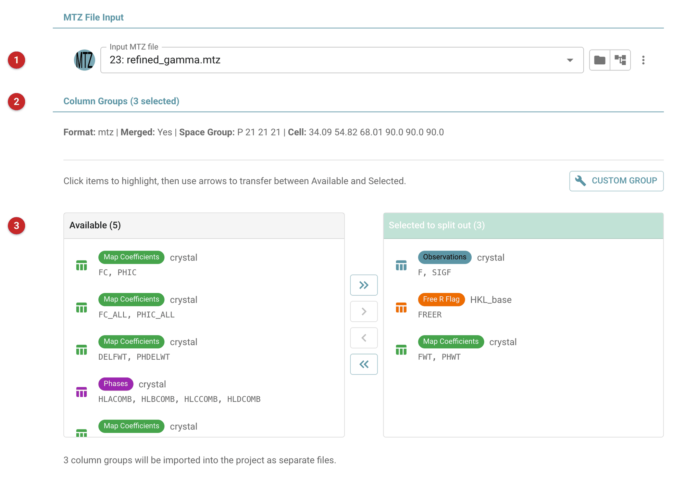
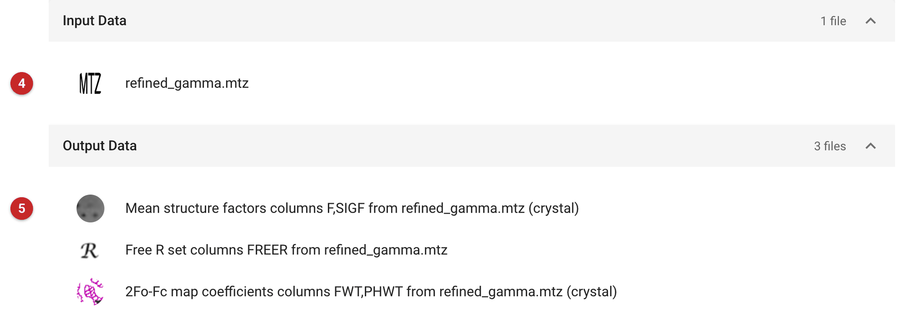

##################################
Import and split an MTZ file
##################################

CCP4i2 does not keep reflection data in one multi-column MTZ file. Each
kind of data is a small typed file of its own (a "mini-MTZ"): observed
data, a free R set, map coefficients, or phases. A task that needs
reflections asks for exactly the type it can use, and offers the project's
files of that type. This is why the observations and the free R set that
go into refinement are always two files, and why combining them into one
file for a program that wants them together is the job of the task that
runs the program.

Files from other programs, though, are often a single MTZ file holding
everything side by side. A refinement's full output has amplitudes, a free
R set, two sets of map coefficients and phases in one file. This task reads
such a file, lists the groups of columns it recognises, and writes each
group you select as a typed file of its own, all in one job.

Use it when:

- **one MTZ file holds several kinds of data** and you want more than one
  of them in the project. The import tasks
  (:doc:`../import_files/index`) bring in one kind of data per job, so
  taking amplitudes, free R set and map coefficients from the same file
  would take three jobs; this takes them together;
- **you want to see what a file contains** before choosing: the groups it
  offers are listed with their types.

For merged reflection data from the usual formats, with the free R set
checked or made at the same time, use :doc:`../import_merged/index`
instead. To go the other way, joining typed files into one MTZ file, use
:doc:`../mergeMtz/index`.

The pictures on this page come from the Gamma project: the input is
``refined_gamma.mtz``, the complete output of a refinement, as another
program might have given it.

Input
=====

   Figure 1: Import and split MTZ input

Choose the MTZ file **(1)**. The file is read at once, and the line under
the heading **(2)** gives its format, whether it is merged, its space
group and its cell. The column groups it holds are listed in two boxes
**(3)**: *Available* on the left, and on the right *Selected to split out*,
the groups that will be written. Each entry shows the type it was
recognised as (observations, free R flag, map coefficients, phases), the
crystal or dataset it belongs to, and its column labels.

Move groups between the boxes by clicking them and using the arrows. In
Figure 1 the file offers eight groups. Three are selected: the
observations (``F, SIGF``), the free R flag (``FREER``) and the
2Fo-Fc map coefficients (``FWT, PHWT``). The other five are not: the
calculated structure factors (``FC, PHIC`` and ``FC_ALL, PHIC_ALL``), the
difference map coefficients (``DELFWT, PHDELWT``), the Hendrickson-Lattman
phases (``HLACOMB`` to ``HLDCOMB``) and one more set of map coefficients
(``FC_ALL_LS, PHIC_ALL_LS``). Only columns that make up a kind of data
CCP4i2 knows are offered.

If the group you want is not listed, because its columns are not named in
the usual way, *Custom group* lets you build one: choose the type, the kind
of data, and then the columns.

If you select nothing, the task does not stop: it writes every group it
recognises.

Results
=======

   Figure 2: Import and split MTZ report

The report (Figure 2) names the file read **(4)** and each file written
**(5)**: here three, one per selected group. Each is annotated with what it is,
the columns it came from and the file they were in, for example *Mean
structure factors columns F,SIGF from refined_gamma.mtz (crystal)*. That
annotation is what tells the files apart in the file menus of later tasks,
so you can pick the right one, and not the other set of map coefficients,
without opening anything.

The files hold the columns ``F, SIGF`` (observations) and ``FREER``
(free R set), as in the source file, and ``F, PHI`` (map coefficients):
the map coefficients were called ``FWT`` and ``PHWT`` in the source file,
and are written with CCP4i2's standard names. Later tasks find them by type,
so the names do not matter to you; they matter only if you open the file
in another program.

What next
=========

The new files are the project's own. Tasks that need observations, a free
R set or map coefficients now offer them in their file menus. A free R set
split out of a refinement's output is the set that model was refined
against: use it with the observations from the same file, and do not
generate a new one for further refinement of that model.

This task does not analyse the data (for twinning, resolution or
completeness, say): it copies columns. If you want the data analysed as
they are imported, use :doc:`../import_merged/index`.
