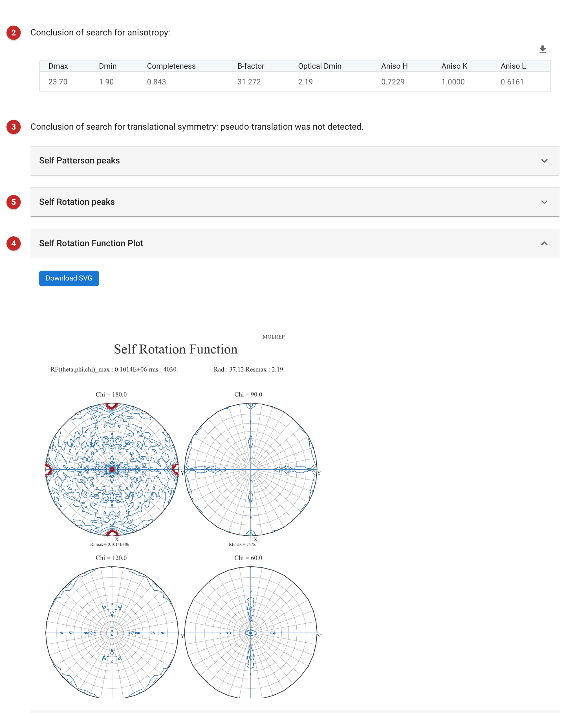

###################################
Self-rotation function (Molrep)
###################################

The self-rotation function rotates the Patterson function of your data onto
itself and asks, for each rotation, how well it overlaps. A rotation that
maps the Patterson onto itself is a symmetry of the crystal. The
crystallographic axes always appear; any *other* peak is a rotation
relating molecules in the asymmetric unit, that is, non-crystallographic
symmetry (NCS). It needs reflections only, no model.

Use it when you suspect there is more than one copy in the asymmetric
unit, or want to know how the copies are related (a two-fold dimer axis,
a three-fold trimer) before or during molecular replacement. How many copies
to expect is a different question, answered from the cell volume and the
sequence (the Matthews calculation, :doc:`../matthews/index`).

Do not use it as proof. A self-rotation can show a real NCS axis only
weakly, and a peak list alone does not establish one: confirm an axis you
see with a placed model, or with other data, before relying on it. Programs
that use NCS, such as density modification (:doc:`../parrot/index`), and
molecular replacement (:doc:`../molrep_pipe/index`) are the next step.

The pictures on this page come from the CDK2_CyclinA project: PDB entry 1h1s,
phospho-CDK2 with cyclin A, which has two CDK2/cyclin A complexes in the
asymmetric unit of space group P2\ :sub:`1`\ 2\ :sub:`1`\ 2\ :sub:`1`.

Input
=====

   Figure 1: Self-rotation input

The reflections **(1)**, as amplitudes with their sigmas; this is the only
input the calculation uses. The task shares its window with Molrep
molecular replacement, so the same window also offers a search model, fixed
model, map coefficients, sequence and asymmetric-unit contents. In this
task they are not used: the model is never passed to Molrep for a
self-rotation. The self-rotation does not need them; leave them empty.

Molrep chooses the rest itself. In the example run it kept the data from
23.7 Å to 2.19 Å (it had been given data to 1.90 Å and judged 2.19 Å, its
"optical resolution", to be the useful limit), and reduced the radius of
integration from its default of 48.3 Å to 37.1 Å, warning that it did so.

Results
=======

   Figure 2: Self-rotation report

The report opens with the anisotropy table **(2)**: the resolution range
given, completeness, overall B, the optical resolution and the three
anisotropy ratios. Strong anisotropy (ratios far from 1) is worth knowing
before reading anything into weak peaks; here they are 0.72, 1.00, 0.62.
Next comes Molrep's conclusion on translational symmetry **(3)**, from the
self-Patterson: a strong off-origin Patterson peak means pseudo-translation,
which also makes the self-rotation hard to read. Here Molrep says
"pseudo-translation was not detected" (the highest off-origin Patterson peak, 4.7 Å from the origin,
is 4.5% of the origin peak, below Molrep's limit of 12.5%). The self-rotation plot
**(4)** shows sections at chi = 180, 90, 120 and 60 degrees. Chi is the
rotation angle, so chi = 180 sections show two-fold axes, 120 three-fold,
90 four-fold and 60 six-fold; positions on a section give the axis direction.

Reading the plot
----------------

The plot is contoured relative to the highest value, which is always the
origin (chi = 0) peak, 25.2 sigma here. The big red marks in the chi = 180
section are the origin's symmetry-equivalents: the crystallographic axes, along
the cell axes. A
weak NCS axis does not stand out against them: in this example the
non-crystallographic two-fold is the highest peak that is not the origin or
a crystallographic one, but it does not stand out on the plot. Read the numbers in the peak list, not the colours.

The peak list
-------------

The report's *Self Rotation peaks* fold **(5)** lists each peak with
theta, phi, chi, the Euler angles and the height Rf and Rf/sigma; every
symmetry-related equivalent is in the job's ``molrep.doc.txt`` (Directory
tab). For 1h1s:

======  =======  =======  =====  ===========
Peak    theta    phi      chi    Rf/sigma
======  =======  =======  =====  ===========
1       0.00     0.00     0      25.16
2       128.12   27.86    180    2.27
3       90.00    -98.50   180    2.04
4       90.00    -90.00   90     1.84
5       8.68     -107.10  180    1.81
======  =======  =======  =====  ===========

Peak 1 is the origin. Peak 2, a two-fold, is the highest peak that is not
the origin, and it is the non-crystallographic two-fold of 1h1s: when the
two CDK2 copies of the refined model are superposed they are related by a
178 degree rotation (C-alpha rmsd 0.39 Å), and that axis agrees with
peak 2 once a crystallographic two-fold has been applied. So the self-rotation
gave the right answer here, but only just: peak 2 is 2.27 sigma, and the next
peaks are 2.04, 1.84 and 1.81. Without the model you could not have told
from the list alone which, if any, of these was real.

What to do next
---------------

* Treat a peak well above the others (many sigma, at a chi that suggests a
  two-, three- or four-fold) as evidence of NCS and of how many copies there
  are; treat peaks of a sigma or two above a noisy background as suggestive
  only.
* Compare with the Matthews calculation for the copy number; the two
  together are much stronger than either.
* Use a found axis to check molecular-replacement solutions: copies should
  be related by it.
* Go on to :doc:`../molrep_pipe/index` or Phaser, then give the placed copies to
  density modification (:doc:`../parrot/index`), which averages over NCS.
