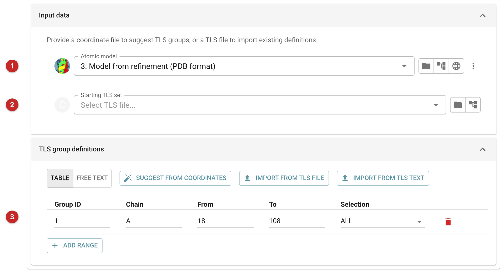
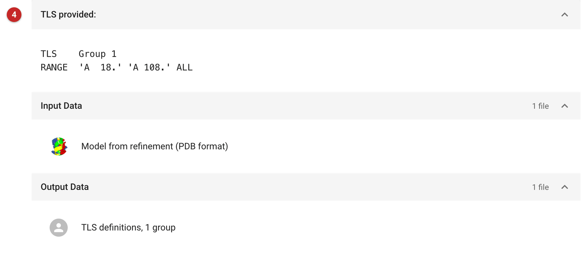

########################################
Define or import TLS groups (ProvideTLS)
########################################

This task makes a set of TLS group definitions for refinement, either
drawn up from a model or imported from a TLS file or text. It does not
refine anything itself: its output is a file that
:doc:`../prosmart_refmac/index` (and PAIREF) can use. The refinement task
can also choose TLS groups by itself (its *automatic* TLS mode, on the
Parameterisation tab); make them here when you want to decide the groups.

TLS (Translation/Libration/Screw) describes the anisotropic motion of a
group of atoms as one rigid body, with about 20 parameters per group instead of
six per atom. It suits medium resolution, where individual anisotropic
B-factors are out of reach but the displacements are clearly not
isotropic: domains that move relative to each other, or copies of a
molecule in the asymmetric unit that move differently, whose residual
B-factors are then similar enough for NCS restraints between them.

When to use it: typically at medium resolution (around 2–3 Å), once
refinement with isotropic B-factors has converged. One group per chain is
a sound start; split a chain into domains only when they move
independently. Refinement reports whether TLS helped: R-free should fall.
If it does not, leave TLS out.

The pictures on this page come from the MDM2 project of the refinement
route: a single chain, residues 18–108, defined as one group. (At 1.35 Å
these data would not need TLS; they show how the task works.)

Input
=====

   Figure 1: TLS input

A model **(1)** (Figure 1), whose chains and residue ranges the task can offer,
or an existing TLS file **(2)** to start from. The groups are edited as a table
**(3)**, one row per residue range: rows with the same group ID form one
group. **Suggest from coordinates** fills the table with one group per
chain; the import buttons read groups from a TLS file or pasted text. The
**Free text** tab edits the same definitions in Refmac's own syntax.

Results
=======

   Figure 2: TLS report

The report (Figure 2) shows the definitions written **(4)**, in Refmac's
syntax: here one group, chain A residues 18 to 108. The TLS file is annotated
with the number of groups it defines. To use it, choose *explicit TLS group
definitions* under TLS on the refinement task's Parameterisation tab, and
pick the file there.

`TLS Motion Determination (TLSMD) <http://skuld.bmsc.washington.edu/~tlsmd/>`_
partitions chains into TLS groups from a refined model's B-factors, if
you want a data-driven division. A `TLS refinement tutorial
<https://www2.mrc-lmb.cam.ac.uk/groups/murshudov/content/tutorials/refmac_tutorial/files/part_2.html>`_
covers the refinement side.
