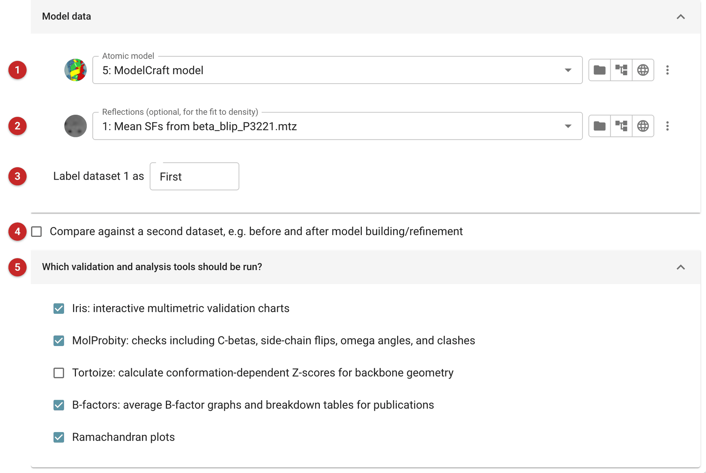
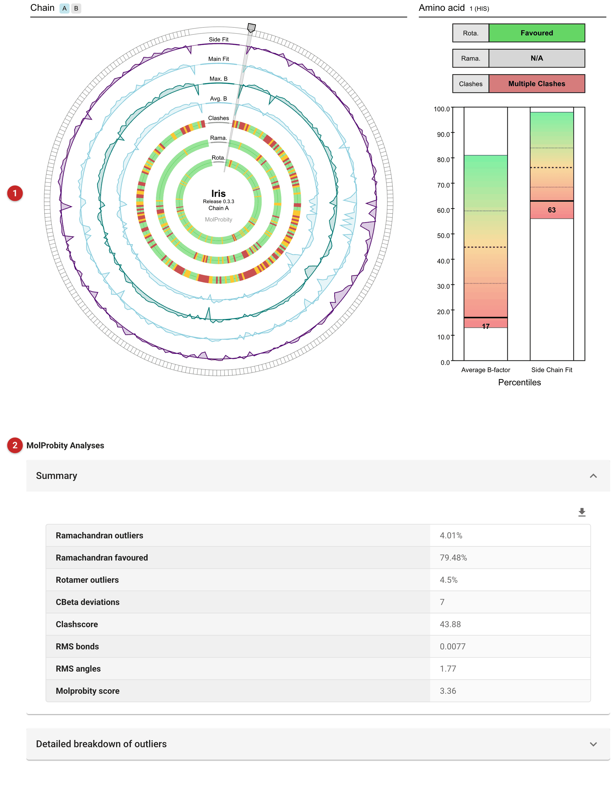

###################################
Multimetric model validation (Iris)
###################################

   This task checks a protein model, residue by residue, and draws the
   results together so problems stand out: geometry and clashes from
   MolProbity, backbone conformation (Ramachandran), B-factors, and the
   fit to the density when you give the data. `Iris
   <https://github.com/glycojones/iris-validation>`__ draws these as
   interactive charts, one ring per metric, so a stretch of the model that
   is poor on several counts at once is easy to see. It can compare two
   models, for example before and after rebuilding.

   It runs by itself, and after refinement in the *Refinement - Servalcat*
   task, whose report includes its results.

   The pictures on this page come from the demo data that ships with
   CCP4i2: the beta-lactamase / BLIP complex after model building with
   ModelCraft.

.. note::

   This page is a draft, written from the task's interface, parameters
   and code. It has not yet been reviewed by the developers of Iris.

Input
=====

   |input|

   Give the model **(1)** and, optionally, the reflections it was refined
   against **(2)**: with them, Iris also measures how well each residue
   fits the density. A short label for the model **(3)** names it in the
   charts.

   To compare two models, tick the comparison box **(4)** and give the
   second model, its data and its label; the charts then show both, so you
   can see what rebuilding or refinement changed.

   Choose which analyses to run **(5)**. All but Tortoize are on by
   default:

   - **Iris**, the interactive multimetric charts;
   - **MolProbity**: Ramachandran and rotamer outliers, C-beta deviations,
     non-planar peptides, suggested side-chain flips and all-atom clashes.
     MolProbity needs its reference data installed; without them this
     section is left out of the report;
   - **Tortoize**: the Ramachandran Z-score (Rama-Z), how typical the
     model's backbone conformations are taken together;
   - **B-factors**: averages by chain and by kind of atom, as asked for in
     the "Table 1" of a publication;
   - **Ramachandran plots**, for general residues, prolines and glycines.

Results
=======

   |report|

   The Iris charts come first **(1)**: each ring is a metric and each
   segment a residue, coloured from good to poor; hover over a residue to
   read its values. Look for residues poor on several rings at once.

   *MolProbity Analyses* summarises the model's geometry: the MolProbity
   score, clashscore, RMS bond and angle deviations and the percentages of
   Ramachandran, rotamer and C-beta outliers, with each kind of outlier
   listed below the summary.
   *B-factor Analyses* gives the mean and spread of the B-factors for the
   whole model and for each chain, by main chain, side chains, waters,
   ligands and ions. *Ramachandran Analyses* plots each residue's backbone
   angles against the favoured and allowed regions from the Richardsons'
   Top500 structures, and lists the outliers.

