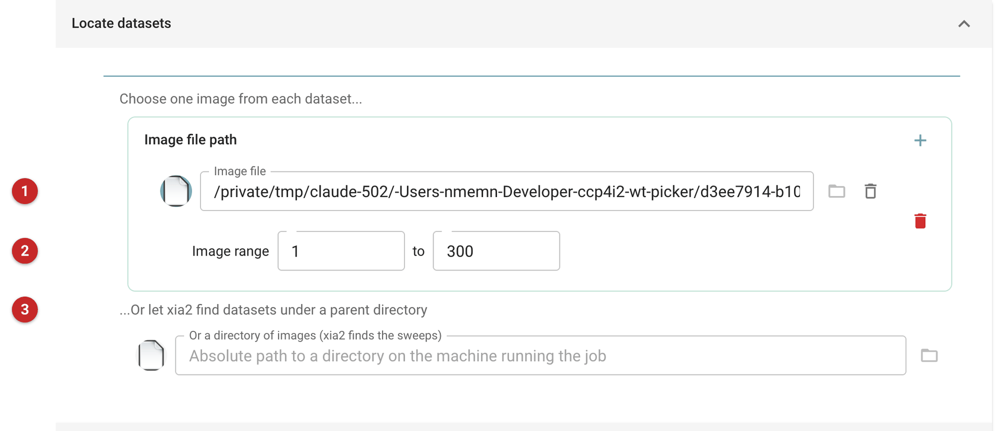
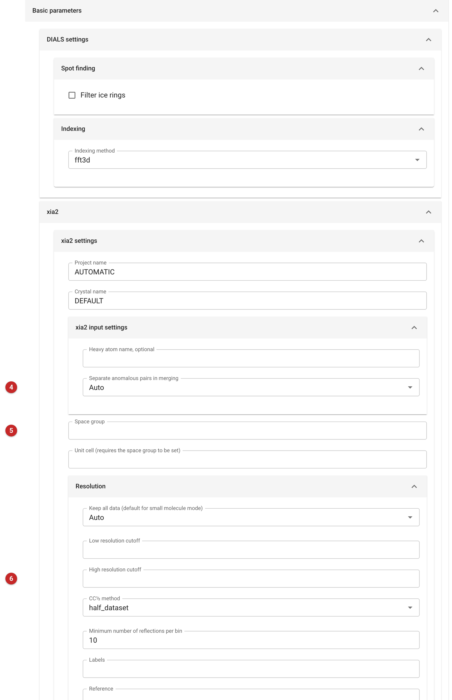
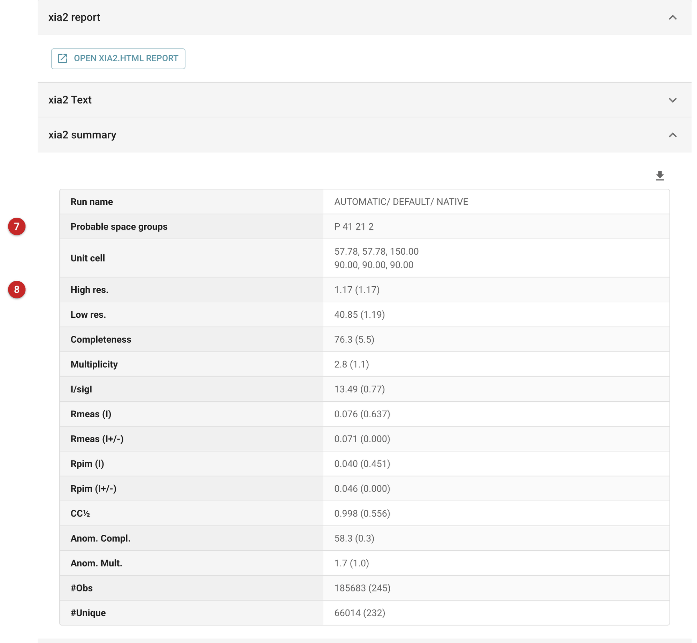

###############
Xia2 with DIALS
###############

Xia2 performs automated X-ray diffraction data processing on your behalf.
This pipeline uses DIALS to find spots, index, refine and integrate the
images, then scales, finds the space group and merges the result, and
chooses a resolution limit. It takes diffraction images and gives you merged
observations and a free R set ready for molecular replacement or refinement,
and the unmerged integrated reflections.

Use it when you have images and want a defensible dataset with the least
effort. Use :doc:`../xia2_xds/index` for the same job with XDS, which is worth
trying when DIALS struggles with a dataset. If xia2 has already been run
outside CCP4i2, import its output with the xia2 import task rather than
processing again; for several sweeps or crystals to be merged together see
:doc:`../xia2_multiplex/index`; to rescale the unmerged output with your own
choices see :doc:`../aimless_pipe/aimless_pipe`.

The pictures on this page come from the Thaumatin project of the data
reduction route: 300 frames of the xia2 test sweep ``th_8_2`` (thaumatin,
Zenodo record 10271), 0.15 degrees each, so 45 degrees of data.

Input
=====

   Figure 1: xia2/dials input

Give a minimum of one image from each dataset **(1)** (Figure 1): the first
image of the sweep, and xia2 finds the rest from its numbered name. Set the
range of images to use **(2)**; here 1 to 300, and if left blank all the images
are used. To process several datasets, add another image with the plus button.
Alternatively give a directory **(3)**, an absolute path on the machine running
the job, and xia2 finds the sweeps under it. DIALS reads a wide range of image
formats (see the DIALS web page).

   Figure 2: xia2/dials settings

The defaults are right for most datasets; the Basic parameters tab (Figure 2)
holds the DIALS settings (ice-ring filtering in spot finding, the indexing
method) and xia2's own. Set the space group **(5)** (with the unit cell, which
needs it) only if you know it: otherwise xia2 chooses it from the symmetry of
the data. The high resolution cutoff **(6)** is empty by default: xia2 then
picks the limit itself, and the next section is about why you should check it.
Whether anomalous pairs are kept separate when merging **(4)** is Auto. The
Advanced parameters tab carries the rest of xia2's options (masks, and the
integration and spot-finding algorithms).

Results
=======

   Figure 3: xia2/dials report

The report (Figure 3) opens with a button for xia2's own HTML report, then the
xia2 summary, with overall values and, in brackets, those of the
highest-resolution shell. It gives the space group xia2 chose **(7)** and the
resolution limit **(8)**, with the completeness, multiplicity, I/σ(I),
R-factors, CC\ :sub:`1/2` and numbers of observations and unique reflections.
The unit cell here is 57.78, 57.78, 150.00 with 90 degree angles.

Read the shell statistics before trusting the limit. xia2 took 1.17 Å as
the limit, where CC\ :sub:`1/2` is still above 0.3 in the highest shell. For these data:

.. list-table::
   :header-rows: 1

   * -
     - Overall
     - Highest shell
   * - Resolution (Å)
     - 40.85 to 1.17
     - 1.19 to 1.17
   * - Completeness (%)
     - 76.3
     - 5.5
   * - Multiplicity
     - 2.8
     - 1.1
   * - I/σ(I)
     - 13.5
     - 0.8
   * - CC\ :sub:`1/2`
     - 0.998
     - 0.556

The space group is P 4\ :sub:`1`\ 2\ :sub:`1`\ 2 and there are 66014 unique
reflections. The data are strong (I/σ(I) 13.5, CC\ :sub:`1/2` 0.998), but the
limit sits where the data are barely there: the highest shell is 5.5%
complete and observed about once per reflection. The overall completeness of
76.3% is low for a tetragonal crystal because 45 degrees of rotation does not
cover the asymmetric unit. To improve it, collect more rotation (about 45
degrees of a P4\ :sub:`1`\ 2\ :sub:`1`\ 2 crystal gives roughly three quarters
of the data), or if the dataset is final, set a more conservative high
resolution cutoff and compare with paired refinement
(:doc:`../pairef/index`) before deciding.

Outputs, annotated in the project, are the merged observations (``AUTOMATIC_DEFAULT_obs.mtz``), the free R
set (``AUTOMATIC_DEFAULT_freer.mtz``) and the unmerged integrated reflections
from DIALS (``AUTOMATIC_DEFAULT_NATIVE_SWEEP1_INTEGRATE.mtz``), which are not
yet scaled; they can be rescaled with Aimless. The DIALS experiment and
reflection files of each step (spot finding, indexing, refinement,
integration) are kept as well, for continuing in DIALS itself.

-  `Xia2 Home Page <https://xia2.github.io/index.html>`__.
-  `Xia2 Run Options <https://xia2.github.io/parameters.html>`__.
-  `DIALS Home Page <https://dials.diamond.ac.uk/>`__.
