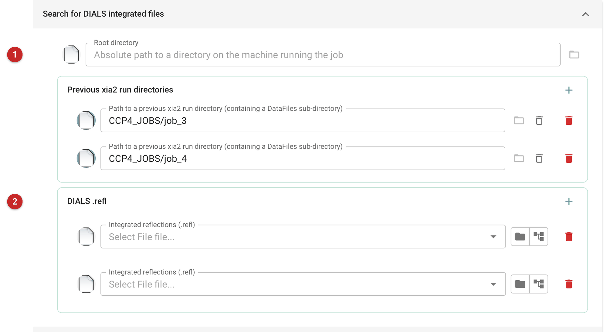
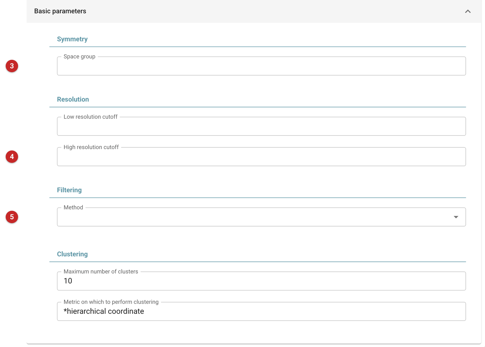
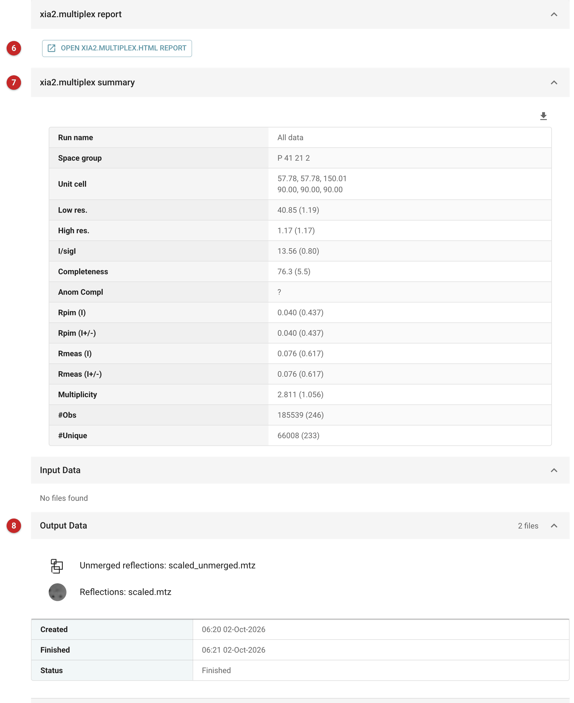

##################################################
Scale and merge several data sets (xia2.multiplex)
##################################################

xia2.multiplex scales and merges data from several sweeps or several
crystals into one data set, and tells you whether they belong together. It
works on data already integrated by DIALS: it clusters the data sets by
unit cell and by the correlation of their intensities, makes the symmetry
consistent across them, scales them together with ``dials.scale`` and merges
the result. It also reports how much each data set helps or hurts the
merged data (the change in CC\ :sub:`1/2` when it is left out).

Use it when one crystal does not give enough data, or the crystals are
small and each gives a short wedge: several wedges of one crystal, or the
sweeps of many crystals of the same form. For a single sweep, process it
with :doc:`../xia2_dials/index` (it integrates, scales and merges one run) or
with Aimless (:doc:`../aimless_pipe/aimless_pipe`) if you already have
integrated intensities. For serial data, collected on many thousands of
still images, use xia2.ssx_reduce instead.

The pictures on this page come from the Thaumatin project of the data
reduction route. The thaumatin sweep of 300 images was processed by
xia2 with DIALS twice, as images 1-150 and images 151-300: two wedges of
22.5 degrees each. xia2.multiplex was then run on the two.

Input
=====

   Figure 1: xia2.multiplex input

The data sets (Figure 1) come from DIALS: each is a pair of files, the
integrated reflections (``.refl``) and the experiment description (``.expt``)
that goes with them. Give them in either of two ways.

- **Previous xia2 run directories.** The task takes the integrated DIALS
  files from the ``DataFiles`` folder of each earlier xia2 DIALS run
  (scaled files are left out). This is how the two wedges here were given.
  These are listed in the form under *Previous xia2 run directories*.
- **DIALS .refl files (2).** Add one ``.refl`` file for each data set; the
  ``.expt`` file must sit beside it with the same name. At least two are
  needed. The folder button of the **Root directory (1)** field is for
  finding them: it names a directory on the machine that runs the job.

   Figure 2: xia2.multiplex basic parameters

Everything else can be left blank and xia2.multiplex chooses. The ones you
may want to set (Figure 2) are the **Space group (3)**, if you know it
(otherwise it is found with ``dials.symmetry``), the **resolution limits (4)**,
and the **filtering method (5)**: *deltacchalf* removes data sets (or parts of
them) whose presence lowers CC\ :sub:`1/2`; the default is *None*. The
*Advanced parameters* tab holds the rest of the program's own parameters.

Results
=======

   Figure 3: xia2.multiplex report

The button **(6)** in Figure 3 opens xia2.multiplex's own HTML report: the
clustering, the symmetry analysis, the stereographic projections and the
detailed merging statistics. The summary table **(7)** gives the space group,
the unit cell and the merged statistics, overall with the outer shell in
brackets. The merged and unmerged reflections **(8)** are the outputs: one
set of each, named ``scaled.mtz`` and ``scaled_unmerged.mtz``, each
annotated with which it is.

What the run showed, and what to read in it:

- **Do the data sets belong together?** The program's log says it found
  one unit-cell cluster holding both data sets (57.78, 57.78, 150.00 Å,
  90, 90, 90), and a single cluster by intensity correlation, so all data
  were used. The correlation between the two data sets was 0.992. If
  you give it crystals that differ, expect several clusters; the task can
  merge each (*Maximum number of clusters*), and the report shows which
  data sets fall in which.
- **Symmetry.** Applied consistently to both data sets, it settled on the
  point group 422 (``dials.cosym``) and then the space group
  P 4\ :sub:`1`\ 2\ :sub:`1`\ 2 (``dials.symmetry``). Check this against
  what you expect before going on; a wrong choice here cannot be undone
  later.
- **Merged statistics.** Overall completeness was 76.3 % (92.0 % at low
  resolution, 5.5 % in the outer shell), multiplicity 2.8 (3.3 and 1.1),
  to 1.17 Å, where CC\ :sub:`1/2` was still 0.52 in the outer shell. The
  completeness is low because the data are two short wedges; it is the
  same as the xia2 DIALS run on all 300 images gave, as it should be for the
  same images. More wedges, from other orientations, are what raise it.
- **ΔCC\ :sub:`1/2`.** With only two data sets it cannot single one out: the
  program's log gave -0.18 and -1.16 for the two, against a cutoff of
  -2.63, and the normalised scores in the report are necessarily
  +0.71 and -0.71. With many data sets this analysis is how a poor one
  stands out; use *deltacchalf* filtering then.

Next, the merged reflections can be used like those of any other data
reduction: give them to :doc:`../freerflag/index` and on to molecular
replacement or refinement, and keep the unmerged file for programs that
want it.

