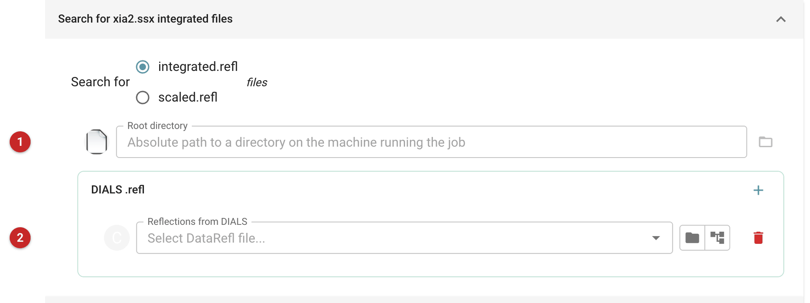
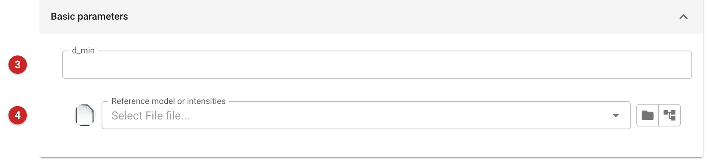
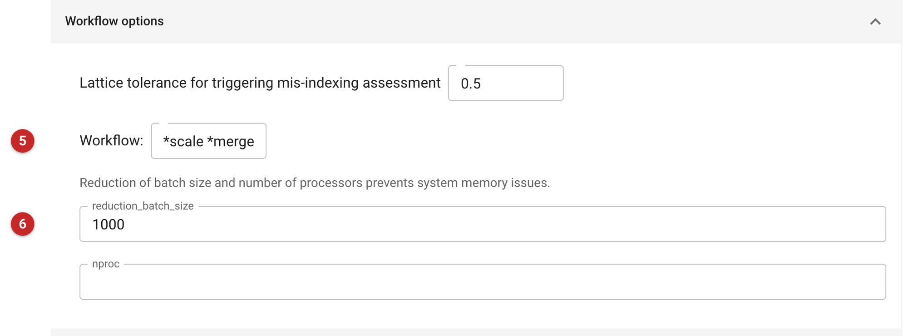
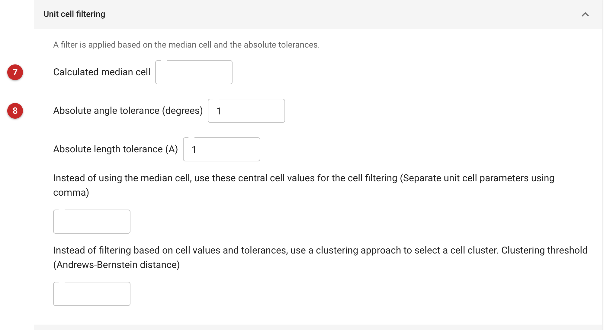

######################################
xia2.ssx_reduce (serial data)
######################################

.. note::

   This page is written from the task's interface and code, not from a
   run. No serial data were available when it was drafted, so there is no
   report picture and every statement about results is what the task's code
   says it will produce.

xia2.ssx_reduce scales and merges serial crystallography data: many
still or small-wedge diffraction images, each from a different crystal,
that DIALS has already indexed and integrated. It runs the xia2.ssx_reduce
program, which filters the crystals by unit cell, resolves indexing
ambiguity (dials.cosym), scales the datasets together and merges them
(dials.merge) into one set of intensities.

Choose it when the data are many crystals each giving a few images, and
the integration has been done already, by xia2.ssx or DIALS. It does not
integrate images. For a rotation (conventional) data set use
:doc:`../xia2_dials/index`, and for rotation data from several crystals
to be combined use :doc:`../xia2_multiplex/index`. If your serial data were
processed with CrystFEL, bring them in with Import Serial Data
(``import_serial_pipe``) instead.

Input
=====

   Figure 1: Where the integrated data come from

The panel (Figure 1) is headed "Search for xia2.ssx integrated files". Choose
whether the files wanted are ``integrated.refl`` or ``scaled.refl``. A
root directory **(1)** is offered, to search from, and the DIALS
reflection files go in the list **(2)**; each ``.refl`` must have its
``.expt`` file beside it, with the same name.

The job's definition also has a list of previous xia2 run directories
(each containing a ``DataFiles`` sub-directory), from which integration
files would be extracted. The interface does not show it, and in the
wrapper's code only the list of reflection files is turned into the
command line (as ``experiments=`` and ``reflections=`` pairs), so
supply the files in the list **(2)**. The same holds for the root
directory: the wrapper does not read it. Both are written from the code
and have not been tried.

The list is the only data input the wrapper passes on. A job with no
files in it has nothing to reduce.

   Figure 2: Basic parameters

Two settings are in the basic panel (Figure 2). The resolution limit **(3)**,
d\_min, is left blank to let the program decide. The reference **(4)** is a
model (PDB or mmCIF) or a file of intensities (mmCIF or MTZ), used for scaling
and to resolve the indexing ambiguity: when the crystal's symmetry is lower
than its lattice's, the same pattern can be indexed in more than one way,
and without a reference the program has to compare the crystals with each
other.

Advanced parameters
===================

   Figure 3: Workflow options

Under *Scaling options* are the partiality threshold (default 0.25), a
choice of keeping anomalous pairs separate during scaling (shown when the
workflow is scale and merge), and a separate resolution cutoff for
dials.cosym, which reaches the program as a small parameter file of its own.

*Workflow options* (Figure 3) offer the lattice tolerance for deciding whether
to assess mis-indexing (default 0.5), the workflow itself **(5)** (the steps to
run: scale, merge; the interface shows it as the text "*scale *merge"), the
batch size **(6)** (default 1000) and the number of processors (blank by
default). Reduce the batch size and the number of processors if a job fails for
memory: the wrapper reports error 226 for that case, a process of the pool
being terminated abruptly, and says that overload of memory is the likely
cause.

   Figure 4: Unit cell filtering

*Unit cell filtering* (Figure 4) discards crystals whose cell differs from a
central cell by more than a tolerance (the defaults shown are 1 degree and 1
Ångström), or selects a cluster by an Andrews-Bernstein distance threshold
instead. The central cell is the median of the data unless you give your
own values. The "Calculated median cell" **(7)** is a display field: the
wrapper never sends it to the program. The angle tolerance is **(8)**.

Further panels set the space group for scaling and merging, the solvent
parameters (k-sol 0.35, B-sol 46) used when a reference is generated from a
model, and, for data from mixed conditions, the number of repeated
measurements in a dose series and a grouping YML file that divides the data
into sets, which are then reduced separately.

Results
=======

From the code, the task produces:

* **Merged reflections**, one observed-data file for each merged MTZ file
  the program writes. If the data are anomalous (separate I(+) and I(-)),
  they are stored as intensity pairs, otherwise as mean intensity.
* **Scaled DIALS files** (``.refl`` with their ``.expt``) for each scaled
  dataset that has a scaling model, which can be used as the input of a
  further xia2.ssx_reduce, for instance to add data.
* A **performance indicator** holding the space group, the overall
  CC\ :sub:`1/2` and the high-resolution limit, read from dials.merge's
  output.

The report links the dials.merge report (and dials.cosym's when it
ran), and has, per dataset, a summary table of low and high resolution,
number of observations and unique reflections, multiplicity, completeness,
I/σ(I), CC\ :sub:`1/2`, R\ :sub:`split`, R\ :sub:`pim` and R\ :sub:`meas`
(each with the outer shell in brackets), the space group, unit cell and the
number of crystals. The xia2 and dials.merge logs follow in folds.

Read the number of crystals and multiplicity first: serial data need
many crystals for the intensities to average well. Then the outer-shell
CC\ :sub:`1/2`, to judge the resolution. Next steps offered are another
xia2.ssx_reduce, molecular replacement (Phaser or MOLREP) and refinement.
