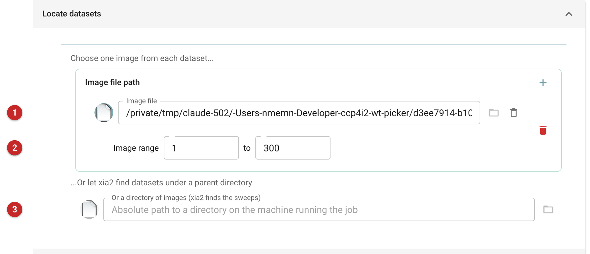
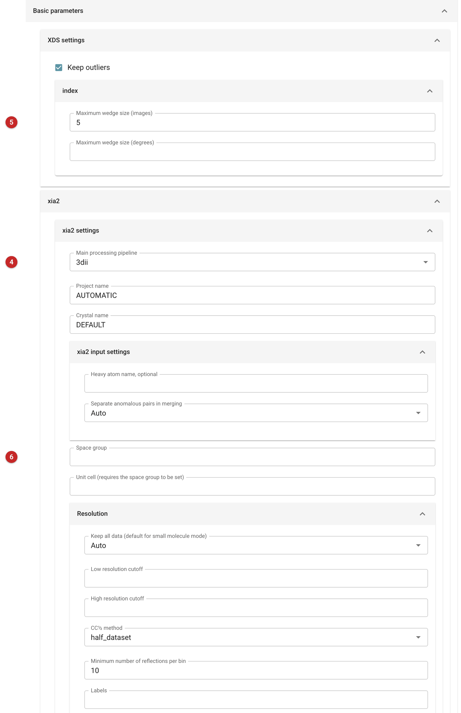

#############
Xia2 with XDS
#############

xia2 performs automated X-ray diffraction data processing on your behalf:
it indexes and integrates the images, scales and merges them, chooses the
point group and the resolution cutoff, and hands back merged and unmerged
reflections. This task runs xia2 with **XDS** doing the indexing and
integration.

It is the same task as :doc:`../xia2_dials/index` in every respect but
which program does that work: it uses the same input, the same options and
the same report, and it makes the same kinds of output files. Choose it when
you want XDS rather than DIALS, for instance to compare the two on one data
set. Run on the same images, the two give you the results shown on the
:doc:`../xia2_dials/index` page. To process several sweeps of one crystal
together afterwards, see :doc:`../xia2_multiplex/index`; to process already
integrated data, see :doc:`../aimless_pipe/aimless_pipe`.

Before you start: XDS must be installed
=======================================

XDS is not part of the CCP4 suite. It is distributed separately by its
authors (`XDS home page <https://xds.mr.mpg.de/>`__), and commercial users
need a licence. It is not installed in the CCP4 build used to prepare this
page, so no job was run for it and the page shows the input only. Install
XDS following the authors' instructions and check that it works from the
command line before running this task.

Input
=====

   Figure 1: Locating the data. The pictures are of a job set up on 300
   images of a thaumatin data set.

You need, at a minimum, a set of diffraction images. There are two ways to
say where they are:

* Choose one image **(1)** from each data set; xia2 finds the rest of the
  set itself. The image range **(2)** limits the images used (for example 1
  to 100); here 1 to 300. Use the **+** button to add another data set.
* Or give a parent directory **(3)**, an absolute path on the machine
  running the job, and xia2 searches it for data sets.

One of the two must be given.

   Figure 2: Basic parameters (the picture is cut off after the resolution
   settings; more follow below them).

The **Basic parameters** hold the options most often changed, and the
**Advanced parameters** tab the rest (its selector sets how much is shown).
What is specific to this task:

* **Main processing pipeline (4)** offers the four XDS pipelines, 3d, 3dd,
  3di and 3dii, and starts at 3dii. xia2's own description of them is: 3d,
  XDS and XSCALE; 3di, as 3d but using three wedges for indexing; 3dii, XDS
  and XSCALE using all images for autoindexing; 3dd, as 3d but with DIALS
  doing the indexing. The DIALS pipelines are not offered here; use
  :doc:`../xia2_dials/index` for those.
* **XDS settings** include whether to keep outliers and, under *index*, the
  maximum wedge size **(5)** in images or degrees.
* The remaining settings are xia2's: the space group and unit cell **(6)**
  (give the cell only together with the space group), the resolution
  limits, whether to keep all data, the heavy atom for anomalous work, and
  the number of processors. Leaving the space group and cell blank lets xia2
  decide.

Results
=======

The results are those of :doc:`../xia2_dials/index`: unmerged and merged
reflection files with a free-R set, and the data reduction statistics.
There are no DIALS experiment or reflection files (the task does not
collect them, since XDS does not produce them).

Further reading
===============

* `Xia2 Home Page <https://xia2.github.io/index.html>`__
* `Xia2 Run Options <https://xia2.github.io/parameters.html>`__
* `XDS Home Page <https://xds.mr.mpg.de/>`__
