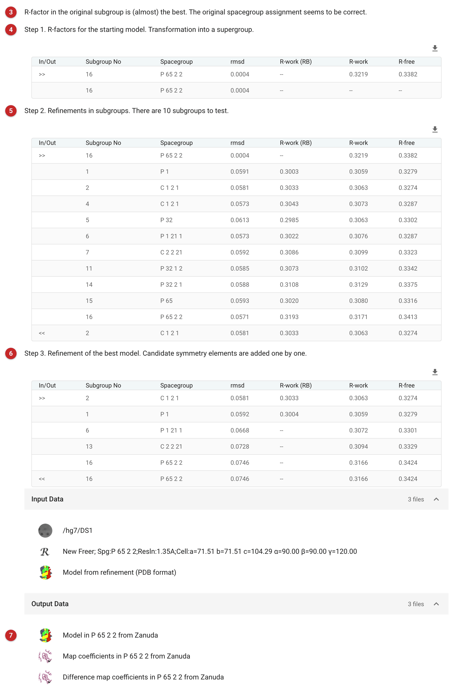

##################################
Space Group Validation with Zanuda
##################################

`Zanuda <http://scripts.iucr.org/cgi-bin/paper?S1399004714014795>`_ checks
whether a structure was solved in the right space group. It matters when
there is *pseudosymmetry*: an approximate global symmetry close enough to
exact that a structure can be solved and partly refined in the wrong space
group, with some pseudosymmetry operations treated as crystallographic and
vice versa. The usual sign is refinement that stalls, with R-free stuck at
about 35% or higher, and a map that stays imperfect (breaks in the main
chain, poor solvent) without suggesting anything to rebuild. It is common
after molecular replacement. Zanuda can also restore the right space group
to a structure deliberately solved in a lower symmetry, down to P1.

Zanuda assumes the model is already refined well enough (R-free about 40%
or better), though not necessarily in the true space group, and that the
pseudosymmetry is close enough to exact symmetry for refinement to reach
the global minimum when the constraints change. It ignores candidate
operations whose Cα r.m.s.d. exceeds 3 Å.

The pictures on this page come from the MDM2 project of the refinement
route: the refined model in its space group, P6\ :sub:`5`\ 22, with one
molecule in the asymmetric unit.

Input
=====

   Figure 1: Zanuda input

The data and free R set **(1)**, and the refined model **(2)**.

Results
=======

   Figure 2: Zanuda report

The report opens with the verdict **(3)**, then shows the three steps
behind it. Step 1 **(4)** places the model in the highest-symmetry space
group the cell allows (the *supergroup*) and scores it. Step 2 **(5)**
refines it in every subgroup of that supergroup, first as rigid bodies
(R-work (RB)) and then with restraints, and picks the best. Step 3
**(6)** starts from the best and adds candidate symmetry back one element
at a time, keeping each only if the fit holds.

Here Zanuda tested ten subgroups. The best, C121, has an R-free of 0.327;
back in P6\ :sub:`5`\ 22 it is 0.342. That difference comes only from
imposing symmetry: a subgroup always fits slightly better, because it has
more parameters. What counts is whether the difference is large. It is
not, and Zanuda concludes: "R-factor in the original subgroup is (almost)
the best. The original spacegroup assignment seems to be correct." With one
molecule in the asymmetric unit there was no pseudosymmetry to find.

A result worth acting on looks different: a lower-symmetry group whose
R-free is clearly lower (several per cent) than the original's, and a
final space group different from the one you started in. The output model
and maps are then in the space group Zanuda chose, named in their
annotations **(7)**; refine from them.

The R factors are from Zanuda's own short refinements and are higher than
the full refinement's (0.235 / 0.247 for this model). Compare them only
with each other.

-----------------
More on the ideas
-----------------

Crystallographic symmetry is global and exact; non-crystallographic
symmetry (NCS) is local and approximate; pseudosymmetry is global and
approximate. An NCS operation is defined by the best overlap of two
molecules, a pseudosymmetry operation by the best match of the whole
crystal with its transformed copy, so the two are in general different
operations. With one molecule per asymmetric unit there is no
pseudosymmetry.

Only 65 of the 230 space groups are possible for chiral molecules such as
proteins: mirror planes and inversion centres would turn L-amino acids
into D. The space group is deduced step by step (lattice symmetry from the
cell, point group from related intensities, space group from systematic
absences), and it remains a hypothesis until the structure is complete.

**References**

`Lebedev A. & Isupov M. (2014). Acta Cryst. D70, 2430–2443.
<http://scripts.iucr.org/cgi-bin/paper?S1399004714014795>`_

`Drenth J. (2007) Principles of Protein X-Ray Crystallography.
Springer-Verlag New York <https://www.springer.com/gp/book/9780387333342>`_

**Acknowledgements**

This page uses material provided by Andrey Lebedev. More about space group
validation with Zanuda `here
<https://www.ccp4.ac.uk/newsletters/newsletter48/articles/Zanuda/zanuda.html>`__.
